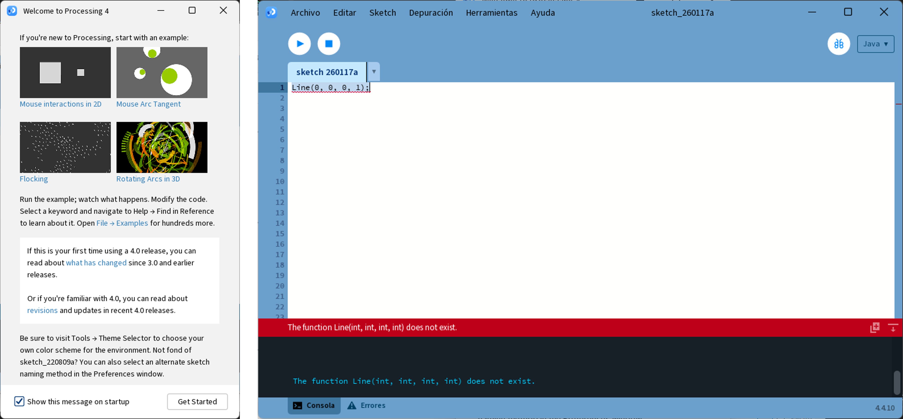
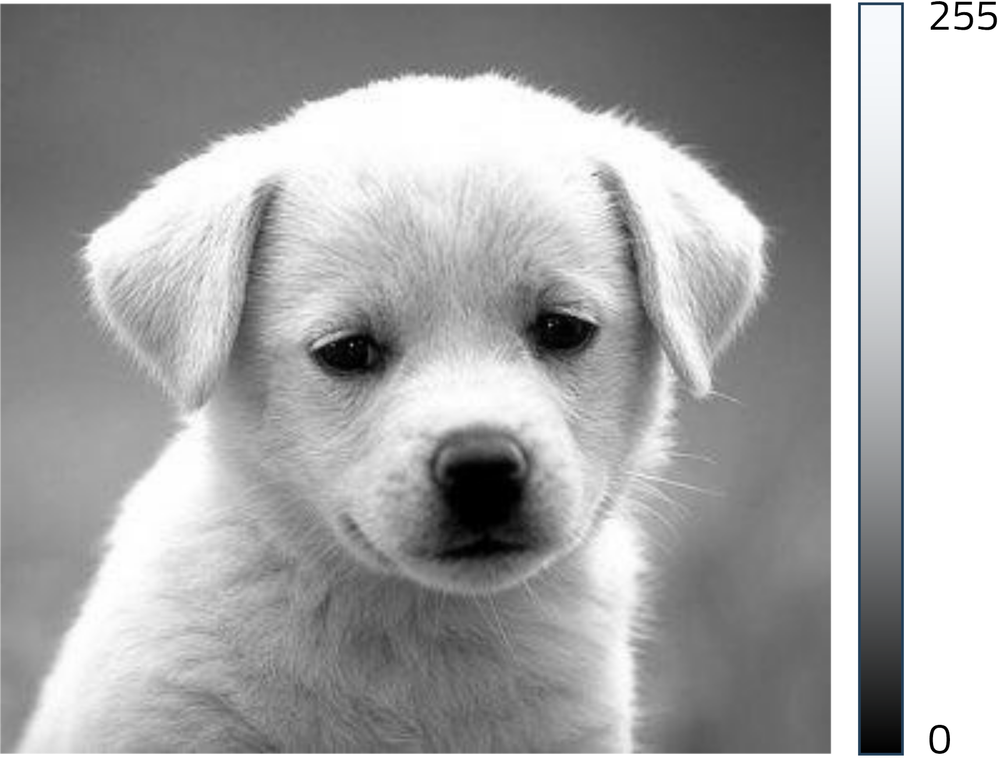
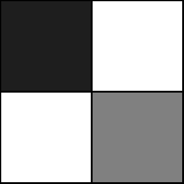
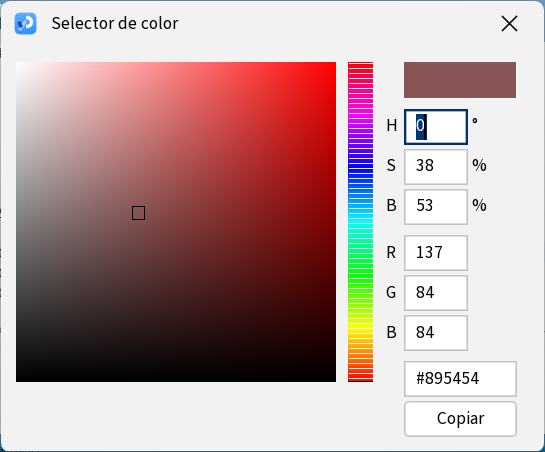
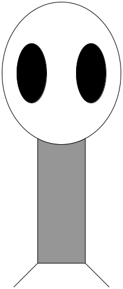
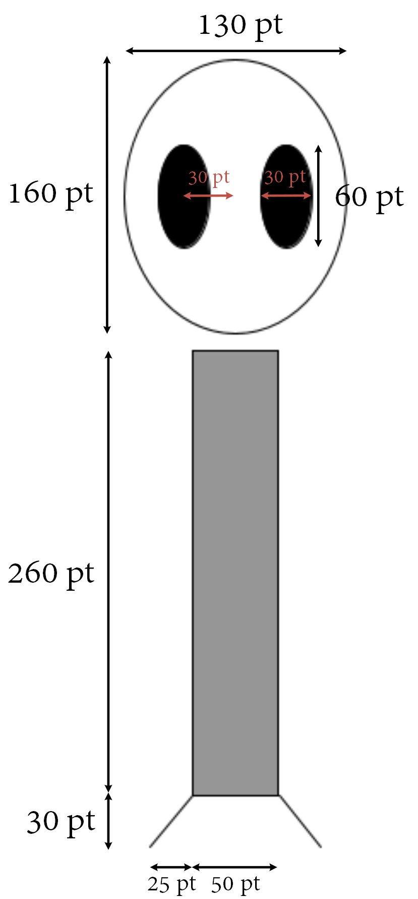
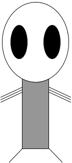
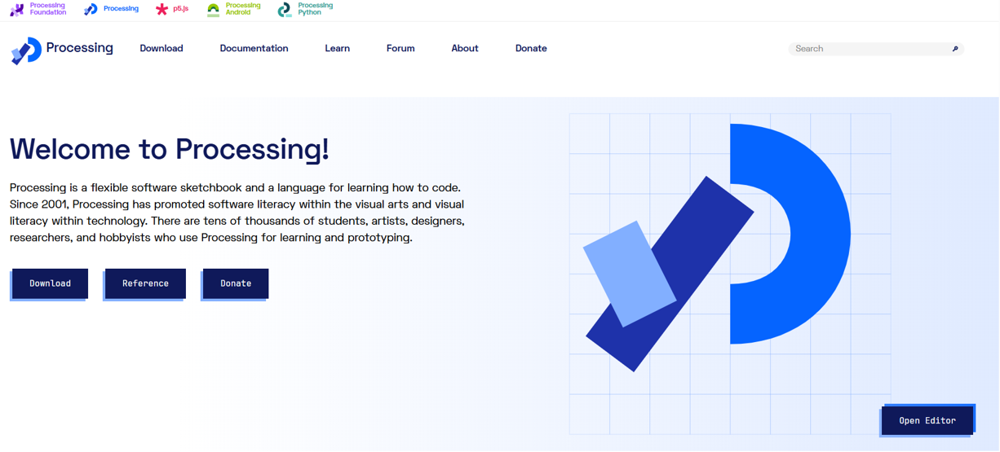

## Objetivos de la práctica

Los objetivos de esta práctica son los siguientes:

- Familiarización con el ordenador y los elementos básicos de un sistema operativo.
- Familiarización con el entorno de desarrollo *Processing*.
- Familiarización con aspectos básicos de programación a través de programas en *Processing*.

---

## Processing

### Introducción

::: {layout="[75,25]"}
::: {.column}
*Processing* es un lenguaje de programación y un entorno de desarrollo (*Integrated Development Environment*, IDE).

- **Basado en Java**.
- **Producción de proyectos multimedia e interactivos**.
- Creado por científicos del MIT en 2001.
- Distribución gratuita y de código abierto.
:::
::: {.column}

:::
:::

---

La propia [página de Processing](https://processing.org/examples/) muestra numerosos ejemplos de proyectos realizados con este lenguaje. También hay muchos ejemplos en Youtube, en particular, en el canal de [The Coding Train](https://www.youtube.com/c/TheCodingTrain).

::: {layout="[50,50]"}
::: {.column}
.](../resources/practica1/images/processing-example.png){#fig-mandelbrot}
:::
::: {.column}
.](../resources/practica1/media/thecodetrain.gif){#fig-thecodetrain}

:::
:::

---

### El entorno de desarrollo

El entorno de desarrollo de *Processing* tiene un diseño minimalista que facilita su uso. La interfaz gráfica está compuesta por los siguientes elementos principales:

- **Un menú de opciones** (archivo, editar, sketch, depuración, herramientas y ayuda).
- **Dos botones para ejecutar y detener el programa.**
- Un área central para escribir el código fuente (**editor**).
- Una ventana inferior donde se muestran dos pestañas:
  - **Consola**: salida estándar del programa.
  - **Errores**: mensajes de error generados durante la ejecución.

---

Al ejecutar un programa se abrirá una **nueva ventana donde se mostrará el resultado de la ejecución**.

{#fig-ide}

---

::: {.callout-warning}
El primer archivo que se crea en un nuevo proyecto de *Processing* se denomina `sketch_yymmdda`. Es recomendable cambiar el nombre del archivo para que tenga sentido con el programa que se va a desarrollar. Además, al guardarlo nos preguntará el nombre del proyecto, que también es recomendable que tenga sentido. 

Indicad una ubicación de fácil acceso en vuestro ordenador para guardar los proyectos de *Processing*.
:::

---

## Dibujando figuras geométricas

Las figuras geométricas se dibujan en una ventana que está formada por una **matriz de píxeles**. Cada píxel es un pequeño punto de luz que puede tener un color diferente. La combinación de todos los píxeles forma la imagen que vemos en la pantalla.

---

Un píxel es la **unidad más pequeña de una imagen digital**. La resolución de una imagen se refiere a la cantidad de píxeles que contiene, y se expresa como el número de píxeles en el eje horizontal por el número de píxeles en el eje vertical (por ejemplo, 1920x1080 píxeles). Por ejemplo, la @fig-highres muestra una animación con una resolución alta, donde los píxeles no son visibles a simple vista. En cambio, en la @fig-lowres se ha reducido la resolución de la animación, y comienzan a ser visibles los píxeles individuales.

::: {layout="[50,50]"}
::: {.column}
{#fig-highres}

:::

::: {.column}
{#fig-lowres}

:::
:::

---

::: {layout="[68,32]"}
::: {.column}
Para dibujar cualquier figura geométrica, es necesario especificar una o varias posiciones en la ventana. Dichas posiciones se definen mediante un par de coordenadas ***(x, y)***, donde ***x*** indica la **posición horizontal** e ***y*** la **posición vertical**. En *Processing*, **el origen de coordenadas (0,0) se encuentra en la esquina superior izquierda de la ventana**, como se muestra en la @fig-pixels.

::: {.callout-note}
## 🧠 Ejercicio 1 - Sistema de coordenadas

Dibuja una línea que va desde la posición (10, 0) hasta la posición (40, 50). Cuando se ejecute, os podréis dar cuenta de que el origen, (0,0), parte de la esquina superior izquierda.
```{.java include="../resources/practica1/snippets/draw-line.java"}
```
:::
:::
::: {.column}
:::: {#fig-pixels .p1-figure-uza}
```{=html}
<div class="p1-pixel-demo-uza" data-p1-pixel-demo>
  <canvas width="420" height="330" aria-label="Matriz interactiva de píxeles"></canvas>
  <output class="p1-pixel-readout-uza" data-readout aria-live="polite">(4, 3)</output>
</div>
```

Ilustración interactiva de una matriz de píxeles y sus coordenadas.
::::

:::
:::

---

Este concepto puede entenderse como **darle un nombre a un conjunto de instrucciones para poder reutilizarlas fácilmente** más adelante. En **matemáticas**, una función toma uno o varios valores de entrada y produce un valor de salida siguiendo una regla. Por ejemplo, la función $f(x) = x^2$ toma un número $x$ y devuelve su cuadrado.

En programación ocurre algo muy similar: una función recibe unos parámetros, ejecuta unas instrucciones con ellos y, opcionalmente, devuelve un resultado.

---

Por ejemplo, podemos definir en Java una función que reciba un número entero y devuelva su cuadrado:
```{.java include="../resources/practica1/snippets/square-function.java"}
```

Una vez definida, podemos usar la función tantas veces como queramos, simplemente indicando el valor de entrada:
```{.java include="../resources/practica1/snippets/square-call.java"}
```

De este modo:

- `square` es el nombre de la función.
- `x` es el parámetro de entrada.
- `return` indica el valor que devuelve la función.

En *Processing* ocurre exactamente lo mismo. La función `line`, por ejemplo, recibe cuatro parámetros (las coordenadas de dos puntos) y ejecuta una acción: dibujar una línea en la ventana. La diferencia es que, en este caso, la función no devuelve un valor, sino que produce un efecto visual en pantalla.

---

::: {.callout-warning}
## Ejercicio 2 - Errores comunes

Prueba a copiar el siguiente código en el editor de *Processing* y ejecutarlo:
```{.java include="../resources/practica1/snippets/wrong-line-case.java"}
```

<details>
<summary>💡 Solución:</summary>
Processing es sensible al uso de mayúsculas y minúsculas. Por ejemplo, la función para dibujar una línea es `line`, no `Line` ni `LINE`.

Las palabras reservadas se muestran <span style="color:#1f77ff; font-weight:600;">resaltadas</span> en el editor, por lo que esta es una manera de ver si el nombre de una función está bien escrito. Los <span style="color:#FF0000; font-weight:600;">errores</span> se muestran en la pestaña *Errores* de la ventana inferior.
</details>
:::

::: {.callout-note}
## 🧠 Ejercicio 3 - Múltiples formas geométricas

Prueba a dibujar varias líneas en diferentes posiciones de la pantalla, utilizando la instrucción `line` varias veces. 
:::

---

### Lienzo

Las figuras geométricas se dibujan sobre un lienzo de tamaño predeterminado 100x100 píxeles. No obstante, es posible cambiar el tamaño del lienzo utilizando la función `size`, que recibe dos parámetros: el ancho y el alto del lienzo en píxeles.

::: {.callout-note}
## 🧠 Ejercicio 4 - Tamaño del lienzo 

Dibuja varias líneas en un lienzo de tamaño 300x200 píxeles.

<details>
<summary>💡 Solución:</summary>
```{.java include="../resources/practica1/snippets/canvas-size-solution.java"}
```
</details>
:::

---

### Tipos de figuras geométricas

Además de la línea utilizada en los ejercicios anteriores, *Processing* permite dibujar otras figuras geométricas básicas, tales como **puntos**, **triángulos**, **cuadriláteros**, **rectángulos** y **elipses**. 

::: {.callout-note}
## 🧠 Ejercicio 5 - Deducción de parámetros

¿Puedes deducir qué parámetros son necesarios para dibujar algunas de las figuras geométricas mencionadas anteriormente?
Puedes consultar la [documentación oficial de *Processing*](https://processing.org/reference#shape), y más concretamente, la sección *2d primitives* en el apartado *Shape*.

<details>
<summary>💡 Solución:</summary>
- `point(x, y)`: un punto en la posición (x, y).
- `triangle(x1, y1, x2, y2, x3, y3)`: un triángulo con vértices en las posiciones (x1, y1), (x2, y2) y (x3, y3).
- `quad(x1, y1, x2, y2, x3, y3, x4, y4)`: un cuadrilátero con vértices en las posiciones (x1, y1), (x2, y2), (x3, y3) y (x4, y4).
- `rect(x, y, anchura, altura)`: un rectángulo con esquina superior izquierda en la posición (x, y), de anchura y altura especificadas.
- `ellipse(x, y, anchura, altura)`: una elipse centrada en la posición (x, y), con anchura y altura especificadas.
</details>
:::

---

#### Dibujando rectángulos y elipses

Tanto en la documentación oficial, como en la solución del ejercicio anterior, os habréis podido dar cuenta de que las funciones `rect` y `ellipse` requieren cuatro parámetros: **dos para la posición** y **dos para el tamaño**. Sin embargo, hemos asumido que la posición siempre corresponde a la esquina superior izquierda del rectángulo o al centro de la elipse. Esta suposición es correcta por defecto, pero es posible cambiarla utilizando las funciones `rectMode` y `ellipseMode`. Más concretamente, estas funciones permiten definir cómo se interpretan las posiciones pasadas como parámetros a las funciones `rect` y `ellipse`. Existen dos modos principales para cada una de estas funciones:

- `CORNER`: la posición corresponde a la esquina superior izquierda del rectángulo o elipse.
- `CENTER`: la posición corresponde al centro del rectángulo o elipse.

---

:::: {#fig-rectmodes .p1-figure-uza}
```{=html}
<div class="p1-mode-demo-uza" data-p1-mode-demo>
  <canvas width="720" height="270" aria-label="Comparación interactiva de rectMode y ellipseMode"></canvas>
  <div class="p1-mode-controls-uza">
    <label>Rectángulo
      <select data-shape="rect">
        <option value="CORNER">CORNER</option>
        <option value="CENTER">CENTER</option>
      </select>
    </label>
    <label>Elipse
      <select data-shape="ellipse">
        <option value="CENTER">CENTER</option>
        <option value="CORNER">CORNER</option>
      </select>
    </label>
  </div>
</div>
```

Representación interactiva de cómo se interpretan las posiciones en ambos modos para rectángulos y elipses.
::::


---

Por defecto, *Processing* interpreta las posiciones de la siguiente manera:
```{.java include="../resources/practica1/snippets/drawing-mode-default.java"}
```

También es posible cambiar esta interpretación usando:

```{.java include="../resources/practica1/snippets/drawing-mode-alternative.java"}
```

::: {.callout-note}
## 🧠 Ejercicio 6 - Modo de dibujo

Intenta dibujar un círculo centrado en (20, 30) con radio 10 utilizando ambos modos. En el siguiente código tienes todas las instrucciones necesarias para completar el ejercicio:
```{.java include="../resources/practica1/snippets/drawing-mode-exercise.java"}
```
:::

---

## Color en *Processing*

### Escala de grises

::: {layout="[60,30]"}
::: {.column}
Hasta ahora, hemos dibujado figuras geométricas sin especificar ningún color. Por defecto, las figuras se dibujan en negro sobre un fondo blanco.

A continuación, veremos cómo especificar colores en *Processing*. Por ahora, basta con componer colores en escala de grises. Para ello hay que tener en cuenta que la escala de un tono de gris va de 0 a 255; el valor 0 corresponde al negro y el valor 255 corresponde al blanco. Por ejemplo, la figura de la derecha se ha representado única y exclusivamente con diferentes valores de gris.

En *Processing*, las figuras tienen **borde** y **relleno**, que se definen mediante los métodos `stroke` y `fill`. Además, también puede controlarse el color de fondo de la ventana con `background`.
:::

::: {.column}
::::: {#fig-grayscale .p1-figure-uza}
```{=html}
<div class="p1-gray-sampler-uza" data-p1-gray-sampler>
  
  <span class="p1-gray-sampler-icon-uza" data-sampler-marker aria-hidden="true">
    <svg viewBox="0 0 24 24" aria-hidden="true">
      <path d="M14.7 4.3a2.1 2.1 0 0 1 3 0l2 2a2.1 2.1 0 0 1 0 3l-8.9 8.9-4.4 1.4 1.4-4.4 8.9-8.9-2-2Z"></path>
      <path d="m13.2 7.8 3 3"></path>
      <path d="M7.8 15.2 10.8 18.2"></path>
    </svg>
  </span>
  <output class="p1-gray-readout-uza" data-gray-readout aria-live="polite">gris: --</output>
</div>
```

Imagen representada únicamente con valores de gris.
:::::

:::
:::

---

Por ejemplo, podemos definir el color del fondo, así como del borde y el relleno de un rectángulo de la siguiente manera:
```{.java include="../resources/practica1/snippets/grayscale-rect.java"}
```

Además, cabe destacar que *Processing* funciona como una **máquina de estados**; es decir, **una vez se indica el color de borde o de relleno, este se utilizará para todas las figuras que se dibujen a continuación**. Por ejemplo, podemos dibujar dos rectángulos con el mismo color de borde, pero diferente color de relleno, de la siguiente manera:
```{.java include="../resources/practica1/snippets/stateful-colors.java"}
```

---

::: {layout="[50, 50]"}

::: {.column}
::: {.callout-note}
## 🧠 Ejercicio 7 - Círculo y colores

Dibuja un círculo negro con borde gris, centrado en (20, 30) y con radio 10.

<details>
<summary>💡 Solución:</summary>
```{.java include="../resources/practica1/snippets/circle-colors-solution.java"}
```
</details>
:::

Intenta crear un lienzo de tamaño 30x30 y repite este ejercicio. **¿Qué sucede ahora?**
:::

::: {.column}
::: {.callout-note}
## 🧠 Ejercicio 8 - Dibuja una forma geométrica

Trata de obtener algo parecido a la figura que se muestra debajo.

{width="40%" fig-align="center"}
:::
:::
:::

---

### Colores RGB (*red*, *green*, *blue*)

Además de diferentes tonos de gris, *Processing* permite definir colores a partir de los tres colores primarios: rojo, verde y azul (RGB). Cuando los tres componentes toman el valor máximo (255), el color resultante es el blanco. En una escala de grises, los tres valores RGB coinciden; por ejemplo, el color (0, 0, 0) corresponde al negro. Por otro lado, si sólo activamos un canal con 255, y dejamos el resto a 0, obtenemos rojo, verde o azul.


```{.java include="../resources/practica1/snippets/rgb-primary-colors.java"}
```

::: {.callout-note}
## 🧠 Ejercicio 9 - Colores RGB

¿Sabrías decir qué colores crearán las siguientes combinaciones de rojo, verde y azul?

- `fill(255, 255, 0)`
- `fill(0, 255, 255)`
- `fill(255, 0, 255)`
- `fill(255, 255, 127)`
- `fill(127, 255, 255)`
- `fill(255, 127, 255)`

**Pista**: fíjate en la @fig-rgb.
:::

---

::: {layout="[40, 50]"}
::: {.column}
{#fig-colorpicker}
:::

::: {.column}
Como habréis podido observar a partir del Ejercicio 9, no es sencillo imaginar qué color genera una mezcla concreta de valores RGB, ni determinar qué valores exactos u aproximados de rojo, verde y azul necesitamos para componer un color que tengamos en mente. Por esta razón, *Processing* dispone de una herramienta, ***Selector de color***, que permite interactuar con una paleta de colores y obtener valores de rojo, verde y azul. Podéis acceder a esta herramienta desde el menú **Herramientas > Selector de color**. También podéis probar el selector que se muestra en la @fig-rgb, que es una implementación web de un selector de color similar al de *Processing*.
:::
:::

:::: {#fig-rgb .p1-figure-uza}
```{=html}
<div class="p1-rgb-demo-uza" data-p1-rgb-demo>
  <div class="p1-rgb-picker-uza">
    <canvas class="p1-rgb-field-uza" width="280" height="280" data-color-field aria-label="Selector de saturación y brillo"></canvas>
    <canvas class="p1-rgb-hue-uza" width="30" height="280" data-hue-strip aria-label="Selector de tono"></canvas>
  </div>
  <div class="p1-rgb-values-uza">
    <span class="p1-rgb-chip-uza" data-color-chip></span>
    <dl>
      <div><dt>R</dt><dd data-channel-value="r">255</dd></div>
      <div><dt>G</dt><dd data-channel-value="g">180</dd></div>
      <div><dt>B</dt><dd data-channel-value="b">40</dd></div>
    </dl>
    <code data-hex>#FFB428</code>
    <code data-code>fill(255, 180, 40);</code>
  </div>
</div>
```

Mezcla interactiva de los canales primarios RGB.
::::

---

### Opacidad

Además de los canales R, G y B, también podemos indicar un valor de **opacidad**. De esta manera, un valor de opacidad de 255 indica que elemento a dibujar es completamente opaco, y un valor de 0 indica que es completamente transparente. Para especificar la opacidad, bastante con indicar un cuarto valor en operaciones como `stroke` o `fill`.

```{.java include="../resources/practica1/snippets/alpha-colors.java"}
```

---

## Programas dinámicos

Hasta este momento, hemos escrito programas estáticos, es decir, programas que dibujan una imagen fija. A continuación, veremos cómo crear programas dinámicos que pueden cambiar con el tiempo.

--- 

::: {layout="[60,40]"}
::: {.column}
Comenzaremos con este bloque de código:
```{.java include="../resources/practica1/snippets/zoog-static.java"}
```
:::

::: {.column}
{#fig-zoog}

::: {.callout-note}
## 🧠 Ejercicio 10 - Dibuja a Zoog
Intenta dibujar al alienígena Zoog utilizando el bloque de código anterior como referencia.
:::
:::
:::

---

### Comentarios

Aprovechando que nuestro programa empieza a ser un poco más largo, es recomendable añadir comentarios para explicar qué hace cada parte del código. En *Processing*, los comentarios se indican con `//` para comentarios de una sola línea, o con `/*` y `*/` para comentarios multilínea. Además de para indicar qué hace una parte de nuestro código, también se pueden usar para desactivar temporalmente líneas de código durante la depuración. Por ejemplo, en el siguiente código se han añadido comentarios para explicar qué parte del cuerpo de Zoog dibuja cada bloque de instrucciones, y para desactivar el dibujo de la cabeza temporalmente:

```{.java include="../resources/practica1/snippets/comments-example.java"}
```

---

### Funciones `setup` y `draw`

Cuando ejecutamos un programa en *Processing*, el código no se ejecuta de arriba a abajo una sola vez, sino que utiliza un modelo de ejecución basado en dos fases bien diferenciadas: `setup()` y `draw()`.

---

::: {layout="[70, 30]"}
::: {.column}
- Al pulsar el botón ▶️, *Processing* inicia el programa y lo primero que hace es llamar a la función `setup()`.
- **La función `setup()` se ejecuta una única vez al comienzo del programa**. Su objetivo es preparar el entorno antes de empezar a dibujar. En esta función se suele definir el tamaño de la ventana, inicializar variables, configurar colores o modos de dibujo y cargar recursos como imágenes o fuentes. **Una vez que `setup()` termina, *Processing* no vuelve a ejecutarla**.
- Después de `setup()`, *Processing* entra automáticamente en la función `draw()`. **La función `draw()` se ejecuta repetidamente**, normalmente unas sesenta veces por segundo. **En cada ejecución se dibuja un nuevo fotograma y se actualizan posiciones o estados**. Gracias a este bucle continuo es posible crear animaciones, juegos y visualizaciones interactivas.

{#fig-disney-animation}
::: 

::: {.column .centered}
```{mermaid}
flowchart TD
    A["El programa comienza"]
    B["setup()"]
    C["Inicializa ventana y variables"]
    D["setup() termina"]
    E["draw()"]
    F["Dibuja un fotograma"]
    G["Actualiza estado"]

    A --> B
    B --> C
    C --> D
    D --> E
    E --> F
    F --> G
    G --> E
```
:::
:::

---

Tanto `setup` como `draw` son funciones especiales que no requieren ser llamadas explícitamente en el código; *Processing* se encarga de ello automáticamente. Por ahora, sólo cabe destacar que el código que se encuentra dentro de una función debe estar **sangrado** (indentado) para indicar que pertenece a dicha función. Además, ambas funciones devuelven `void`, lo que significa que no devuelven ningún valor. También es importante abrir y cerrar llaves `{}` para definir el bloque de código que pertenece a cada función.

---

::: {.callout-note}
## 🧠 Ejercicio 11 - Zoog, utilizando `setup` y `draw`

Reescribe el código de Zoog utilizando las funciones `setup` y `draw`. **¿Notas alguna diferencia en el resultado respecto al código original?**

```{.java include="../resources/practica1/snippets/zoog-setup-draw.java"}
```
:::

--- 

::: {.callout-warning}
## 🔴 Color de fondo 

Prueba a mover la instrucción `background(255);` desde la función `draw` a la función `setup`. **¿Qué ocurre?**
:::

---

### Interacción con el ratón

En *Processing* existen algunas **palabras reservadas** como `width` y `height`, que permiten acceder al ancho y alto de la ventana, respectivamente, y otras que permiten 
interactuar con el usuario, como `mouseX` y `mouseY`, que indican la **posición actual del ratón en la ventana**.

--- 

::: {layout="[70,30]"}
::: {.column}
::: {.callout-note}
## 🧠 Ejercicio 12 - Sigue al ratón

Modifica el programa de Zoog para que la esquina superior izquierda del cuerpo de Zoog sea la posición del ratón, utilizando `mouseX` y `mouseY`.
:::

::: {.callout-note}
## 🧠 Ejercicio 13 - Sigue al ratón II

Posiciona la cabeza de Zoog sobre el cuerpo, de acuerdo también a las coordenadas (`mouseX`, `mouseY`), de manera que la cabeza se mueva en función de la posición del ratón. Por supuesto, tendrás que ajustar también la posición de los ojos.
:::

::: {.callout-note}
## 🧠 Ejercicio extra - Sigue al ratón III
Intenta que las piernas de Zoog también sigan al ratón, manteniendo la misma distancia relativa con el cuerpo.
:::
:::

::: {.column}
{#fig-zoog-follow-mouse}
:::
:::

---

## Variables, condicionales y bucles

### Introducción a variables

En la sección anterior hemos descubierto que el método `draw` se ejecuta de manera repetitiva en un bucle infinito. Esto nos permite crear programas dinámicos que cambian con el tiempo. Sin embargo, para crear programas más complejos, es necesario utilizar **variables** para almacenar datos que pueden cambiar durante la ejecución del programa.

::: {.callout-note}
## 🧠 Ejercicio 14 - Traslada una esfera

Crea un programa que traslade una esfera de izquierda a derecha en la ventana. Utiliza una variable para almacenar la posición horizontal de la esfera, y actualízala en cada iteración del bucle `draw`.

<details>
<summary>💡 Solución:</summary>
```{.java include="../resources/practica1/snippets/moving-circle-solution.java"}
```
</details>
:::

---

### Condicionales

Los **condicionales** permiten ejecutar **diferentes bloques de código** en función de **si se cumple o no una determinada condición**. En *Processing*, los condicionales se implementan utilizando las palabras reservadas `if`, `else if` y `else`.

La sintaxis básica de un condicional es la siguiente:
```{.java include="../resources/practica1/snippets/conditional-syntax.java"}
```

Ten en cuenta que no siempre es necesario utilizar `else if` o `else`; **un condicional puede consistir únicamente en una instrucción `if`**.

---

::: {.callout-note}
## 🧠 Ejercicio 15 - Color de fondo interactivo

Modifica el programa de Zoog para que el color de fondo cambie en función de la posición del ratón. Por ejemplo, si el ratón se encuentra en el primer tercio de la ventana, el fondo debe ser blanco; si está en el segundo tercio, el fondo debe ser gris; y si está en el tercer tercio, el fondo debe ser negro.

💡 **Pista**: en el código que hemos utilizado para dibujar a Zoog se define una ventana de tamaño 600x600. Puedes comprobar si `mouseX` o `mouseY` se encuentran en un determinado tercio de la pantalla:
```{.java include="../resources/practica1/snippets/mouse-third-hint.java"}
```
:::

---

### Bucles

Existen algunas palabras reservadas en *Java* para representar **bucles**, es decir, **bloques de código que se repiten durante un número de iteraciones, o infinitamente hasta que no se cumpla alguna condición**. 

En esta sesión es suficiente con conocer el bucle `for`, que permite ejecutar un bloque de código un número determinado de veces. La sintaxis básica de un bucle `for` es la siguiente:
```{.java include="../resources/practica1/snippets/for-loop-syntax.java"}
```

---

::: {.callout-note}
### 🧠 Ejercicio 16 - Múltiples Zoog

El objetivo es mostrar 2 Zoogs en la pantalla a partir del programa de un único Zoog. Ten en cuenta que tendrás que modificar la posición de al menos uno de ellos para que sea visible.

**A modo de inspiración**, el siguiente código dibuja dos rectángulos desplazados en el eje horizontal y vertical en función de *i*:
```{.java include="../resources/practica1/snippets/multiple-zoog-offsets.java"}
```
:::

---

::: {layout="[80,20]"}
::: {.column}
::: {.callout-note}
### 🧠 Ejercicio 17 - Z pares de brazos

Modifica el programa de Zoog para que dibuje *Z* pares de brazos, donde *Z* es una variable que puedes definir al principio del programa. Utiliza un bucle `for` para dibujar los brazos.
:::
:::
::: {.column}
{#fig-zoog-multiple-arms}
:::
:::

---

## Apéndice: Instalación de Processing {.unnumbered}

{#fig-installation}

- Accede a [la página oficial de *Processing*](http://processing.org) y selecciona **Download**.
- Descarga la versión correspondiente a tu sistema operativo.
- Ejecuta el instalador descargado y sigue las instrucciones.

