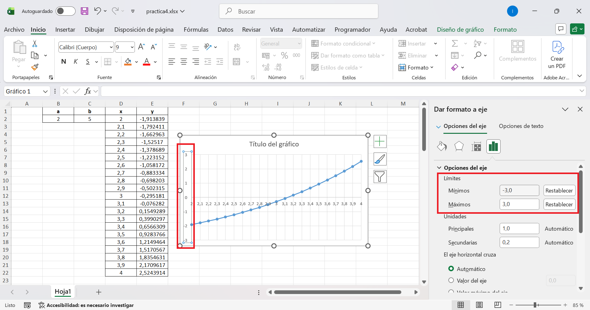
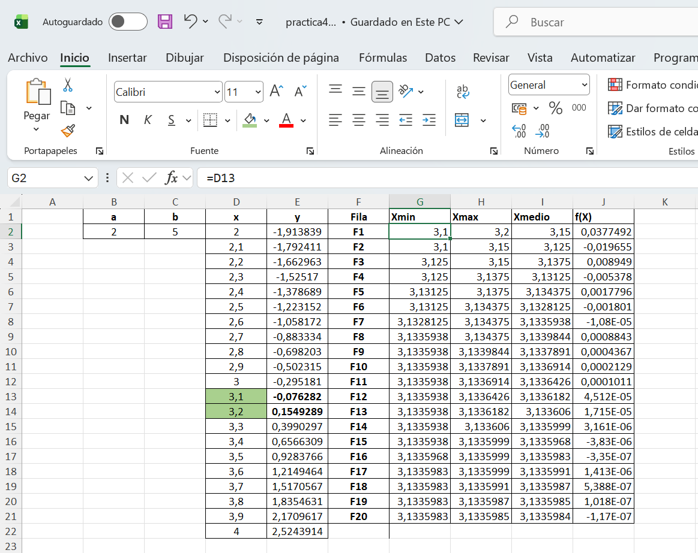
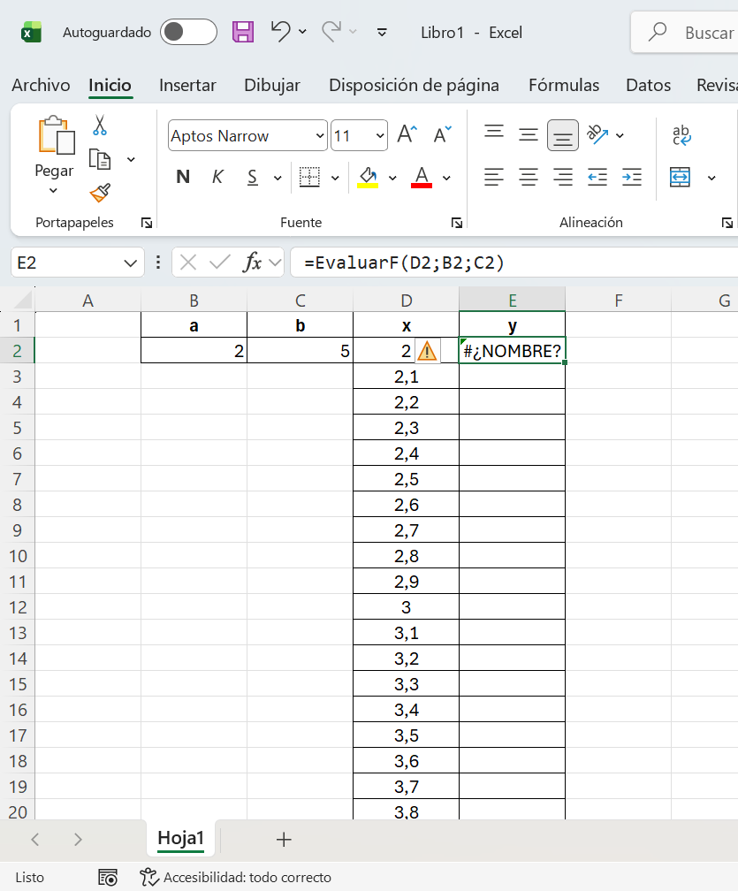
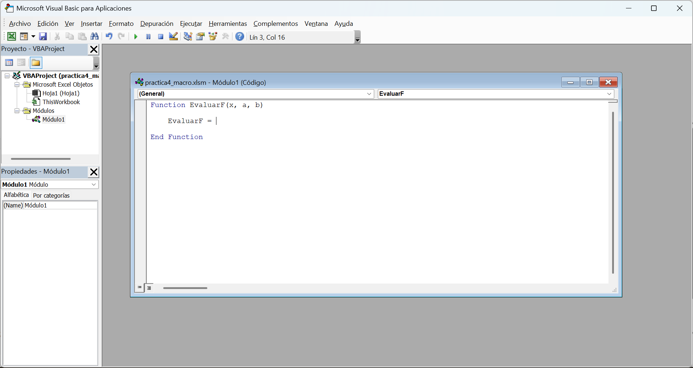

## Objetivos de la práctica
Los objetivos de esta práctica son los siguientes:

- Mostrar algunas de las capacidades más interesantes de la hoja de cálculo como herramienta de ayuda a la resolución de problemas. **No se pretende impartir un curso
de Excel**, sino despertar el interés por este tipo de herramientas, de enorme utilidad.
- **Aplicar** algunos de los **conocimientos de programación** aprendidos de esta asignatura


## Introducción

La **hoja de cálculo** es una herramienta de gran utilidad en la **resolución de problemas en ingeniería** ya que, además de permitir manejar una gran cantidad de datos y realizar
operaciones complejas de forma interactiva, proporciona una potente herramienta de
representación gráfica de datos, fácil de utilizar. De hecho, hay una gran cantidad de
problemas que pueden ser resueltos y analizados con una simple hoja de cálculo, de una
**manera rápida y eficaz**, sin tener que recurrir al desarrollo de aplicaciones específicas o al
uso de otras aplicaciones de cálculo comerciales más potentes, pero más costosas y
complejas de utilizar.

Nos centraremos en los siguientes contenidos, remitiendo al alumno interesado a la bibliografía de la asignatura para ampliar la información:

- Representación de datos simples
- Cálculo mediante fórmulas complejas
- Funciones definidas en Excel
- Composición condicional
- Composición de repetición para crear tablas de datos
- Referencias absolutas y relativas
- Creación de gráficos
- Creación de macros

Hay muchos problemas matemáticos donde no se conoce un método analítico para calcular
una solución exacta o bien la obtención de la solución es tan costosa en tiempo que no
resulta una opción válida en la práctica. En dichos casos, una alternativa es utilizar un método
numérico que aproxime la solución.

En esta práctica vamos a considerar la **resolución de ecuaciones no lineales** por **métodos iterativos** y, a modo de ejemplo, consideraremos el caso de las **curvas catenarias**. Una curva catenaria es la que describe un cable que está fijo por sus dos extremos y no está sometido a otras fuerzas distintas que su propio peso. Como es bien sabido, una **curva catenaria invertida** es un trazado útil para un **arco en arquitectura**.

](../resources/practica4/curva.jpg){#fig-curva}


La curva que describe un cable suspendido de **dos puntos** a la misma altura y cuyo **punto mínimo** es el punto **(0, $a$)** se puede escribir como:
$$
\begin{aligned}
y = a  \cdot  cosh \frac{x}{a} =a\frac{e^\frac{x}{a}+e^\frac{-x}{a}}{2}
\end{aligned}
$$


La siguiente gráfica muestra catenarias para distintos valores de $a$ :

::: {.card .shadow-sm .mb-4 .mt-4}
::: {.card-body}

```{ojs}
viewof params = {
  const cleanSlider = (range, config) => {
    const input = Inputs.range(range, config);
    const numberBox = input.querySelector("input[type=number]");
    if (numberBox) numberBox.style.display = "none";
    const rangeSlider = input.querySelector("input[type=range]");
    if (rangeSlider) rangeSlider.style.width = "100%";
    input.style.width = "100%";
    return input;
  };

  const ia = cleanSlider([0.1, 5], { value: 1, step: 0.1 });

  const col = (input, label) => {
    const val = htl.html`<div style="font-family: monospace; color: #555; margin-top: 4px;">${input.value.toFixed(1)}</div>`;
    input.addEventListener("input", () => val.textContent = input.value.toFixed(1));
    
    return htl.html`<div style="display: flex; flex-direction: column; align-items: center; margin: 0 10px; flex: 1; min-width: 120px;">
      <div style="font-weight: bold; font-size: 0.9rem; margin-bottom: 5px; white-space: nowrap;">${label}</div>
      <div style="width: 100%">${input}</div>
      ${val}
    </div>`;
  };

  const form = htl.html`<div style="display: flex; flex-wrap: wrap; justify-content: center; width: 50%; padding-bottom: 20px; border-bottom: 1px solid #eee; margin: 0 auto 20px auto;">
    ${col(ia, "Constante a")}
  </div>`;

  form.oninput = () => form.value = { a: ia.value };
  form.value = { a: ia.value };
  return form;
}
```

```{ojs}
// Extracted to its own block for proper reactivity
a = params.a
```

```{ojs}
{
  const curve = Array.from({ length: 401 }, (_, i) => {
    const x = -10 + i * 0.05;
    
    // THE FIX: Clamp the max y-value to 20 so it gracefully goes off-screen 
    // without crashing the SVG `<path>` renderer.
    const y = Math.min(20, a * Math.cosh(x / a));
    
    return { x, y };
  });

  const points = [];
  
  if (a !== 0) {
    points.push({ 
      x: 0, 
      y: a, 
      type: "Vertex", 
      label: `V=(0, ${a.toFixed(2)})` 
    });
  }

  const curve_plot = Plot.plot({
    height: 400,
    grid: true,
    marginLeft: 40, 
    marginRight: 20,
    x: { domain: [-4, 4], label: "x axis" },
    y: { domain: [-0, 6], label: "y axis" }, 
    marks: [
      Plot.ruleY([0], { stroke: "#888", strokeWidth: 1.5 }),
      Plot.ruleX([0], { stroke: "#888", strokeWidth: 1.5 }),
      Plot.line(curve, { x: "x", y: "y", stroke: "steelblue", strokeWidth: 3 }),
      Plot.dot(points, { 
        x: "x", 
        y: "y", 
        fill: "#f49e61", 
        r: 6, 
        stroke: "white", 
        strokeWidth: 2 
      }),
      Plot.text(points, { 
        x: "x", 
        y: "y", 
        text: "label", 
        dy: -15, 
        fill: "currentColor", 
        stroke: "white", 
        strokeWidth: 4, 
        fontWeight: "bold", 
        fontSize: 12 
      })
    ]
  });
  
  curve_plot.style.width = "100%";
  return curve_plot;
}
```
:::
:::
En esta práctica vamos a resolver la ecuación $y = b$, para un número real $b$. Para ello,
consideraremos la función $f(x) = y  –  b$ y buscaremos la solución a la ecuación $f(x) = 0$.

## Obtención gráfica de la solución

1. Abrir Excel y la opción un Libro en blanco.

2. En las celdas **B2 , C2** escribiremos los valores de **a** y **b**. Por ejemplo, **a = 2** y **b = 5**.
Podemos utilizar la columna **B1** y **C1** para añadir texto que permita explicar el significado de las celdas de abajo, escribiendo los nombres **a** y **b**. 

3. Buscaremos un intervalo de valores entre los que sepamos que se encuentra la solución,
de manera que en ambos extremos del intervalo la función cambie de signo. Como la
función $f$ es continua, esto implica que existe un valor intermedio donde la función toma un
valor nulo. Por ejemplo, la @fig-curva anterior muestra que el valor de $x$ donde $f(x) = 5$ está en
$[2, 4]$, y además $f(2) < 0$ y $f(4) > 0$. Por tanto, los valores de $x$ irán en el rango $[2, 4]$, con un incremento de $0,1$ entre cada valor.

4. Crear una tabla con los valores de $f(x)$ en función de $x$, en las celdas $D2-E22$. Esto se
realizará en los pasos 5. al 7. No basta con crear la tabla, es obligatorio utilizar correctamente referencias absolutas y relativas.

5. Para rellenar los valores de $x$, se introduce el primer valor **2** en la celda **D2**, se
marca junto a las celdas a rellenar **D2-D22** y se selecciona la opción del menú:
`Inicio > Rellenar > Series`, indicando el **Incremento** de valor deseado (en este
caso, **0,1**). En **D1** dejar **x** y en **E1** dejar **y**.

6. Introducir en la celda **E2** la fórmula para calcular $f(x)$ a partir del valor de $x$ en la
celda a su izquierda (**D2**). Excel incluye la función **COSH** para calcular un coseno
hiperbólico.

7. Copiar el valor de la celda **E2** en las celdas **E3-E22**. 


::: {.callout-warning}
## Error de actualización

Excel ha ajustado
automáticamente la fórmula, pero el resultado no es correcto: $x$ se ha actualizado
correctamente, pero las referencias a los valores de **a** y **b** también.

:::

8. Para solucionar esto, modificaremos la fórmula en **E2** combinando el uso de
**referencias absolutas** (que se mantendrán constantes al copiar la celda) y **relativas**
(que se actualizarán al ser copiadas). 
Para hacer referencias absolutas (de modo que no cambien automáticamente al copiarse la celda) se añade un carácter **$** entre la letra del nombre de la celda o usar el atajo de teclado con ``F4`` o ``Fn+F4``, por ejemplo la celda **\$B\$2** . Haz los cabios correspondientes con el resto de referencias absolutas.

9. Ahora sí, volver a copiar el valor de la celda **E2** en las celdas de la tabla **E3-E22**.

10. Seleccionar **D2-E22** e insertar un gráfico **XY Dispersión**. Pinchando en cada eje,
podemos cambiar el rango de valores mostrado, como ilustra la @fig-graf1:

{#fig-graf1}


11. Podemos observar en la @fig-graf2  que el resultado está en **[3,1, 3,2]**. Si se repite el proceso
con valores de $x$ en ese rango en vez de en el rango **[2, 4]**, el resultado será más preciso
(también habría que reducir también el incremento a, por ejemplo **0,01**).

{#fig-graf2}

12. Guardar el fichero de Excel con extensión *.xlsx  ejemplo: `practica4.xlsx` .

## Automatización mediante el método de bisección

En lugar de repetir el proceso a mano, vamos a automatizarlo: comenzaremos con un intervalo e iremos reduciéndolo por el **método de bisección** hasta obtener una solución que
nos parezca suficientemente buena.

1. En las celdas **G1-J1** escribiremos los nombres **Xmin** (valor mínimo del intervalo),
**Xmax** (valor máximo), **Xmedio** (valor del punto medio) y **f(x)** (valor de la función $f$ en el
punto **Xmedio**).


2. En las celdas **G2** y **H2** escribiremos los extremos del intervalo inicial, tales que **f(G2)** y
**f(H2)** tengan distinto signo: $f(3,1) < 0$ y $f(3,2) > 0$. Es decir en  **G2** poner **3,1** y **H2** poner **3,2**.

3. En la celda **I2** escribiremos una fórmula para **calcular el punto medio del intervalo**. Es decir la media de  **G2** y **H2**.

4. En la celda **J2** calculamos el resultado de evaluar la función $f$ en el punto indicado en
la celda **I2**. El valor de **a** y **b** se mantienen para evaluar $f$. 

5. En la fila **3** (celdas **G3** y **H3**) definiremos un nuevo extremo para el intervalo. **Si f(xMedio) es negativo**, seleccionaremos el rango **[xMedio, xMax]** en la siguiente iteración. **Si es positivo**, seleccionaremos **[xMin, xMedio]**. Usar la funcion **=SI**.

6. Copiar las celdas **I2** y **J2** en **I3** y **J3**, respectivamente.

7. Copiar la fila **3** en la fila **4** y repetir este proceso hasta que se obtenga una solución suficientemente buena. Con **20 filas** obtendremos un resultado suficientemente bueno.

{#fig-graf3}


12. Guardar cambios sobre el fichero `practica4.xlsx` .

## Creación de una macro

Por último, vamos a crear una **macro** que permita calcular nuestra función $f$.

1. En un nuevo fichero de Excel y Libro. Por ejemplo, esto
nos permitirá escribir una **fórmula para evaluar la función en el punto indicado** por la
celda **E2** (función EvaluarF)), suponiendo que **B2** contiene el valor de **a** y que **C2** contiene el valor de **b** y **D2** el valor de **x**. Es decir, nuestra función recibirá 3 parámetros de entrada: los valores de $x$, $a$ y $b$ (Ver @fig-graf4).

{#fig-graf4}

::: {.callout-warning}
## Error de función
Excel no encuentra la función llamada **EvaluarF**, intenta ahora usar la función **SUMA** y darle algun rango de celdas. Las funciones inician con el carácter **=**.

{#fig-graf5}
:::

2. Vamos a crear nuestra función **EvaluarF**. Ir al menú de  `Archivo > Opciones > Personalizar cinta de opciones`. Dar click en la opcion **Desarrollador** o **Programador** (Ver @fig-graf6)

{#fig-graf6}


3. En el menú  `desarrollador > Visual Basic` , aparecera una nueva pantalla (de Visual Basic) ahora hacer click en el menú `Insertar > módulo`, copiar y pegar el código de abajo (Ver @fig-graf7).
```java
Function EvaluarF(x, a, b)
  EvaluarF = ...
End Function
```
Los `...` indican que falta por completar el código de la función. Completa (teniendo en cuenta que en Visual Basic hay una función **Exp(x)** para calcular una exponencial, pero no una función **COSH** para calcular el coseno hiperbólico):

{#fig-graf7}

<details>
<summary>💡 Solución</summary>
{#fig-graf8}
</details>
:::

4. Cerra la ventana de **Visual Basic**,  Guardar el fichero de Excel con extensión *.xlsm  ejemplo: `practica4_macro.xlsm` .

5. Una vez guardado el fichero de Excel, probaremos sobre **E2** la función **EvaluarF**. Haz lo mismo para las celdas **E3-E22**. Tener cuidado nuevamente con las referencias absolutas.

<details>
<summary>💡 Solución</summary>
{#fig-graf9}
</details>

## Ficheros dentro de un zip (practica4.zip)
- `practica4.xlsx`
- `practica4_macro.xlsm`