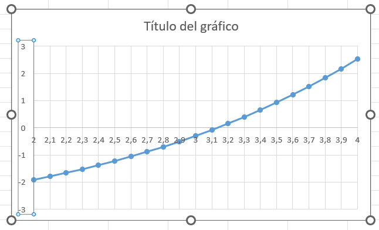
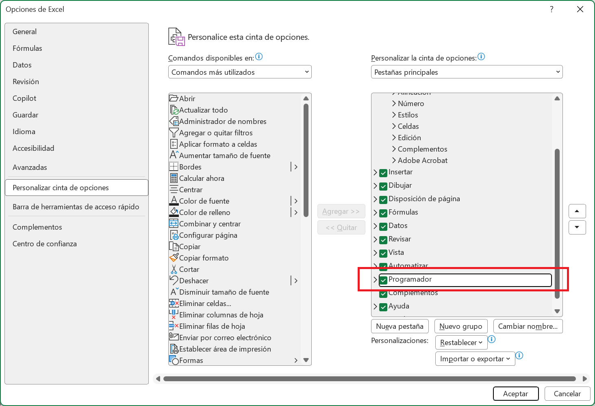
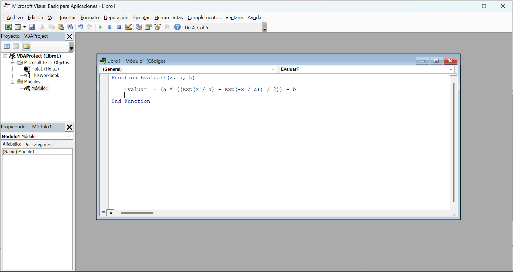
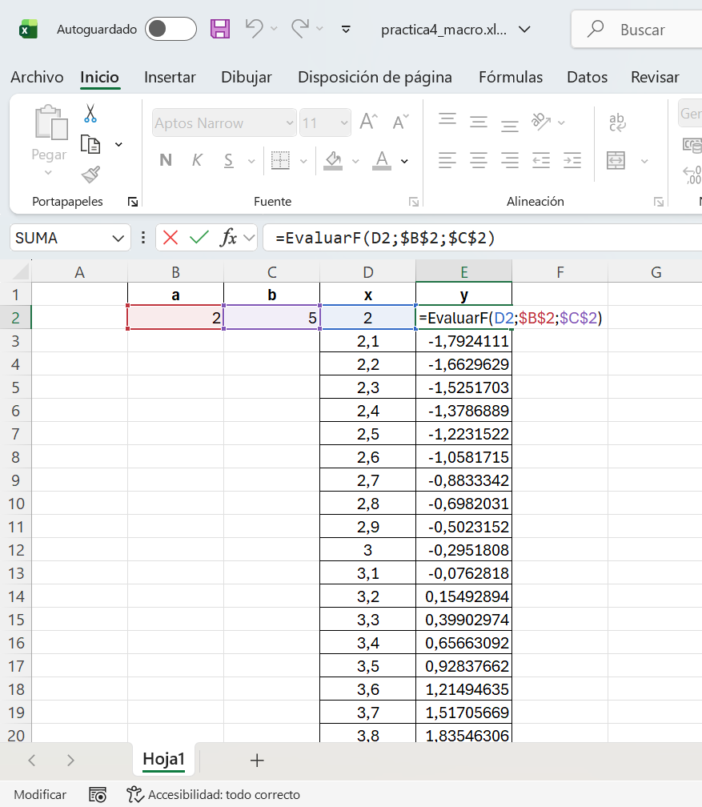

## Objetivos de la práctica

Los objetivos de esta práctica son los siguientes:

- Mostrar algunas de las capacidades más interesantes de una hoja de cálculo como herramienta para la resolución de problemas. **No se pretende impartir un curso
de Excel**, sino despertar el interés por herramientas de enorme utilidad.
- **Aplicar** algunos de los **conocimientos de programación** aprendidos en esta asignatura.

---

## Introducción

Una **hoja de cálculo** es una herramienta de gran utilidad en la **resolución de problemas en ingeniería** dado que, además de permitir manejar una gran cantidad de datos y realizar operaciones complejas de forma interactiva, proporciona una potente herramienta de representación gráfica de datos, fácil de utilizar. De hecho, hay una gran cantidad de problemas que pueden ser resueltos y analizados con una simple hoja de cálculo, de una **manera rápida y eficaz**, sin tener que recurrir al desarrollo de aplicaciones específicas o al uso de otras aplicaciones de cálculo comerciales más potentes, pero más costosas y complejas de utilizar.

---

Nos centraremos en los siguientes puntos, aunque para profundizar en ellos se recomienda consultar la documentación oficial de Excel y la bibliografía recomendada:

- Representación de datos simples.
- Cálculo mediante fórmulas complejas.
- Funciones de Excel.
- Estructuras condicionales.
- Repetición para crear tablas de datos.
- Referencias absolutas y relativas.
- Creación de gráficos.
- Creación de macros.

---

## Ecuaciones no lineales y métodos iterativos

Hay muchos problemas matemáticos donde **no se conoce un método analítico para calcular una solución exacta o bien el método para obtener la solución es tan costoso que no resulta una opción válida** para obtener un resultado con un tiempo de respuesta bajo. En dichos casos, una alternativa es utilizar un método numérico que **aproxime** la solución.

---

Como caso de estudio consideraremos la **curva catenaria**. Desde el punto de vista físico, una catenaria describe la forma que adopta un cable suspendido por sus extremos y sometido exclusivamente a la acción de su propio peso. La **catenaria invertida**, obtenida al reflejar la curva respecto de un eje horizontal, presenta una propiedad estructural especialmente relevante en arquitectura: bajo cargas gravitatorias uniformes, el esfuerzo interno es predominantemente de compresión, lo que la convierte en una forma óptima para el diseño de arcos y bóvedas.

::: {.column-margin}
](../resources/practica4/ejemplos_catenarias.jpg){#fig-ejemplos-catenarias}
:::

---

Un ejemplo de su aplicación es la obra del arquitecto **Antonio Gaudí**, quien empleó modelos físicos de catenarias invertidas para el diseño de la **Sagrada Familia** en Barcelona, tal como se ilustra en la @fig-ejemplos-catenarias.

Podéis utilizar la web [**WikiArchitect**](https://es.wikiarquitectura.com/) para explorar información sobre edificios, arquitectos y obras de distintos lugares del mundo. Su principal ventaja es que permite buscar proyectos mediante distintos criterios, como el país, el tipo de edificio o el nombre de una obra concreta. En el contexto de esta práctica, puede ser especialmente útil para localizar ejemplos arquitectónicos en los que aparezcan arcos, bóvedas o formas relacionadas con la curva **catenaria**, y así relacionar el modelo matemático que vamos a trabajar en clase con aplicaciones reales en arquitectura.

También podéis encontrar más información sobre las curvas catenarias en el siguiente vídeo:



---

### Curva catenaria

La curva que describe un cable suspendido de **dos puntos a la misma altura** y cuyo **punto mínimo** es el punto $(0,a)$ se puede escribir como:

$$
y = a \cosh\left(\frac{x}{a}\right)
  = a \frac{e^{x/a} + e^{-x/a}}{2}
$$

donde $a > 0$ es un parámetro real que controla la forma de la curva y la tensión del cable. Valores mayores de $a$ producen una curva más ancha y menos tensa, mientras que valores menores de $a$ producen una curva más estrecha y más tensa.

---

En esta práctica vamos a resolver la ecuación $y = b$, para un número real $b$. Para ello, consideraremos la función:

$$
f(x) = a \cosh\left(\frac{x}{a}\right) - b
$$

y buscaremos las soluciones de la ecuación $f(x) = 0$.

Podéis interactuar con la curva catenaria a continuación, modificando el valor de la constante $a$ para ver cómo afecta a la forma de la curva. También podéis modificar el valor de $b$ para ver cómo afecta a la posición de la línea horizontal y a las soluciones de la ecuación $f(x) = 0$. El punto mínimo de la curva se denomina **vértice** y aparece marcado como un punto naranja. Las soluciones de la ecuación $f(x) = 0$ aparecen marcadas como puntos rojos.

---

::: {.column-page-inset}
::: {.card .shadow-sm .mb-4 .mt-4}
::: {.card-body}

<div style="display: flex; gap: 30px; align-items: flex-start;">
<div style="flex: 0 0 20%;">
```{ojs}
viewof params = {
  const cleanSlider = (range, config) => {
    const input = Inputs.range(range, config);
    const numberBox = input.querySelector("input[type=number]");
    if (numberBox) numberBox.style.display = "none";
    const rangeSlider = input.querySelector("input[type=range]");
    if (rangeSlider) rangeSlider.style.width = "100%";
    input.style.width = "100%";
    return input;
  };

  const ia = cleanSlider([0.1, 5], { value: 1, step: 0.1 });
  const ib = cleanSlider([0, 6], { value: 2, step: 0.1 });

  const col = (input, label) => {
    const val = htl.html`<div style="font-family: monospace; color: #555; margin-top: 4px;">
      ${input.value.toFixed(1)}
    </div>`;
    input.addEventListener("input", () => 
      val.textContent = input.value.toFixed(1)
    );
    
    return htl.html`
      <div style="display: flex; flex-direction: column; margin-bottom: 20px;">
        <div style="font-weight: bold; font-size: 0.9rem; margin-bottom: 5px;">
          ${label}
        </div>
        ${input}
        ${val}
      </div>`;
  };

  const form = htl.html`
    <div style="width: 100%;">
      ${col(ia, "Constante a")}
      ${col(ib, "Nivel b")}
    </div>`;

  form.oninput = () => form.value = { a: ia.value, b: ib.value };
  form.value = { a: ia.value, b: ib.value };
  return form;
}
```

```{ojs}
a = params.a
b = params.b
```
</div> 
  <!-- Right column -->
  <div style="flex: 1;">
```{ojs}
{
  const curve = Array.from({ length: 401 }, (_, i) => {
    const x = -10 + i * 0.05;
    const y = Math.min(20, a * Math.cosh(x / a));
    return { x, y };
  });

  const points = [];
  if (a !== 0) {
    points.push({ 
      x: 0, 
      y: a, 
      label: `V=(0, ${a.toFixed(2)})` 
    });
  }

  const yline = [{ x: -4, y: b }, { x: 4, y: b }];
  const intersections = [];
  if (b >= a) {
    const xsol = a * Math.acosh(b / a);
    intersections.push({ x: xsol, y: b });
    if (xsol !== 0) {
      intersections.push({ x: -xsol, y: b });
    }
  }

  const curve_plot = Plot.plot({
    height: 300,
    grid: true,
    marginLeft: 40,
    x: { domain: [-4, 4], label: "x axis" },
    y: { domain: [0, 6], label: "y axis" },
    marks: [
      Plot.ruleY([0], { stroke: "#888" }),
      Plot.ruleX([0], { stroke: "#888" }),
      Plot.line(curve, { x: "x", y: "y", stroke: "steelblue", strokeWidth: 3 }),
      Plot.dot(points, { x: "x", y: "y", fill: "#f49e61", r: 6 }),
      Plot.text(points, { x: "x", y: "y", text: "label", dy: -15 }),
      Plot.line(yline, { x: "x", y: "y", stroke: "red", strokeDasharray: "4 4" }),
      Plot.dot(intersections, { x: "x", y: "y", fill: "red", r: 5 })
    ]
  });

  curve_plot.style.width = "100%";
  return curve_plot;
}
```
</div></div>
:::
:::
:::

---

## Representación gráfica de la solución

Los pasos a seguir para representar gráficamente la función $f$ y obtener una aproximación de la solución a la ecuación $f(x) = 0$ son los siguientes:

1. Abrir *Excel* y crear un `Libro en blanco`.

2. En las celdas `B2`, `C2` escribiremos los valores de $a$ y $b$. Por ejemplo, $a = 2$ y $b = 5$. Asimismo, podemos utilizar las columnas `B1` y `C1` para añadir texto que permita explicar el significado de las celdas de abajo, escribiendo **a** y **b**. Fijaros en la @fig-grafico-limites-ejes para ver un ejemplo de cómo debería quedar la hoja de cálculo en este punto.

3. Buscaremos un intervalo de valores entre los que sepamos que se encuentra la solución, de manera que en ambos extremos del intervalo la función cambie de signo. Como la función $f$ es continua, esto implica que entre dicho valor existe un valor intermedio donde la función toma el valor $0$. Por ejemplo, la gráfica de la derecha muestra que el valor de $x$ donde $f(x) = 5$ está en $[2, 4]$, y además $f(2) < 0$ y $f(4) > 0$. Por tanto, los valores de $x$ irán en el rango $[2, 4]$, con un incremento de $0,1$ entre cada valor.

---

```{ojs}
//| column: margin

{
  const a = 2;
  const b = 5;

  const curve = Array.from({ length: 401 }, (_, i) => {
    const x = -6 + i * 0.03;
    const y = Math.min(20, a * Math.cosh(x / a));
    return { x, y };
  });

  // Horizontal line y = b
  const yline = [{ x: -6, y: b }, { x: 6, y: b }];

  // Intersections
  const intersections = [];
  if (b >= a) {
    const xsol = a * Math.acosh(b / a);
    intersections.push({ x: xsol, y: b });
    if (xsol !== 0) {
      intersections.push({ x: -xsol, y: b });
    }
  }

  return Plot.plot({
    height: 450,
    grid: true,
    marginLeft: 40,
    x: { domain: [-6, 6] },
    y: { domain: [0, 8] },
    style: { fontSize: "1.4em" },
    marks: [
      Plot.rect(
        [{ x1: 2, x2: 4, y1: 0, y2: 8 }],
        {
          x1: "x1",
          x2: "x2",
          y1: "y1",
          y2: "y2",
          fill: "orange",
          fillOpacity: 0.15
        }
      ),
      Plot.ruleY([0], { stroke: "#888" }),
      Plot.ruleX([0], { stroke: "#888" }),
      Plot.line(curve, { x: "x", y: "y", stroke: "steelblue", strokeWidth: 3 }),
      Plot.line(yline, { x: "x", y: "y", stroke: "red", strokeDasharray: "4 4" }),
      Plot.dot(intersections, { x: "x", y: "y", fill: "red", r: 5 })
    ]
  });
}
```

---

4. A continuación, en los pasos **5, 6 y 7**, crearemos una tabla con los valores de $f(x)$ en función de $x$, en las celdas `D2-E22`. No basta con crear la tabla, es obligatorio utilizar correctamente referencias absolutas y relativas.

5. Para rellenar los valores de $x$, se introduce el primer valor, $2$, en la celda `D2`. Después, marcamos las celdas a rellenar, `D2-D22` y utilizamos la opción `Inicio > Rellenar > Series` (sección de `Edición`), indicando el **incremento** de valor deseado (en este caso, **0,1**). Igual que antes, podemos indicar en `D1` y `E1` el significado de cada columna, escribiendo **x** y **y**, respectivamente.

6. Introduce en la celda `E2` la fórmula para calcular $f(x)$ a partir del valor de $x$ en la celda `D2`. *Excel* incluye la función `COSH` para calcular un coseno hiperbólico.

7. Copia el valor de la celda `E2` en las celdas `E3-E22`. 

::: {.callout-warning}
## Error de actualización

*Excel* ajusta automáticamente la fórmula, pero el resultado no es correcto; $x$ se ha actualizado correctamente, pero las referencias a los valores de $a$ y $b$ también. 
:::

---

8. Para solucionar el problema anterior, modificaremos la fórmula en `E2` combinando el uso de **referencias absolutas** (que se mantendrán constantes al copiar la celda) y **relativas** (que se actualizarán al ser copiadas). Para crear referencias absolutas, de modo que no cambien automáticamente al copiarse la celda, se añade un carácter `$` entre la letra y el número (por ejemplo, `$B$2`). También podéis usar el atajo de teclado con `F4` o `Fn+F4`. Haz los cambios correspondientes para utilizar referencias absolutas para los valores de $a$ y $b$ (celdas `B2` y `C2`) y referencias relativas para el valor de $x$ (celda `D2`).

9. Ahora sí, propagad el valor de la celda `E2` a las celdas `E3-E22`.

---

10. Seleccionamos `D2-E22` e insertamos un gráfico de tipo **XY Dispersión** (abrid el menú de gráficos, pinchando en la esquina inferior derecha). Haciendo click en cada eje podemos cambiar el rango de valores mostrado, como muestra la @fig-grafico-limites-ejes:

{#fig-grafico-limites-ejes}

---

11. Podemos observar en la @fig-grafico-xy-dispersion que el valor cero de $f(x)$ se alcanza en **[3.1, 3.2]**. Si se repite el proceso con valores de $x$ en el intervalo **$[2, 4]$** e incremento **0.01**, el resultado será más preciso. 

{width="65%" #fig-grafico-xy-dispersion}

---

12. Guarda el fichero de *Excel* con extensión `.xlsx`, por ejemplo, `practica4.xlsx`.

---

## Automatización mediante el método de bisección

En lugar de repetir el proceso a mano, vamos a automatizarlo. Comenzaremos con un intervalo e iremos reduciéndolo por el **método de bisección** hasta obtener una solución que
nos parezca suficientemente buena.

El **método de bisección** es un método numérico para encontrar soluciones de funciones continuas. El método se basa en el teorema del valor intermedio, que establece que si una función cambia de signo en un intervalo, entonces debe tener al menos una solución en ese intervalo. El método de bisección consiste en dividir el intervalo en dos partes iguales y determinar en cuál de las dos partes se encuentra la raíz, repitiendo este proceso iterativamente hasta alcanzar la precisión deseada. 

---

::: {.column-page-inset}
::: {.card .shadow-sm .mb-4 .mt-4}
::: {.card-body}

<div style="display: flex; gap: 28px; align-items: flex-start; flex-wrap: wrap;">
<div style="flex: 0 0 260px; min-width: 230px;">
```{ojs}
viewof bisectParams = {
  function cleanSlider(range, config) {
    const input = Inputs.range(range, config);
    const numberBox = input.querySelector("input[type=number]");
    if (numberBox) numberBox.style.display = "none";

    const rangeSlider = input.querySelector("input[type=range]");
    if (rangeSlider) {
      rangeSlider.style.width = "100%";
      rangeSlider.style.accentColor = "#2563eb";
    }

    input.style.width = "100%";
    return input;
  }

  function makeControl(input, label, fmt = x => x.toFixed(1), color = "#2563eb") {
    const value = htl.html`<div style="
      margin-top: 8px;
      display: inline-block;
      padding: 4px 10px;
      border-radius: 999px;
      background: ${color};
      color: white;
      font-family: monospace;
      font-size: 0.90rem;
      font-weight: 700;
    ">${fmt(input.value)}</div>`;

    input.addEventListener("input", () => {
      value.textContent = fmt(input.value);
    });

    return htl.html`
      <div style="
        margin-bottom: 18px;
        padding: 14px 14px 12px 14px;
        border: 1px solid #e5e7eb;
        border-radius: 14px;
        background: linear-gradient(180deg, #ffffff 0%, #f8fafc 100%);
      ">
        <div style="
          font-weight: 700;
          font-size: 0.93rem;
          margin-bottom: 8px;
          color: #1f2937;
        ">${label}</div>
        ${input}
        ${value}
      </div>
    `;
  }

  const aSlider = cleanSlider([0.5, 5], { value: 2.0, step: 0.1 });
  const bSlider = cleanSlider([0.5, 8], { value: 5.0, step: 0.1 });
  const stepSlider = cleanSlider([0, 5], { value: 0, step: 1 });

  const form = htl.html`
    <div style="width: 100%;">
      <div style="
        font-size: 1rem;
        font-weight: 800;
        margin-bottom: 14px;
        color: #111827;
      ">
        Método de bisección
      </div>

      ${makeControl(aSlider, "Constante a", x => x.toFixed(1), "#2563eb")}
      ${makeControl(bSlider, "Nivel b", x => x.toFixed(1), "#dc2626")}
      ${makeControl(stepSlider, "Iteración", x => `${x}`, "#7c3aed")}
    </div>
  `;

  form.oninput = () => {
    form.value = {
      a: +aSlider.value,
      b: +bSlider.value,
      step: +stepSlider.value
    };
  };

  form.value = {
    a: +aSlider.value,
    b: +bSlider.value,
    step: +stepSlider.value
  };

  return form;
}

aBis = bisectParams.a
bBis = bisectParams.b
stepBis = bisectParams.step
```
</div>
<div style="flex: 1 1 520px; min-width: 320px;">
```{ojs}
{
  function f(x, a, b) {
    return a * Math.cosh(x / a) - b;
  }

  function bracketRoot(a, b) {
    const xmin = 3.1;
    const xmax = 3.2;

    if (f(xmin, a, b) * f(xmax, a, b) > 0) return null;
    return { xmin, xmax };
  }

  const bracket = bracketRoot(aBis, bBis);

  if (!bracket) {
    return htl.html`<div style="
      padding: 18px;
      border-radius: 14px;
      background: #fff7ed;
      border: 1px solid #fed7aa;
      color: #9a3412;
      font-weight: 600;
    ">
      No hay cambio de signo en el intervalo <span style="font-family: monospace;">[2,4]</span>.
    </div>`;
  }

  let xmin = bracket.xmin;
  let xmax = bracket.xmax;

  for (let i = 0; i < stepBis; ++i) {
    const xmid = 0.5 * (xmin + xmax);
    const fxmin = f(xmin, aBis, bBis);
    const fxmid = f(xmid, aBis, bBis);

    if (fxmin * fxmid <= 0) xmax = xmid;
    else xmin = xmid;
  }

  const xmid = 0.5 * (xmin + xmax);

  const curveXMin = 3.05;
  const curveXMax = 3.25;

  const curve = Array.from({ length: 400 }, (_, i) => {
    const x = curveXMin + (curveXMax - curveXMin) * i / 399;
    return { x, y: f(x, aBis, bBis) };
  });

  const yValues = curve.map(d => Math.abs(d.y));
  const yLim = Math.max(...yValues, 1e-3) * 1.1;

  const band = [{
    x1: xmin,
    x2: xmax,
    y1: -yLim,
    y2: yLim
  }];

  const endpointGuides = [
    { x: xmin },
    { x: xmax }
  ];

  const midpointGuide = [
    { x: xmid }
  ];

  const endPoints = [
    { x: xmin, y: f(xmin, aBis, bBis) },
    { x: xmax, y: f(xmax, aBis, bBis) }
  ];

  const midPoint = [
    { x: xmid, y: f(xmid, aBis, bBis) }
  ];

  const overlayLabels = [
    { x: 2.18, y: yLim * 0.88, text: `xmin = ${xmin.toFixed(3)}`, color: "#b45309" },
    { x: 2.7, y: yLim * 0.88, text: `f(xMedio) = ${f(xmid, aBis, bBis).toExponential(2)}`, color: "#1d4ed8" },
    { x: 3.68, y: yLim * 0.88, text: `xmax = ${xmax.toFixed(3)}`, color: "#b45309" }
  ];

  const plot = Plot.plot({
    height: 350,
    marginLeft: 52,
    marginRight: 18,
    marginTop: 18,
    marginBottom: 40,
    grid: true,
    x: {
      domain: [curveXMin, curveXMax],
      label: "x"
    },
    y: {
      domain: [-yLim, yLim],
      label: "f(x)"
    },
    marks: [
      Plot.rect(band, {
        x1: "x1",
        x2: "x2",
        y1: "y1",
        y2: "y2",
        fill: "#f59e0b",
        fillOpacity: 0.12
      }),

      Plot.ruleY([0], {
        stroke: "#9ca3af",
        strokeWidth: 1.2
      }),

      Plot.ruleX([0], {
        stroke: "#d1d5db",
        strokeWidth: 1
      }),

      Plot.line(curve, {
        x: "x",
        y: "y",
        stroke: "#2563eb",
        strokeWidth: 3.2
      }),

      Plot.ruleX(endpointGuides, {
        x: "x",
        stroke: "#f59e0b",
        strokeOpacity: 0.45,
        strokeDasharray: "4 4"
      }),

      Plot.ruleX(midpointGuide, {
        x: "x",
        stroke: "#7c3aed",
        strokeOpacity: 0.7,
        strokeDasharray: "6 4",
        strokeWidth: 2
      }),

      Plot.dot(endPoints, {
        x: "x",
        y: "y",
        r: 7,
        fill: "#f59e0b",
        stroke: "white",
        strokeWidth: 2
      }),

      Plot.dot(midPoint, {
        x: "x",
        y: "y",
        r: 8.5,
        fill: "#dc2626",
        stroke: "white",
        strokeWidth: 2.5
      }),

      Plot.text(overlayLabels, {
        x: "x",
        y: "y",
        text: "text",
        fill: "color",
        fontSize: 13,
        fontWeight: 600
      })
    ]
  });

  plot.style.width = "100%";
  return plot;
}
```
</div></div>

:::
:::
:::

---

1. En las celdas `G1-J1` escribiremos los nombres **Xmin** (valor mínimo del intervalo),
**Xmax** (valor máximo), **Xmedio** (valor del punto medio) y **f(x)** (valor de la función $f$ en el punto **Xmedio**).

2. En las celdas `G2` y `H2` escribiremos los extremos del intervalo inicial, tales que $f(G2)$ y $f(H2)$ tengan distinto signo: $f(3.1) < 0$ y $f(3.2) > 0$. Es decir, en `G2` escribimos **3,1** y en `H2` **3,2**.

3. En la celda `I2` escribimos la fórmula para **calcular el punto medio del intervalo**, es decir, la media de `G2` y `H2`.

---

4. En la celda `J2` calculamos el resultado de evaluar la función $f$ en el punto indicado en la celda `I2`. El valor de `a` y `b` se mantiene para evaluar $f$. 

5. En la fila **3** (celdas `G3` y `H3`) definimos un nuevo extremo para el intervalo. **Si f(xMedio) es negativo**, seleccionamos el intervalo **[xMedio, xMax]** en la siguiente iteración. **Si es positivo**, utilizamos **[xMin, xMedio]**. Usa la funcion `=SI` para resolver esta composición condicional.

6. Copia las celdas `I2` y `J2` en `I3` y `J3`, respectivamente.

---

7. Copia la fila **3** en la fila **4** y repite este proceso hasta que se obtenga una solución suficientemente buena. Con **20 filas** debería ser suficiente para obtener una aproximación de la solución con un error menor a $10^{-6}$.

{#fig-biseccion}

8. Guarda los cambios en el fichero `practica4.xlsm`.

---

## Creación de una macro

Por último, vamos a crear una **macro** que permita calcular nuestra función $f$. Una **macro** no es más que una función que nos permitirá escribir una **fórmula para evaluar la función en un punto** dado por la celda `E2` (función `EvaluarF`), suponiendo que `B2` contiene el valor de $a$ y que `C2` contiene el valor de $b$ y `D2` el valor de $x$. Es decir, nuestra función recibirá 3 parámetros de entrada: los valores de $x$, $a$ y $b$ (fíjate en la @fig-ejemplo-evaluarf).

1. Crea un nuevo libro de *Excel* y en la celda `E2` escribe la fórmula `=EvaluarF(D2, B2, C2)`.
  
---

::: {.column-margin}
{#fig-ejemplo-evaluarf}
:::

---

::: {.callout-warning}
## Error de función no definida

Por ahora, *Excel* no encuentra la función llamada `EvaluarF`. En su lugar, intenta utilizar la función `SUMA` y especifica un rango de celdas. Las funciones deben comenzar con el carácter `=`.

{width="50%" #fig-error-evaluarf}
:::

---

2. Creamos la función `EvaluarF`. Para ello, utilizamos la opción del menú `Archivo > Opciones > Personalizar cinta de opciones` y activamos **Desarrollador** o **Programador** (ver @fig-programador).

{#fig-programador}

---

3. En la opción del menú `Desarrollador > Visual Basic` aparecerá una nueva ventana. Después de utilizar la opción `Insertar > módulo`, copia y pega el código siguiente (ver @fig-evaluarf_macro).

```java
Function EvaluarF(x, a, b)
  EvaluarF = ...
End Function
```

Los puntos suspensivos `...` indican el código que debéis completar en la función, teniendo en cuenta que en *Visual Basic* hay una función exponencial `Exp(x)`, pero no una función `COSH` para calcular el coseno hiperbólico, por lo que tendréis que escribir la fórmula de la función $f$ utilizando `Exp` para calcular el coseno hiperbólico.

::: {.callout-tip}
## Programación en *Visual Basic*

Al igual que en Java, nuestra función en *Visual Basic* debe utilizar operaciones como la suma (`+`), la resta (`-`), la multiplicación (`*`) y la división (`/`). Rercuerda además que los paréntesis se utilizan para indicar el orden de las operaciones. De nuevo, recuerda que la curva catenaria se define como $f(x) = a \frac{e^{x/a} + e^{-x/a}}{2} - b$.
:::

---

{#fig-evaluarf_macro}

<!--<details>
<summary>💡 Solución</summary>
{#fig-solucion-evaluarf}
</details>-->

---

4. Cierra la ventana de ***Visual Basic*** y guarda el fichero de *Excel* con extensión `.xlsm`. Por ejemplo, guárdalo con el nombre `practica4_macro.xlsm`.

5. Una vez guardado el fichero de *Excel*, probaremos sobre `E2` la macro `EvaluarF`. Haz lo mismo para las celdas `E3-E22`. Tened cuidado nuevamente con las referencias absolutas.

---

<details>
<summary>💡 Solución</summary>
{#fig-resultado_evaluarf}
</details>

---

## Entrega de la solución

**Sólo debe realizar la entrega un miembro del grupo**. Sube a Moodle un **fichero comprimido `practica4.zip`** que contenga los siguientes archivos:

- `practica4.xlsx`
- `practica4_macro.xlsm`

---
