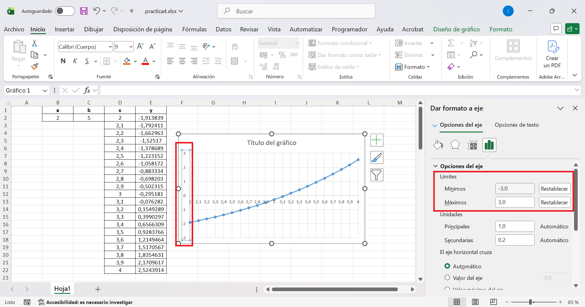
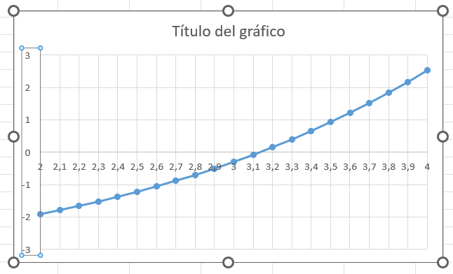
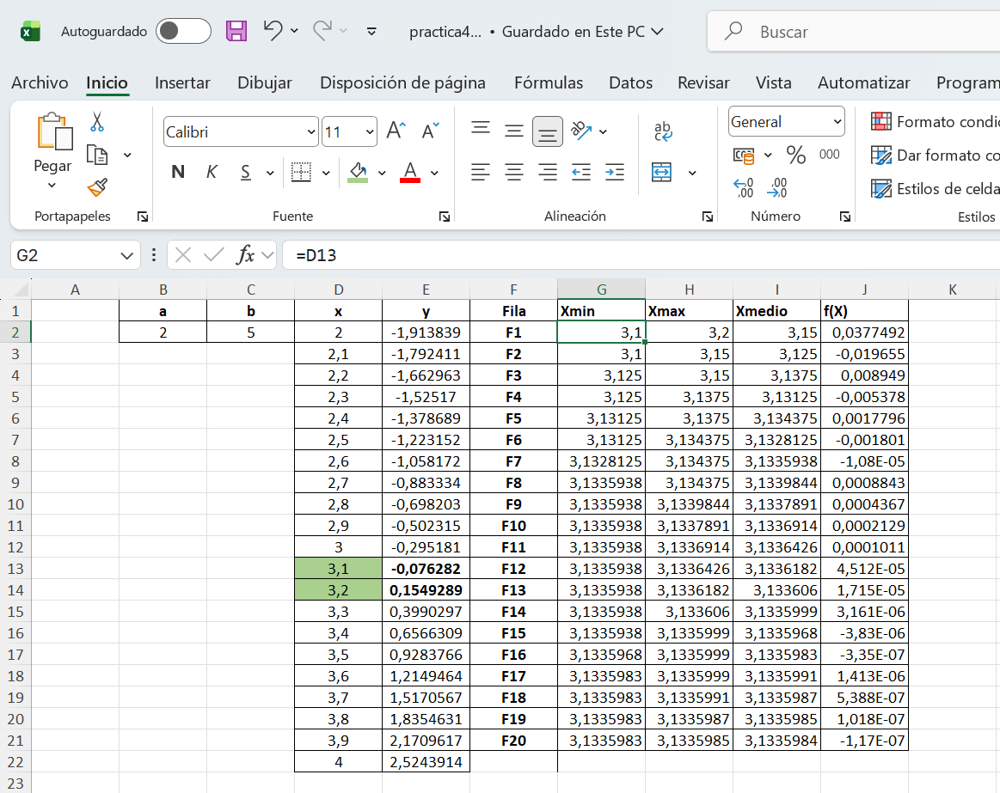
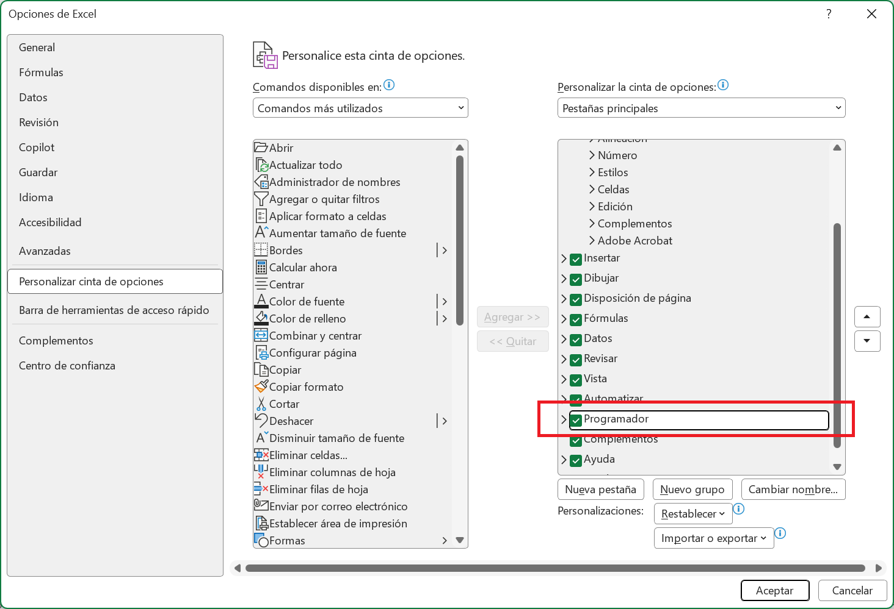
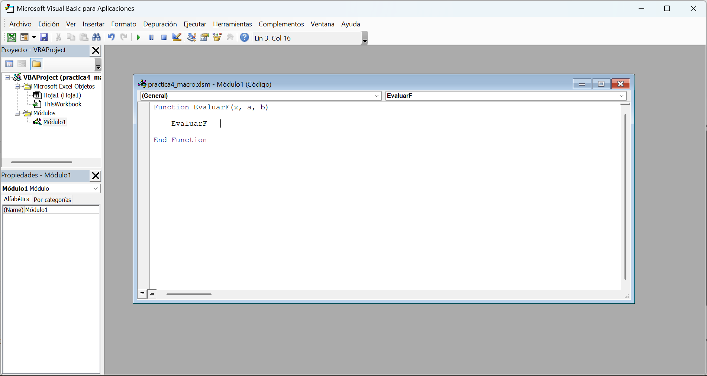

## Objetivos de la práctica

Los objetivos de esta práctica son los siguientes:

- Mostrar algunas de las capacidades más interesantes de una hoja de cálculo como herramienta para la resolución de problemas. **No se pretende impartir un curso de Excel**, sino despertar el interés por herramientas de enorme utilidad.
- **Aplicar** algunos de los **conocimientos de programación** aprendidos en esta asignatura.

---

## Introducción

Una **hoja de cálculo** es una herramienta de gran utilidad en la **resolución de problemas en ingeniería** dado que, además de permitir manejar una gran cantidad de datos y realizar operaciones complejas de forma interactiva, proporciona una potente herramienta de representación gráfica de datos, fácil de utilizar.

De hecho, hay una gran cantidad de problemas que pueden ser resueltos y analizados con una simple hoja de cálculo de una **manera rápida y eficaz**, sin tener que recurrir al desarrollo de aplicaciones específicas o al uso de otras aplicaciones de cálculo comerciales más potentes, pero más costosas y complejas de utilizar.

---

Nos centraremos en los siguientes puntos, aunque para profundizar en ellos se recomienda consultar la documentación oficial de Excel y la bibliografía recomendada:

- Representación de datos simples.
- Cálculo mediante fórmulas complejas.
- Funciones de Excel.
- Estructuras condicionales.
- Repetición para crear tablas de datos.
- Referencias absolutas y relativas.
- Creación de gráficos.
- Creación de macros.

---

## Ecuaciones no lineales y métodos iterativos

Hay muchos problemas matemáticos donde **no se conoce un método analítico para calcular una solución exacta o bien el método para obtener la solución es tan costoso que no resulta una opción válida** para obtener un resultado con un tiempo de respuesta bajo. En dichos casos, una alternativa es utilizar un método numérico que **aproxime** la solución.

---

Como caso de estudio consideraremos la **curva catenaria**. Desde el punto de vista físico, una catenaria describe la forma que adopta un cable suspendido por sus extremos y sometido exclusivamente a la acción de su propio peso.

La **catenaria invertida**, obtenida al reflejar la curva respecto de un eje horizontal, presenta una propiedad estructural especialmente relevante en arquitectura: bajo cargas gravitatorias uniformes, el esfuerzo interno es predominantemente de compresión, lo que la convierte en una forma óptima para el diseño de arcos y bóvedas.

{#fig-ejemplos-catenarias width="72%"}

---

Un ejemplo de su aplicación es la obra del arquitecto **Antonio Gaudí**, quien empleó modelos físicos de catenarias invertidas para el diseño de la **Sagrada Familia** en Barcelona, tal como se ilustra en la @fig-ejemplos-catenarias.

Podéis utilizar la web [**WikiArquitectura**](https://es.wikiarquitectura.com/) para explorar información sobre edificios, arquitectos y obras de distintos lugares del mundo. En el contexto de esta práctica, puede ser especialmente útil para localizar ejemplos arquitectónicos en los que aparezcan arcos, bóvedas o formas relacionadas con la curva **catenaria**, y así relacionar el modelo matemático con aplicaciones reales en arquitectura.

También podéis encontrar más información sobre las curvas catenarias en el siguiente vídeo:



---

### Curva catenaria

La curva que describe un cable suspendido de **dos puntos a la misma altura** y cuyo **punto mínimo** es el punto $(0,a)$ se puede escribir como:

$$
y = a \cosh\left(\frac{x}{a}\right)
  = a \frac{e^{x/a} + e^{-x/a}}{2}
$$

donde $a > 0$ es un parámetro real que controla la forma de la curva y la tensión del cable. Valores mayores de $a$ producen una curva más ancha y menos tensa, mientras que valores menores de $a$ producen una curva más estrecha y más tensa.

---

En esta práctica vamos a resolver la ecuación $y = b$, para un número real $b$. Para ello, consideraremos la función:

$$
f(x) = a \cosh\left(\frac{x}{a}\right) - b
$$

y buscaremos las soluciones de la ecuación $f(x) = 0$.

Podéis interactuar con la curva catenaria a continuación, modificando el valor de la constante $a$ para ver cómo afecta a la forma de la curva. También podéis modificar el valor de $b$ para ver cómo afecta a la posición de la línea horizontal y a las soluciones de la ecuación $f(x) = 0$.

---

:::: {#fig-catenaria-interactiva .p4-figure-uza}
::: {.p4-interactive-grid-uza}
::: {.p4-control-panel-uza}
```{ojs}
import {
  createCatenaryControls,
  renderCatenaryPlot,
  renderCatenaryExamplePlot,
  createBisectionControls,
  renderBisectionPlot
} from "../resources/practica4/ojs/practica4.js"
```

```{ojs}
viewof params = createCatenaryControls({ Inputs, html })
```
:::

::: {.p4-plot-panel-uza}
```{ojs}
renderCatenaryPlot({ Plot, a: params.a, b: params.b })
```
:::
:::

Explorador interactivo de la catenaria $y=a\cosh(x/a)$, el nivel $b$ y las soluciones de $f(x)=0$.
::::

---

## Representación gráfica de la solución

Los pasos a seguir para representar gráficamente la función $f$ y obtener una aproximación de la solución a la ecuación $f(x) = 0$ son los siguientes:

1. Abrir *Excel* y crear un `Libro en blanco`.
2. En las celdas `B2` y `C2` escribiremos los valores de $a$ y $b$. Por ejemplo, $a = 2$ y $b = 5$. Asimismo, podemos utilizar las columnas `B1` y `C1` para añadir texto que permita explicar el significado de las celdas de abajo, escribiendo **a** y **b**.
3. Buscaremos un intervalo de valores entre los que sepamos que se encuentra la solución, de manera que en ambos extremos del intervalo la función cambie de signo.

---

Como la función $f$ es continua, un cambio de signo implica que entre dichos valores existe un valor intermedio donde la función toma el valor $0$.

Por ejemplo, la gráfica muestra que el valor de $x$ donde $f(x) = 0$ está en $[2, 4]$, y además $f(2) < 0$ y $f(4) > 0$. Por tanto, los valores de $x$ irán en el rango $[2, 4]$, con un incremento de $0,1$ entre cada valor.

:::: {#fig-catenaria-ejemplo .p4-figure-uza}
::: {.p4-plot-panel-uza}
```{ojs}
renderCatenaryExamplePlot({ Plot })
```
:::

Intervalo inicial para localizar una solución de $f(x)=0$.
::::

---

4. A continuación, en los pasos **5, 6 y 7**, crearemos una tabla con los valores de $f(x)$ en función de $x$, en las celdas `D2:E22`. No basta con crear la tabla, es obligatorio utilizar correctamente referencias absolutas y relativas.
5. Para rellenar los valores de $x$, se introduce el primer valor, `2`, en la celda `D2`. Después, marcamos las celdas a rellenar, `D2:D22`, y utilizamos la opción `Inicio > Rellenar > Series`, indicando el **incremento** de valor deseado.
6. Introduce en la celda `E2` la fórmula para calcular $f(x)$ a partir del valor de $x$ en la celda `D2`. *Excel* incluye la función `COSH` para calcular un coseno hiperbólico.
7. Copia el valor de la celda `E2` en las celdas `E3:E22`.

::: {.callout-warning}
## Error de actualización

*Excel* ajusta automáticamente la fórmula, pero el resultado no es correcto: $x$ se ha actualizado correctamente, pero las referencias a los valores de $a$ y $b$ también.
:::

---

8. Para solucionar el problema anterior, modificaremos la fórmula en `E2` combinando el uso de **referencias absolutas** y **relativas**. Para crear referencias absolutas, de modo que no cambien automáticamente al copiarse la celda, se añade un carácter `$` entre la letra y el número, por ejemplo `$B$2`. También podéis usar el atajo de teclado con `F4` o `Fn+F4`.
9. Ahora sí, propagad el valor de la celda `E2` a las celdas `E3:E22`.
10. Seleccionamos `D2:E22` e insertamos un gráfico de tipo **XY Dispersión**. Haciendo click en cada eje podemos cambiar el rango de valores mostrado, como muestra la @fig-grafico-limites-ejes.

{#fig-grafico-limites-ejes}

---

11. Podemos observar en la @fig-grafico-xy-dispersion que el valor cero de $f(x)$ se alcanza en **[3.1, 3.2]**. Si se repite el proceso con valores de $x$ en el intervalo **$[2, 4]$** e incremento **0.01**, el resultado será más preciso.

{width="65%" #fig-grafico-xy-dispersion}

12. Guarda el fichero de *Excel* con extensión `.xlsx`, por ejemplo, `practica4.xlsx`.

---

## Automatización mediante el método de bisección

En lugar de repetir el proceso a mano, vamos a automatizarlo. Comenzaremos con un intervalo e iremos reduciéndolo por el **método de bisección** hasta obtener una solución que nos parezca suficientemente buena.

El **método de bisección** es un método numérico para encontrar soluciones de funciones continuas. El método se basa en el teorema del valor intermedio: si una función cambia de signo en un intervalo, entonces debe tener al menos una solución en dicho intervalo.

---

:::: {#fig-biseccion-interactiva .p4-figure-uza}
::: {.p4-interactive-grid-uza}
::: {.p4-control-panel-uza}
```{ojs}
viewof bisectParams = createBisectionControls({ Inputs, html })
```
:::

::: {.p4-plot-panel-uza}
```{ojs}
renderBisectionPlot({
  Plot,
  html,
  a: bisectParams.a,
  b: bisectParams.b,
  step: bisectParams.step
})
```
:::
:::

Evolución interactiva del intervalo en el método de bisección para el caso $a=2$, $b=5$ e intervalo inicial $[3.1, 3.2]$.
::::

---

1. En las celdas `G1:J1` escribiremos los nombres **Xmin**, **Xmax**, **Xmedio** y **f(x)**.
2. En las celdas `G2` y `H2` escribiremos los extremos del intervalo inicial, tales que $f(G2)$ y $f(H2)$ tengan distinto signo: $f(3.1) < 0$ y $f(3.2) > 0$.
3. En la celda `I2` escribimos la fórmula para **calcular el punto medio del intervalo**, es decir, la media de `G2` y `H2`.
4. En la celda `J2` calculamos el resultado de evaluar la función $f$ en el punto indicado en la celda `I2`.

---

5. En la fila **3**, celdas `G3` y `H3`, definimos un nuevo extremo para el intervalo. **Si f(xMedio) es negativo**, seleccionamos el intervalo **[xMedio, xMax]** en la siguiente iteración. **Si es positivo**, utilizamos **[xMin, xMedio]**. Usa la función `=SI` para resolver esta composición condicional.
6. Copia las celdas `I2` y `J2` en `I3` y `J3`, respectivamente.
7. Copia la fila **3** en la fila **4** y repite este proceso hasta que se obtenga una solución suficientemente buena. Con **20 filas** debería ser suficiente para obtener una aproximación de la solución con un error menor a $10^{-6}$.

{#fig-biseccion}

8. Guarda los cambios en el fichero `practica4.xlsx`.

---

## Creación de una macro

Por último, vamos a crear una **macro** que permita calcular nuestra función $f$. Una **macro** no es más que una función que nos permitirá escribir una **fórmula para evaluar la función en un punto** dado por una celda.

Nuestra función recibirá 3 parámetros de entrada: los valores de $x$, $a$ y $b$. Fíjate en la @fig-ejemplo-evaluarf.

{#fig-ejemplo-evaluarf width="55%"}

---

1. Crea un nuevo libro de *Excel* y en la celda `E2` escribe la fórmula `=EvaluarF(D2; B2; C2)`.

::: {.callout-warning}
## Error de función no definida

Por ahora, *Excel* no encuentra la función llamada `EvaluarF`. En su lugar, intenta utilizar la función `SUMA` y especifica un rango de celdas. Las funciones deben comenzar con el carácter `=`.

{width="55%" #fig-error-evaluarf}
:::

---

2. Creamos la función `EvaluarF`. Para ello, utilizamos la opción del menú `Archivo > Opciones > Personalizar cinta de opciones` y activamos **Desarrollador** o **Programador**.

{#fig-programador}

3. En la opción del menú `Desarrollador > Visual Basic` aparecerá una nueva ventana. Después de utilizar la opción `Insertar > Módulo`, copia y pega el código siguiente.

```{.vb include="../resources/practica4/snippets/vba/evaluar-f.bas"}
```

---

::: {.callout-tip}
## Programación en *Visual Basic*

Al igual que en Java, nuestra función en *Visual Basic* debe utilizar operaciones como la suma (`+`), la resta (`-`), la multiplicación (`*`) y la división (`/`). Recuerda además que los paréntesis se utilizan para indicar el orden de las operaciones.

De nuevo, la curva catenaria se define como $f(x) = a \frac{e^{x/a} + e^{-x/a}}{2} - b$.
:::

{#fig-evaluarf_macro}

---

4. Cierra la ventana de ***Visual Basic*** y guarda el fichero de *Excel* con extensión `.xlsm`. Por ejemplo, guárdalo con el nombre `practica4_macro.xlsm`.
5. Una vez guardado el fichero de *Excel*, probaremos sobre `E2` la macro `EvaluarF`. Haz lo mismo para las celdas `E3:E22`. Tened cuidado nuevamente con las referencias absolutas.

<details>
<summary>Solución:</summary>

{#fig-resultado_evaluarf width="55%"}

</details>

---

## Entrega de la solución

**Solo debe realizar la entrega un miembro del grupo**. Sube a Moodle un **fichero comprimido `practica4.zip`** que contenga los siguientes archivos:

- `practica4.xlsx`
- `practica4_macro.xlsm`
