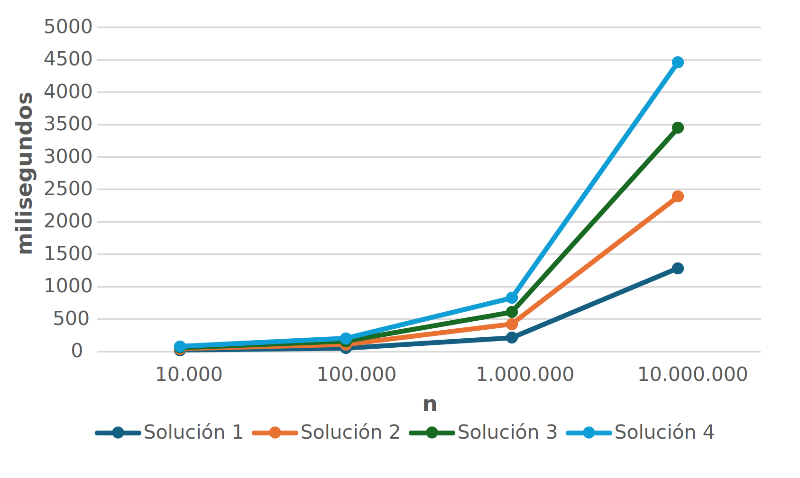

## Objetivos de la práctica

Los objetivos de la quinta práctica de la asignatura son los siguientes:

- Desarrollar algoritmos en Java.
- Ejecutar algoritmos en el entorno *Eclipse*.

## Criba de Eratóstenes

La **criba de Eratóstenes** es un algoritmo eficiente para **encontrar todos los números primos menores o iguales a un número dado**. El algoritmo funciona de la siguiente manera:

1. Se guardan en un vector todos los números desde 2 hasta el número dado.
2. Se comienza con el primer número primo (2) y se descartan todos los múltiplos de ese número.
3. Se repite el proceso con el siguiente número primo en el vector hasta que se hayan procesado todos los números.

Por ejemplo, para encontrar los números primos menores o iguales a 30, el algoritmo eliminaría los múltiplos de 2 (4, 6, 8, ...), luego los múltiplos de 3 (6, 9, 12, ...), y así sucesivamente, dejando solo los números primos (2, 3, 5, 7, 11, 13, 17, 19, 23, 29).

## Vectores en Java

A modo de recordatorio, un **vector en Java** es una estructura de datos que almacena una colección de elementos del mismo tipo. Se puede declarar e inicializar de la siguiente manera:

```java
// Declaración e inicialización de un vector de enteros con 10 elementos
int[] vector = new int[10];

// Asignación de valores a los elementos del vector
vector[0] = 1;
vector[1] = 2;  

// Acceso a los elementos del vector
int valor = vector[0]; // valor es igual a 1

// Asignación de valores utilizando un bucle
for (int i = 0; i < vector.length; i++) {
    vector[i] = i + 1; // Asigna el valor i+1 a cada posición del vector
}
```

## Ejercicios

Ten en cuenta que la criba de Eratóstenes se puede implementar de varias maneras, dependiendo de cómo se manejen los datos y se optimice el proceso. A continuación, se presentan cuatro posibles soluciones para implementar la criba de Eratóstenes en Java. Cada solución se deberá implementar en una clase separada, de nombre `Solucion1.java`, `Solucion2.java`, `Solucion3.java` y `Solucion4.java`, respectivamente.

El objetivo es modificar cada una de las implementaciones para **contar el número de "tachones" (números descartados)** que realiza cada una de las implementaciones de la criba, y **medir su tiempo de ejecución**.

**Anota el tiempo de ejecución en Microsoft Excel para cada una de las implementaciones, y cuatro valores de $n$ diferentes**: $10^3$, $10^4$, $10^5$ y $10^6$. Los valores de $n$ se representarán en el eje $X$ de un gráfico, y el tiempo de ejecución en el eje $Y$. Dibuja una gráfica similar a la ilustrada a continuación:

{#fig-graph width=75%}

```{python}
import pandas as pd
import numpy as np

df = pd.read_excel('../resources/practica5/tiempos.xlsx')
df.columns.values[0] = ""
df
```

::: {.callout-warning}
## Posible falta de memoria

Ten en cuenta que para valores de $n$ muy grandes, es posible que el programa no tenga suficiente memoria para ejecutar la criba de Eratóstenes, especialmente en las implementaciones que utilizan un vector de enteros. En ese caso, puedes intentar aumentar la memoria asignada a Java. Para ello, accede a `Run > Run Configurations...` en *Eclipse*, selecciona tu clase principal, ve a la pestaña `Arguments` y en el campo `VM arguments` añade la siguiente línea:

```bash
-Xmx4g
```

Esto asignará un máximo de 4 GB de memoria a tu programa. Si sigues teniendo problemas de memoria, puedes intentar aumentar aún más este valor, aunque ten en cuenta que esto dependerá de la cantidad de memoria RAM disponible en tu ordenador.
:::

### Medición de tiempo de ejecución

Para medir el tiempo de ejecución de cada implementación, puedes utilizar la clase `System` de Java para obtener el tiempo antes y después de ejecutar el algoritmo, y luego calcular la diferencia. Aquí tienes un ejemplo de cómo hacerlo:

```java
// Pide al usuario que introduzca el valor de n

long startTime = System.currentTimeMillis();

// Introduce la implementación de la criba de Eratóstenes aquí

long endTime = System.currentTimeMillis();
long duration = endTime - startTime;
System.out.println("Tiempo de ejecución: " + duration + " milisegundos");
```

### Solución 1: Implementación básica

En esta implementación, se utiliza un **vector de números enteros para representar los números desde 0 hasta $n$**, donde cada posición indica si el número correspondiente es primo o no. **Se itera a través de los números y se marcan como no primos los múltiplos de cada número primo encontrado**.

Un número será primo si su posición en el vector no es cero, sino igual a su propio valor. Por ejemplo, si `numero[5]` es igual a 5, entonces 5 es un número primo. Si `numero[6]` es igual a 0, entonces 6 no es un número primo.

Formalmente, al final de la criba de Eratóstenes, cada número $i$, donde $2 <= i <= n$, tendrá el siguiente valor en el vector:
$$
numero[i] = \begin{cases} i & \text{si } i \text{ es primo} \\ 0 & \text{si } i \text{ no es primo} \end{cases}
$$

::: {.card .shadow-sm .mb-4}
::: {.card-body}
```{ojs}
// definimos la función global una sola vez para usarla en todos los bloques
cleanSlider = (range, config) => {
  const input = Inputs.range(range, config);
  const numberBox = input.querySelector("input[type=number]");
  if (numberBox) numberBox.style.display = "none";
  const rangeSlider = input.querySelector("input[type=range]");
  if (rangeSlider) rangeSlider.style.width = "100%";
  input.style.width = "100%";
  return input;
};
```

```{ojs}
viewof N1 = cleanSlider([10, 50], { value: 30, step: 1, label: "Valor N: " })
```

```{ojs}
steps1 = {
  const max = N1;
  let state = Array(max + 1).fill("candidate");
  state[0] = state[1] = "discarded";

  const out = [];

  for (let p = 2; p <= max; p++) {
    if (state[p] === "candidate") {
      out.push({ type: "prime", p, state: [...state] });

      for (let k = p * 2; k <= max; k += p) {
        if (state[k] === "candidate") {
          state[k] = "discarded";
          out.push({ type: "discard", p, k, state: [...state] });
        }
      }
    }
  }

  out.push({ type: "final", state: [...state] });
  return out;
}
```

```{ojs}
maxStep1 = steps1.length - 1
```

```{ojs}
viewof step1 = cleanSlider([0, maxStep1], { value: 0, step: 1, label: "Paso de la criba: " })
```

```{ojs}
{
  if (!steps1 || steps1.length === 0) return html`<div>Cargando...</div>`;

  const safeStep = Math.min(step1, steps1.length - 1);
  const s = steps1[safeStep];

  if (!s) return html`<div>Cargando...</div>`;

  const arr = s.state;
  const max = N1;
  const cols = Math.ceil(Math.sqrt(max));
  
  const currentPrime = s.p;
  const lastDiscard = s.k;

  const grid = Array.from({ length: max + 1 }, (_, i) => {
    let bgColor = "#2a9d8f"; 
    if (i < 2) bgColor = "#ddd";
    else if (i === currentPrime) bgColor = "#457b9d";
    else if (i === lastDiscard) bgColor = "#f4a261";
    else if (arr[i] === "discarded") bgColor = "#e63946";

    return {
      n: i, x: i % cols, y: Math.floor(i / cols), state: arr[i],
      color: bgColor, textColor: i < 2 ? "#333" : "white" 
    };
  });

  return html`
    <div style="margin-top:15px;">
      ${Plot.plot({
        height: Math.ceil(max / cols) * 35 + 20, margin: 10,
        x: { axis: null }, y: { axis: null, reverse: true }, color: { type: "identity" }, 
        marks: [
          Plot.rect(grid, { x1: d => d.x - 0.45, x2: d => d.x + 0.45, y1: d => d.y - 0.45, y2: d => d.y + 0.45, fill: "color", stroke: "white", rx: 4 }),
          Plot.text(grid, { x: "x", y: "y", text: "n", fill: "textColor", fontSize: 13, fontWeight: "bold" })
        ]
      })}
      <div style="margin-top:15px; font-size: 1.1em; height: 1.5em;">
        ${s.type === "prime" ? html`🔎 Probando primo <b>${currentPrime}</b>` : s.type === "discard" ? html`❌ ${lastDiscard} es múltiplo de <b>${currentPrime}</b>` : html`✅ Criba completada`}
      </div>
    </div>
  `;
}
```
:::
:::

La implementación básica se puede realizar de la siguiente manera:
```java
Scanner sc = new Scanner(System.in);
System.out.print("Introduce un numero entero: ");
int n = sc.nextInt();

int[] numero = new int[n + 1];
for (int i = 0; i <= n; i++) {
    numero[i] = i;
}

int salto;
int j = 0;

for (int i = 2; i <= n; i++) {
    if (numero[i] != 0) {
        salto = i;
        j = i + salto;
        
        while (j <= n) {
            numero[j] = 0;
            j = j + salto;
        }
    }
}

int contadorPrimos = 0;
for (int i = 2; i <= n; i++) {
    if (numero[i] != 0) {
        contadorPrimos++; 
        System.out.println(i + " es primo");
    }
}

System.out.println();
System.out.println("Total: " + contadorPrimos + " números primos");
```

::: {.callout-note collapse="true"}
## Tamaño del vector
Cada entero ocupa 4 bytes en Java, por lo que el vector utilizado para la criba de Eratóstenes ocupará un total de `4 * (n + 1)` bytes, donde `n` es el número hasta el cual se desea encontrar los números primos. Por ejemplo, si `n` es 100, el vector ocupará `4 * (100 + 1) = 404` bytes.
:::

### Solución 2: Optimización utilizando la raíz cuadrada de n

**En la solución previa se itera hasta `n` para encontrar los números primos, lo cual es ineficiente**. En esta solución, **se optimiza el proceso iterando solo hasta la raíz cuadrada de `n`**.

::: {.callout-warning collapse="true"}
## Optimización con la raíz cuadrada 🧮
**Lema**: Si $n ∈ ℕ+$ admite la factorización $n = a*b$, con $a, b ∈ ℤ$, entonces $a ≤ \sqrt{n}$ o $b ≤ \sqrt{n}$.

**Corolario**: Si $n$ no es primo, uno de sus factores $d$ cumple $1 ≤ d ≤ \sqrt{n}$. Si $n$ no tiene factores $d$ con $1 ≤ d ≤ \sqrt{n}$, entonces es primo. Por tanto, $n$ es primo si y solo si es divisible por algún primo menor o igual a $\sqrt{n}$.
:::

::: {.card .shadow-sm .mb-4}
::: {.card-body}

```{ojs}
viewof N2 = cleanSlider([10, 150], { value: 60, step: 1, label: "Valor N: " })
```

```{ojs}
steps2 = {
  const max = N2;
  let state = Array(max + 1).fill("candidate");
  state[0] = state[1] = "discarded";

  const out = [];

  for (let p = 2; p * p <= max; p++) {
    if (state[p] === "candidate") {
      out.push({ type: "prime", p, state: [...state] });

      for (let k = p * p; k <= max; k += p) {
        if (state[k] === "candidate") {
          state[k] = "discarded";
          out.push({ type: "discard", p, k, state: [...state] });
        }
      }
    }
  }

  out.push({ type: "final", state: [...state] });
  return out;
}
```

```{ojs}
maxStep2 = steps2.length - 1
```

```{ojs}
viewof step2 = cleanSlider([0, maxStep2], { value: 0, step: 1, label: "Paso de la criba: " })
```

```{ojs}
{
  if (!steps2 || steps2.length === 0) return html`<div>Cargando...</div>`;

  const safeStep = Math.min(step2, steps2.length - 1);
  const s = steps2[safeStep];

  if (!s) return html`<div>Cargando...</div>`;

  const arr = s.state;
  const max = N2;
  const cols = Math.ceil(Math.sqrt(max));
  
  const currentPrime = s.p;
  const lastDiscard = s.k;

  const grid = Array.from({ length: max + 1 }, (_, i) => {
    let bgColor = "#2a9d8f"; 
    if (i < 2) bgColor = "#ddd";
    else if (i === currentPrime) bgColor = "#457b9d";
    else if (i === lastDiscard) bgColor = "#f4a261";
    else if (arr[i] === "discarded") bgColor = "#e63946";

    return {
      n: i, x: i % cols, y: Math.floor(i / cols), state: arr[i],
      color: bgColor, textColor: i < 2 ? "#333" : "white" 
    };
  });

  return html`
    <div style="margin-top:15px;">
      ${Plot.plot({
        height: Math.ceil(max / cols) * 35 + 20, margin: 10,
        x: { axis: null }, y: { axis: null, reverse: true }, color: { type: "identity" }, 
        marks: [
          Plot.rect(grid, { x1: d => d.x - 0.45, x2: d => d.x + 0.45, y1: d => d.y - 0.45, y2: d => d.y + 0.45, fill: "color", stroke: "white", rx: 4 }),
          Plot.text(grid, { x: "x", y: "y", text: "n", fill: "textColor", fontSize: 13, fontWeight: "bold" })
        ]
      })}
      <div style="margin-top:15px; font-size: 1.1em; height: 1.5em;">
        ${s.type === "prime" ? html`🔎 Probando primo <b>${currentPrime}</b>` : s.type === "discard" ? html`❌ ${lastDiscard} es múltiplo de <b>${currentPrime}</b>` : html`✅ Criba completada`}
      </div>
    </div>
  `;
}
```
:::
:::

La implementación de esta optimización se puede realizar de la siguiente manera:
```java
Scanner sc = new Scanner(System.in);
System.out.print("Introduce un numero entero: ");
int n = sc.nextInt();

int[] numero = new int[n + 1];
for (int i = 0; i <= n; i++) {
    numero[i] = i;
}

int salto;
int j = 0;

for (int i = 2; i * i <= n; i++) {
    if (numero[i] != 0) {
        salto = i;
        j = i + salto;
        
        while (j <= n) {
            numero[j] = 0;
            j = j + salto;
        }
    }
}

int contadorPrimos = 0;
for (int i = 2; i <= n; i++) {
    if (numero[i] != 0) {
        contadorPrimos++; 
        System.out.println(i + " es primo");
    }
}

System.out.println();
System.out.println("Total: " + contadorPrimos + " números primos");
```

::: {.callout-note collapse="true"}
## Tamaño del vector

En esta solución, el vector utilizado para la criba de Eratóstenes seguirá ocupando `4 * (n + 1)` bytes, ya que se sigue utilizando un vector de enteros para representar los números desde 0 hasta n. Sin embargo, el número de iteraciones realizadas para marcar los múltiplos de cada número primo será significativamente menor, lo que puede mejorar el rendimiento del algoritmo.
:::

### Solución 3: Implementación utilizando un vector de booleanos

En esta implementación, se utiliza un **vector de booleanos** para representar si cada número es primo o no. El vector se inicializa con `true` para todos los números desde 2 hasta $n$, y luego se marcan como `false` los múltiplos de cada número primo encontrado. Al final del proceso, los números que siguen siendo `true` en el vector son los números primos.

La implementación de esta solución se puede realizar de la siguiente manera:
```java
Scanner sc = new Scanner(System.in);
System.out.print("Introduce un numero entero: ");
int n = sc.nextInt();

boolean[] esPrimo = new boolean[n + 1];
for (int i = 2; i <= n; i++) {
    esPrimo[i] = true;
}

int salto;
int j = 0;

for (int i = 2; i * i <= n; i++) {
    if (esPrimo[i]) {
        salto = i;
        j = i + salto;
        
        while (j <= n) {
            esPrimo[j] = false;
            j = j + salto;
        }
    }
}

int contadorPrimos = 0;
for (int i = 2; i <= n; i++) {
    if (esPrimo[i]) {
        contadorPrimos++; 
        System.out.println(i + " es primo");
    }
}

System.out.println();
System.out.println("Total: " + contadorPrimos + " números primos");
```

::: {.callout-note collapse="true"}
## Tamaño del vector

En esta solución, el vector utilizado para la criba de Eratóstenes ocupará $1 * (n + 1)$ bytes, ya que se utiliza un vector de booleanos para representar si cada número es primo o no. Cada booleano ocupa 1 byte en Java, por lo que el tamaño del vector será significativamente menor que en las soluciones anteriores que utilizaban enteros. Sin embargo, el rendimiento del algoritmo puede ser similar al de la solución anterior, ya que el número de iteraciones realizadas para marcar los múltiplos de cada número primo seguirá siendo el mismo.

Por ejemplo, si $n$ es 100, el vector ocupará $1 * (100 + 1) = 101$ bytes, un tamaño mucho menor que los $404$ bytes de la solución con enteros.
:::

### Solución 4: Implementación con optimización utilizando un vector de booleanos y solo números impares

En esta implementación, se utiliza un **vector de booleanos** para representar si cada número **impar es primo o no**, ya que el único número par que es primo es el 2. De esta manera, se reduce a la mitad el tamaño del vector y se optimiza el proceso de marcado de múltiplos, ya que solo se consideran los números impares.

En resumen, los cambios introducidos en esta solución son los siguientes:

- El número **2** es el único número par que es primo, por lo que podemos ignorar todos los números pares mayores que 2. 
- Por tanto, solo necesitamos analizar los **números impares** mayores que 2: 
  $$
  3, 5, 7, 9, \ldots, n \quad (\text{o } n-1 \text{ si } n \text{ es par})
  $$

- Estos números pueden escribirse como  
  $$
  p = 2i + 3 \quad \text{con } i = 0, 1, 2, \ldots, \left\lfloor \frac{n-3}{2} \right\rfloor
  $$

- Por ello, el vector solo necesita  
  $$
  \left\lfloor \frac{n-3}{2} \right\rfloor + 1
  $$
  posiciones (una por cada impar).

- Para cada primo $p = 2i + 3$ menor que $n$, eliminamos sus **múltiplos impares** menores que $n$:  
  $$
  3p, 5p, 7p, \ldots
  $$

- En general, estos múltiplos pueden escribirse como  
  $$
  (2k+1)p \quad \text{con } k = i+1, i+2, \ldots
  $$

La implementación de esta solución se puede realizar de la siguiente manera:
```java
Scanner sc = new Scanner(System.in);
System.out.print("Introduce un numero entero: ");
int n = sc.nextInt();

int max = ...;     // <--- calcular el tamaño del vector para solo números impares
boolean[] numero = new boolean[max + 1];

for (int i = 0; i <= max; i++) {
    numero[i] = true;
}

for (int i = 0; ... <= n; i++) {   // <--- iterar solo sobre números impares
    int k = ...;
    while (... <= n) {
        numero[...] = false;    // <--- marcar múltiplos impares de i como no primos
        k++;
    }
}

int contadorPrimos = 1;
System.out.print("2 es primo \n");

for (int i = 0; i <= ...; i++) {
    if (numero[i] != false) {
        contadorPrimos = contadorPrimos + 1;
        System.out.println(... + " es primo");
    }
}

System.out.println();
System.out.println("Total: " + contadorPrimos + " números primos");
```

::: {.card .shadow-sm .mb-4 .mt-4}
::: {.card-body}

```{ojs}
//| echo: false
viewof N4 = cleanSlider([10, 150], { value: 60, step: 1, label: "Valor N: " })
```

```{ojs}
//| echo: false
steps4 = {
  const max = N4;
  if (max < 3) return [{ type: "final", state: [] }];

  const size = Math.floor((max - 3) / 2) + 1;
  let state = Array(size).fill("candidate");

  const out = [];

  for (let i = 0; ; i++) {
    let p = 2 * i + 3;
    if (p * p > max) break;

    if (state[i] === "candidate") {
      out.push({ type: "prime", p, state: [...state] });

      for (let mult = p * p; mult <= max; mult += 2 * p) {
        let idx = (mult - 3) / 2; 
        if (state[idx] === "candidate") {
          state[idx] = "discarded";
          out.push({ type: "discard", p, k: mult, state: [...state] });
        }
      }
    }
  }

  out.push({ type: "final", state: [...state] });
  return out;
}
```

```{ojs}
//| echo: false
maxStep4 = steps4.length - 1
```

```{ojs}
//| echo: false
viewof step4 = cleanSlider([0, maxStep4], { value: 0, step: 1, label: "Paso de la criba: " })
```

```{ojs}
//| echo: false
{
  if (!steps4 || steps4.length === 0) return html`<div>Cargando...</div>`;

  const safeStep = Math.min(step4, steps4.length - 1);
  const s = steps4[safeStep];

  if (!s) return html`<div>Cargando...</div>`;

  const arr = s.state;
  const max = N4;
  
  const size = Math.floor((max - 3) / 2) + 1;
  const cols = Math.ceil(Math.sqrt(size)); 
  
  const currentPrime = s.p;
  const lastDiscard = s.k;

  const grid = Array.from({ length: size }, (_, i) => {
    const num = 2 * i + 3; 
    let bgColor = "#2a9d8f"; 
    
    if (num === currentPrime) bgColor = "#457b9d";
    else if (num === lastDiscard) bgColor = "#f4a261";
    else if (arr[i] === "discarded") bgColor = "#e63946";

    return {
      idx: i, n: num, x: i % cols, y: Math.floor(i / cols), state: arr[i],
      color: bgColor, textColor: "white" 
    };
  });

  return html`
    <div style="margin-top:15px;">
      ${Plot.plot({
        height: Math.ceil(size / cols) * 35 + 20, margin: 10,
        x: { axis: null }, y: { axis: null, reverse: true }, color: { type: "identity" }, 
        marks: [
          Plot.rect(grid, { x1: d => d.x - 0.45, x2: d => d.x + 0.45, y1: d => d.y - 0.45, y2: d => d.y + 0.45, fill: "color", stroke: "white", rx: 4 }),
          Plot.text(grid, { x: "x", y: "y", text: "n", fill: "textColor", fontSize: 13, fontWeight: "bold" })
        ]
      })}
      <div style="margin-top:15px; font-size: 1.1em; height: 1.5em;">
        ${s.type === "prime" ? html`🔎 Probando primo impar <b>${currentPrime}</b>` : s.type === "discard" ? html`❌ ${lastDiscard} es múltiplo impar de <b>${currentPrime}</b>` : html`✅ Criba completada`}
      </div>
    </div>
  `;
}
```
:::
:::

::: {.callout-note collapse="true"}
## Tamaño del vector

En esta solución, el vector utilizado para la criba de Eratóstenes ocupará `1 * (⌊(n-3)/2⌋ + 1)` bytes, ya que se utiliza un vector de booleanos para representar si cada número impar es primo o no. Cada booleano ocupa 1 byte en Java, por lo que el tamaño del vector será significativamente menor que en las soluciones anteriores que utilizaban enteros y que consideraban tanto números pares como impares. Por ejemplo, si `n` es 100, el vector ocupará `1 * (⌊(100-3)/2⌋ + 1) = 49` bytes, lo que representa aproximadamente el **12% del tamaño del vector utilizado en la solución con enteros que consideraba todos los números (404 bytes)**.
:::