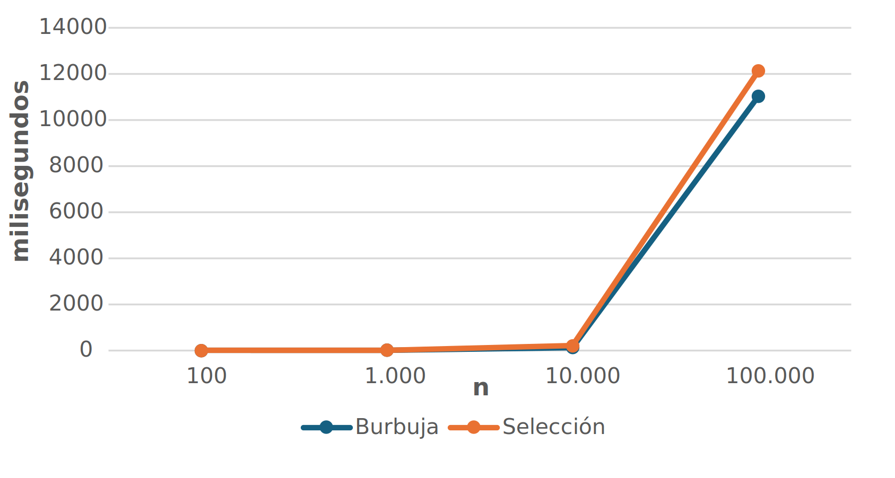

## Objetivos de la práctica

Los objetivos de la sexta práctica de la asignatura son los siguientes:

- Desarrollar algoritmos en Java.
- Ejecutar algoritmos en el entorno *Eclipse*.

---

## Algoritmos de ordenación

Dado un vector de $n$ números enteros, el objetivo de esta práctica es implementar dos algoritmos de ordenación: el algoritmo de **ordenación de burbuja** (*bubble sort*) y el algoritmo de **selección** (*selection sort*). Ambos algoritmos son métodos sencillos para ordenar una lista de elementos, aunque no son los más eficientes para grandes conjuntos de datos. Sin embargo, son útiles para entender los conceptos básicos de ordenación y complejidad algorítmica.

---

### *Bubble sort* u ordenación de burbuja

El algoritmo de **ordenación de burbuja** funciona **comparando cada par de elementos adyacentes** e **intercambiándolos si están en el orden incorrecto**. Este proceso se repite hasta que la lista está completamente ordenada.

Por ejemplo, dado un vector de $n$ números enteros, el proceso a seguir sería el siguiente:

- Comparamos el primer elemento $v[0]$ con el segundo $v[1]$ y, si es mayor que él, los intercambiamos.
- Comparamos el segundo elemento $v[1]$ con el tercero $v[2]$ y, si es mayor que él, los intercambiamos.
- Repetimos para todo el vector, hasta comparar $v[n-2]$ y $v[n-1]$.
- En ese momento, la última posición ya está ordenada.
- Repetimos el proceso hasta tener todo el vector ordenado.
- En el peor caso, tendríamos que repetir $n-1$ veces.
- Si en algún momento recorremos todo el vector sin que haya ningún intercambio, el vector ya estará ordenado.

---

A continuación se muestra un ejemplo del algoritmo de ordenación de burbuja para visualizar el proceso de ordenación paso a paso.

::: {.card .shadow-sm .mb-4}
::: {.card-body}
```{ojs}
// variable mutable que actuará como gatillo para generar un nuevo vector
mutable randTrigger = 0;
```

```{ojs}
// vector base re-generado cada vez que cambia el randTrigger
baseArr = {
  randTrigger; // Dependencia reactiva
  return Array.from({length: 8}, () => Math.floor(Math.random() * 90) + 10);
}
```

```{ojs}
// pre-computamos todos los pasos del Bubble Sort
stepsBS = {
  let arr = [...baseArr];
  const out = [];
  const n = arr.length;
  
  let sortedBound = n; 
  out.push({ type: "start", arr: [...arr], i: null, j: null, sortedBound });

  for (let i = 0; i < n - 1; i++) {
    let swapped = false;
    for (let j = 0; j < n - i - 1; j++) {
      out.push({ type: "compare", arr: [...arr], i: j, j: j+1, sortedBound });
      
      if (arr[j] > arr[j + 1]) {
        let temp = arr[j];
        arr[j] = arr[j + 1];
        arr[j + 1] = temp;
        swapped = true;
        
        out.push({ type: "swap", arr: [...arr], i: j, j: j+1, sortedBound });
      }
    }
    sortedBound = n - i - 1;
    if (!swapped) break; 
  }
  
  out.push({ type: "done", arr: [...arr], i: null, j: null, sortedBound: 0 });
  return out;
}
```

```{ojs}
// controles unificados: Botón Regenerar, Botón Reproducir y Slider
viewof stepBS = {
  const max = stepsBS.length - 1;
  // Añadimos flex-wrap por si la pantalla es muy estrecha
  const form = html`<form style="display: flex; align-items: center; gap: 15px; width: 100%; margin-top: 15px; flex-wrap: wrap;">
    <button type="button" class="btn btn-secondary btn-sm rand-btn" style="color: #eee; font-weight: bold; font-size: 0.9em;">🎲 Regenerar</button>
    <button type="button" class="btn btn-primary btn-sm play-btn" style="color: #eee; font-weight: bold; font-size: 0.9em;">▶ Reproducir</button>
    <label style="font-weight: bold; white-space: nowrap; font-size: 0.9em;">Paso:</label>
    <input type="range" min="0" max="${max}" value="0" style="flex-grow: 1;">
    <output style="min-width: 30px; text-align: right; font-weight: bold;">0</output>
  </form>`;
  
  const randBtn = form.querySelector(".rand-btn");
  const btn = form.querySelector(".play-btn");
  const range = form.querySelector("input[type=range]");
  const out = form.querySelector("output");
  
  let timer;
  let isPlaying = false;

  // Disparar la generación de un nuevo vector
  randBtn.onclick = () => {
    mutable randTrigger++;
  };
  
  const update = () => {
    out.value = range.value;
    form.value = parseInt(range.value);
    form.dispatchEvent(new Event("input", { bubbles: true })); 
  };
  
  range.oninput = () => {
    if (isPlaying) btn.click(); 
    update();
  };
  
  btn.onclick = () => {
    isPlaying = !isPlaying;
    btn.innerHTML = isPlaying ? "⏸ Pausar" : "▶ Reproducir";
    btn.classList.toggle("btn-primary", !isPlaying);
    btn.classList.toggle("btn-danger", isPlaying);
    
    if (isPlaying) {
      if (parseInt(range.value) >= max) {
        range.value = 0; 
        update();
      }
      timer = setInterval(() => {
        let val = parseInt(range.value);
        if (val < max) {
          range.value = val + 1;
          update();
        } else {
          btn.click(); 
        }
      }, 1100); 
    } else {
      clearInterval(timer);
    }
  };
  
  form.value = 0;
  return form;
}
```

```{ojs}
// renderizado visual con Observable Plot
{
  if (!stepsBS || stepsBS.length === 0) return html`<div>Cargando...</div>`;

  const safeStep = Math.min(stepBS, stepsBS.length - 1);
  const s = stepsBS[safeStep];

  if (!s) return html`<div>Cargando...</div>`;

  const arr = s.arr;
  
  const grid = arr.map((val, idx) => {
    let bgColor = "#2a9d8f"; 
    
    if (idx >= s.sortedBound) bgColor = "#457b9d"; 
    
    if (idx === s.i || idx === s.j) {
       bgColor = s.type === "swap" ? "#e63946" : "#f4a261"; 
    }
    
    if (s.type === "done") bgColor = "#457b9d"; 

    return { n: idx, value: val, color: bgColor };
  });

  return html`
    <div style="margin-top:20px;">
      ${Plot.plot({
        height: 80, 
        margin: 10,
        x: { axis: null, domain: [-0.5, arr.length - 0.5] }, 
        y: { axis: null, domain: [0, 1] }, 
        color: { type: "identity" }, 
        marks: [
          Plot.rect(grid, { x1: d => d.n - 0.45, x2: d => d.n + 0.45, y1: 0, y2: 1, fill: "color", stroke: "white", rx: 4 }),
          Plot.text(grid, { x: "n", y: 0.5, text: "value", fill: "white", fontSize: 16, fontWeight: "bold" })
        ]
      })}
      
      <div style="margin-top:20px; font-size: 1.15em; height: 1.5em; text-align: center;">
        ${s.type === "start" ? html`🚀 Vector inicial. Comenzando ordenación de burbuja` : 
          s.type === "compare" ? html`🔎 Comparando índices: ¿es <b>${arr[s.i]}</b> mayor que <b>${arr[s.j]}</b>?` : 
          s.type === "swap" ? html`🔄 Intercambiando posiciones` : html`✅ Ordenamiento completado con éxito`}
      </div>
      
      <div style="margin-top:15px; display:flex; gap:15px; justify-content:center; font-size:0.85em; color:#555;">
        <span><span style="display:inline-block; width:12px; height:12px; background:#2a9d8f; margin-right:5px; border-radius:2px;"></span> No ordenado</span>
        <span><span style="display:inline-block; width:12px; height:12px; background:#f4a261; margin-right:5px; border-radius:2px;"></span> Comparando</span>
        <span><span style="display:inline-block; width:12px; height:12px; background:#e63946; margin-right:5px; border-radius:2px;"></span> Intercambiando</span>
        <span><span style="display:inline-block; width:12px; height:12px; background:#457b9d; margin-right:5px; border-radius:2px;"></span> Ordenado</span>
      </div>
    </div>
  `;
}
```
:::
:::

---

### *Selection sort* u ordenación por selección

El algoritmo de ordenación por **selección** funciona **dividiendo la lista en dos partes**: la parte **ordenada** y la parte **no ordenada**. En cada iteración, el algoritmo selecciona el elemento más pequeño de la parte no ordenada y lo intercambia con el primer elemento de esa parte, moviendo así el límite entre las partes ordenada y no ordenada.

Dado un vector de $n$ números enteros, **el proceso a seguir sería el siguiente**:

- **Buscamos el elemento más pequeño en el vector y lo intercambiamos con el primer elemento**.
- Luego, **buscamos el elemento más pequeño en el resto del vector** (excluyendo el primer elemento) **y lo intercambiamos con el segundo elemento**.
- **Repetimos este proceso** hasta que todo el vector esté ordenado.

---

A continuación se muestra una animación paso a paso del algoritmo de ordenación por selección para visualizar el proceso de ordenación.

::: {.card .shadow-sm .mb-4}
::: {.card-body}
```{ojs}
// variable mutable independiente para la selección
mutable randTriggerSS = 0;
```

```{ojs}
// vector base re-generado
baseArrSS = {
  randTriggerSS; 
  return Array.from({length: 8}, () => Math.floor(Math.random() * 90) + 10);
}
```

```{ojs}
// pre-computamos todos los pasos de Selection Sort
stepsSS = {
  let arr = [...baseArrSS];
  const out = [];
  const n = arr.length;
  
  // En Selection Sort, los elementos ordenados crecen desde la izquierda (índice 0)
  let sortedBound = 0; 
  out.push({ type: "start", arr: [...arr], curr: null, minIdx: null, i: null, j: null, sortedBound });

  for (let i = 0; i < n - 1; i++) {
    let min_idx = i;
    
    // Mostramos cuál es el mínimo provisional al empezar la pasada
    out.push({ type: "new_min", arr: [...arr], curr: i, minIdx: min_idx, i: null, j: null, sortedBound });

    for (let j = i + 1; j < n; j++) {
      // Estado de comparación con el mínimo actual
      out.push({ type: "compare", arr: [...arr], curr: j, minIdx: min_idx, i: null, j: null, sortedBound });
      
      if (arr[j] < arr[min_idx]) {
        min_idx = j;
        // Estado cuando se encuentra un nuevo mínimo
        out.push({ type: "new_min", arr: [...arr], curr: j, minIdx: min_idx, i: null, j: null, sortedBound });
      }
    }
    
    if (min_idx !== i) {
      // Intercambio del mínimo encontrado con la primera posición no ordenada
      let temp = arr[i];
      arr[i] = arr[min_idx];
      arr[min_idx] = temp;
      
      out.push({ type: "swap", arr: [...arr], curr: null, minIdx: null, i: i, j: min_idx, sortedBound });
    }
    // Expandimos el límite de la zona ordenada
    sortedBound = i + 1;
  }
  
  out.push({ type: "done", arr: [...arr], curr: null, minIdx: null, i: null, j: null, sortedBound: n });
  return out;
}
```

```{ojs}
// controles unificados
viewof stepSS = {
  const max = stepsSS.length - 1;
  const form = html`<form style="display: flex; align-items: center; gap: 15px; width: 100%; margin-top: 15px; flex-wrap: wrap;">
    <button type="button" class="btn btn-secondary btn-sm rand-btn" style="color: #eee; font-weight: bold; font-size: 0.9em;">🎲 Regenerar</button>
    <button type="button" class="btn btn-primary btn-sm play-btn" style="color: #eee; font-weight: bold; font-size: 0.9em;">▶ Reproducir</button>
    <label style="font-weight: bold; white-space: nowrap; font-size: 0.9em;">Paso:</label>
    <input type="range" min="0" max="${max}" value="0" style="flex-grow: 1;">
    <output style="min-width: 30px; text-align: right; font-weight: bold;">0</output>
  </form>`;
  
  const randBtn = form.querySelector(".rand-btn");
  const btn = form.querySelector(".play-btn");
  const range = form.querySelector("input[type=range]");
  const out = form.querySelector("output");
  
  let timer;
  let isPlaying = false;

  randBtn.onclick = () => {
    mutable randTriggerSS++;
  };
  
  const update = () => {
    out.value = range.value;
    form.value = parseInt(range.value);
    form.dispatchEvent(new Event("input", { bubbles: true })); 
  };
  
  range.oninput = () => {
    if (isPlaying) btn.click(); 
    update();
  };
  
  btn.onclick = () => {
    isPlaying = !isPlaying;
    btn.innerHTML = isPlaying ? "⏸ Pausar" : "▶ Reproducir";
    btn.classList.toggle("btn-primary", !isPlaying);
    btn.classList.toggle("btn-danger", isPlaying);
    
    if (isPlaying) {
      if (parseInt(range.value) >= max) {
        range.value = 0; 
        update();
      }
      timer = setInterval(() => {
        let val = parseInt(range.value);
        if (val < max) {
          range.value = val + 1;
          update();
        } else {
          btn.click(); 
        }
      }, 1100); 
    } else {
      clearInterval(timer);
    }
  };
  
  form.value = 0;
  return form;
}
```

```{ojs}
// renderizado visual
{
  if (!stepsSS || stepsSS.length === 0) return html`<div>Cargando...</div>`;

  const safeStep = Math.min(stepSS, stepsSS.length - 1);
  const s = stepsSS[safeStep];

  if (!s) return html`<div>Cargando...</div>`;

  const arr = s.arr;
  
  const grid = arr.map((val, idx) => {
    let bgColor = "#2a9d8f"; // No ordenado
    
    if (idx < s.sortedBound) bgColor = "#457b9d"; // Ordenado (ahora crece desde la izquierda)
    
    if (s.type === "swap" && (idx === s.i || idx === s.j)) {
       bgColor = "#e63946"; // Intercambiando
    } else if (s.type !== "swap") {
       if (idx === s.minIdx) bgColor = "#e9c46a"; // Mínimo actual (dorado)
       else if (idx === s.curr) bgColor = "#f4a261"; // Comparando (naranja)
    }
    
    if (s.type === "done") bgColor = "#457b9d"; // Todo ordenado

    return { n: idx, value: val, color: bgColor };
  });

  return html`
    <div style="margin-top:20px;">
      ${Plot.plot({
        height: 80, 
        margin: 10,
        x: { axis: null, domain: [-0.5, arr.length - 0.5] }, 
        y: { axis: null, domain: [0, 1] }, 
        color: { type: "identity" }, 
        marks: [
          Plot.rect(grid, { x1: d => d.n - 0.45, x2: d => d.n + 0.45, y1: 0, y2: 1, fill: "color", stroke: "white", rx: 4 }),
          Plot.text(grid, { x: "n", y: 0.5, text: "value", fill: "white", fontSize: 16, fontWeight: "bold" })
        ]
      })}
      
      <div style="margin-top:20px; font-size: 1.15em; height: 1.5em; text-align: center;">
        ${s.type === "start" ? html`🚀 Vector inicial. Comenzando ordenación por selección` : 
          s.type === "new_min" ? html`📌 Mínimo provisional marcado: <b>${arr[s.minIdx]}</b>` :
          s.type === "compare" ? html`🔎 ¿Es <b>${arr[s.curr]}</b> menor que el mínimo actual <b>${arr[s.minIdx]}</b>?` : 
          s.type === "swap" ? html`🔄 Mínimo encontrado. Intercambiando posiciones...` : 
          html`✅ Ordenamiento completado con éxito`}
      </div>
      
      <div style="margin-top:15px; display:flex; gap:15px; justify-content:center; font-size:0.85em; color:#555; flex-wrap: wrap;">
        <span><span style="display:inline-block; width:12px; height:12px; background:#2a9d8f; margin-right:5px; border-radius:2px;"></span> No ordenado</span>
        <span><span style="display:inline-block; width:12px; height:12px; background:#e9c46a; margin-right:5px; border-radius:2px;"></span> Mínimo actual</span>
        <span><span style="display:inline-block; width:12px; height:12px; background:#f4a261; margin-right:5px; border-radius:2px;"></span> Comparando</span>
        <span><span style="display:inline-block; width:12px; height:12px; background:#e63946; margin-right:5px; border-radius:2px;"></span> Intercambiando</span>
        <span><span style="display:inline-block; width:12px; height:12px; background:#457b9d; margin-right:5px; border-radius:2px;"></span> Ordenado</span>
      </div>
    </div>
  `;
}
```
:::
:::

---

## Ejercicios

Implementa los algoritmos de ordenación de burbuja y selección en Java utilizando dos clases diferentes, `OrdenacionBurbuja.java` y `OrdenacionSeleccion.java`. A continuación se muestra un ejemplo de cómo podría ser la estructura de la clase `OrdenacionBurbuja.java`:

```java
public class OrdenacionBurbuja {
  public static void ordenar(int[] v) {
    // Tu código aquí
    // Recuerda que puedes acceder al tamaño del vector 
    // con v.length y a cada elemento con v[i]
  }

  public static void main(String[] args) {
    Random r = new Random();
    Scanner sc = new Scanner(System.in);
    
    System.out.print("Dimensión de la lista de números: ");
    int size = sc.nextInt();
    
    int[] v = new int[size];
    for (int i = 0; i < size; i++) {
      int x = r.nextInt();
      x = Math.abs(x) % 50;     // Limitamos el rango para facilitar la visualización
      v[i] = x;
    }
    
    System.out.println("Vector inicial");
    for (int i = 0; i < size; i++)
      System.out.print(v[i] + "\t");
    
    ordenar(v);
    
    System.out.println();
    System.out.println("Vector ordenado");
    for (int i = 0; i < size; i++)
      System.out.print(v[i] + "\t");
  }
}
```

---

Ejecuta paso a paso los algoritmos utilizando el depurador de *Eclipse* para entender cómo funciona el proceso de ordenación. Utiliza un tamaño de vector pequeño (por ejemplo, 20 elementos) para facilitar la visualización del proceso. Además, debes **medir el tiempo de ejecución de los algoritmos utilizando cuatro valores de $n$ diferentes**: $10^2$, $10^3$, $10^4$ y $10^5$. Los valores de $n$ se representarán en el eje $X$ de un gráfico, y el tiempo de ejecución en el eje $Y$. Dibuja una gráfica similar a la ilustrada a continuación:

{#fig-graph width=75%}

---

```{python}
#| tbl-cap: "Tabla de tiempos de ejecución en milisegundos de los algoritmos de ordenación."

import pandas as pd
import numpy as np

df = pd.read_excel('../resources/practica6/tiempos.xlsx')
df.columns.values[0] = ""
df
```

---

::: {.callout-warning}
## Posible falta de memoria

Ten en cuenta que para valores de $n$ muy grandes, es posible que el programa no tenga suficiente memoria para ejecutar el algoritmo de ordenación de burbuja. En ese caso, puedes intentar aumentar la memoria asignada a Java. Para ello, accede a `Run > Run Configurations...` en *Eclipse*, selecciona tu clase principal, ve a la pestaña `Arguments` y en el campo `VM arguments` añade la siguiente línea:

```bash
-Xmx1024m
```

Esto asignará un máximo de 1 GB de memoria a tu programa. Si sigues teniendo problemas de memoria, puedes intentar aumentar aún más este valor, aunque ten en cuenta que esto dependerá de la cantidad de memoria RAM disponible en tu ordenador.
:::

---

### Medición de tiempo de ejecución

Para medir el tiempo de ejecución de cada implementación, puedes utilizar la clase `System` de Java para obtener el tiempo antes y después de ejecutar el algoritmo, y luego calcular la diferencia. Aquí tienes un ejemplo de cómo hacerlo:

```java
// Selección del tamaño del vector

long startTime = System.currentTimeMillis();

ordenar(v);

long endTime = System.currentTimeMillis();
long duration = endTime - startTime;
System.out.println("Tiempo de ejecución: " + duration + " milisegundos");
```

---

## Entrega de la solución

**Sólo debe realizar la entrega un miembro del grupo**. Sube a Moodle un **fichero comprimido `practica6.zip`** que contenga los siguientes archivos:

- `OrdenacionBurbuja.java`: Implementación del algoritmo de ordenación de burbuja.
- `OrdenacionSeleccion.java`: Implementación del algoritmo de ordenación por selección.

