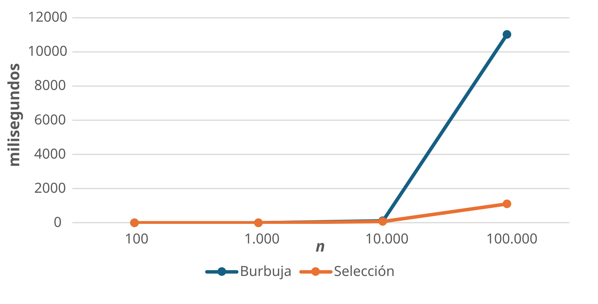

## Objetivos de la práctica

Los objetivos de la sexta práctica de la asignatura son los siguientes:

- Desarrollar algoritmos en Java.
- Ejecutar algoritmos en el entorno *Eclipse*.

---

## Algoritmos de ordenación

Dado un vector de $n$ números enteros, el objetivo de esta práctica es implementar dos algoritmos de ordenación: el algoritmo de **ordenación de burbuja** (*bubble sort*) y el algoritmo de **selección** (*selection sort*). Ambos algoritmos son métodos sencillos para ordenar una lista de elementos, aunque no son los más eficientes para grandes conjuntos de datos. Sin embargo, son útiles para entender los conceptos básicos de ordenación y complejidad algorítmica.

---

### *Bubble sort* u ordenación de burbuja

El algoritmo de **ordenación de burbuja** funciona **comparando cada par de elementos adyacentes** e **intercambiándolos si están en el orden incorrecto**. Este proceso se repite hasta que la lista está completamente ordenada.

Por ejemplo, dado un vector de $n$ números enteros, el proceso a seguir sería el siguiente:

- Comparamos el primer elemento $v[0]$ con el segundo $v[1]$ y, si es mayor que él, los intercambiamos.
- Comparamos el segundo elemento $v[1]$ con el tercero $v[2]$ y, si es mayor que él, los intercambiamos.
- Repetimos para todo el vector, hasta comparar $v[n-2]$ y $v[n-1]$.
- En ese momento, la última posición ya está ordenada.
- Repetimos el proceso hasta tener todo el vector ordenado.
- En el peor caso, tendríamos que repetir $n-1$ veces.
- Si en algún momento recorremos todo el vector sin que haya ningún intercambio, el vector ya estará ordenado.

---

A continuación se muestra un ejemplo del algoritmo de ordenación de burbuja para visualizar el proceso de ordenación paso a paso.

::: {.card .shadow-sm .mb-4}
::: {.card-body}
```{ojs}
import {
  randomIntArray,
  computeBubbleSortSteps,
  computeSelectionSortSteps,
  createStepPlayer,
  renderBubbleSortState,
  renderSelectionSortState
} from "../resources/practica6/ojs/practica6.js"
```

```{ojs}
mutable randTrigger = 0
```

```{ojs}
baseArr = {
  randTrigger;
  return randomIntArray(8);
}
```

```{ojs}
stepsBS = computeBubbleSortSteps(baseArr)
```

```{ojs}
viewof stepBS = createStepPlayer({
  html,
  max: stepsBS.length - 1,
  onRegenerate: () => {
    mutable randTrigger++;
  }
})
```

```{ojs}
renderBubbleSortState({ html, Plot, steps: stepsBS, stepIndex: stepBS })
```
:::
:::

---

### *Selection sort* u ordenación por selección

El algoritmo de ordenación por **selección** funciona **dividiendo la lista en dos partes**: la parte **ordenada** y la parte **no ordenada**. En cada iteración, el algoritmo selecciona el elemento más pequeño de la parte no ordenada y lo intercambia con el primer elemento de esa parte, moviendo así el límite entre las partes ordenada y no ordenada.

Dado un vector de $n$ números enteros, **el proceso a seguir sería el siguiente**:

- **Buscamos el elemento más pequeño en el vector y lo intercambiamos con el primer elemento**.
- Luego, **buscamos el elemento más pequeño en el resto del vector** (excluyendo el primer elemento) **y lo intercambiamos con el segundo elemento**.
- **Repetimos este proceso** hasta que todo el vector esté ordenado.

---

A continuación se muestra una animación paso a paso del algoritmo de ordenación por selección para visualizar el proceso de ordenación.

::: {.card .shadow-sm .mb-4}
::: {.card-body}
```{ojs}
mutable randTriggerSS = 0
```

```{ojs}
baseArrSS = {
  randTriggerSS;
  return randomIntArray(8);
}
```

```{ojs}
stepsSS = computeSelectionSortSteps(baseArrSS)
```

```{ojs}
viewof stepSS = createStepPlayer({
  html,
  max: stepsSS.length - 1,
  onRegenerate: () => {
    mutable randTriggerSS++;
  }
})
```

```{ojs}
renderSelectionSortState({ html, Plot, steps: stepsSS, stepIndex: stepSS })
```
:::
:::

---

## Ejercicios

Implementa los algoritmos de ordenación de burbuja y selección en Java utilizando dos clases diferentes, `OrdenacionBurbuja.java` y `OrdenacionSeleccion.java`. A continuación se muestra un ejemplo de cómo podría ser la estructura de la clase `OrdenacionBurbuja.java`:

```java
import java.util.*;

public class OrdenacionBurbuja {
  public static void ordenar(int[] v) {
    // Tu código aquí
    // Recuerda que puedes acceder al tamaño del vector 
    // con v.length y a cada elemento con v[i]
  }

  public static void main(String[] args) {
    Random r = new Random();
    Scanner sc = new Scanner(System.in);
    
    System.out.print("Dimensión de la lista de números: ");
    int size = sc.nextInt();
    
    int[] v = new int[size];
    for (int i = 0; i < size; i++) {
      int x = r.nextInt();
      x = Math.abs(x) % 50;     // Limitamos el rango para facilitar la visualización
      v[i] = x;
    }
    
    System.out.println("Vector inicial");
    for (int i = 0; i < size; i++)
      System.out.print(v[i] + "\t");
    
    ordenar(v);
    
    System.out.println();
    System.out.println("Vector ordenado");
    for (int i = 0; i < size; i++)
      System.out.print(v[i] + "\t");
  }
}
```

---

Ejecuta paso a paso los algoritmos utilizando el depurador de *Eclipse* para entender cómo funciona el proceso de ordenación. Utiliza un tamaño de vector pequeño (por ejemplo, 20 elementos) para facilitar la visualización del proceso. Además, debes **medir el tiempo de ejecución de los algoritmos utilizando cuatro valores de $n$ diferentes**: $10^2$, $10^3$, $10^4$ y $10^5$. Los valores de $n$ se representarán en el eje $X$ de un gráfico, y el tiempo de ejecución en el eje $Y$. Dibuja una gráfica similar a la ilustrada a continuación:

{#fig-graph width=75%}

---

```{python}
#| tbl-cap: "Tabla de tiempos de ejecución en milisegundos de los algoritmos de ordenación."

import pandas as pd
import numpy as np

df = pd.read_excel('../resources/practica6/data/tiempos.xlsx')
df.columns.values[0] = ""
df
```

---

::: {.callout-warning}
## Posible falta de memoria

Ten en cuenta que para valores de $n$ muy grandes, es posible que el programa no tenga suficiente memoria para ejecutar el algoritmo de ordenación de burbuja. En ese caso, puedes intentar aumentar la memoria asignada a Java. Para ello, accede a `Run > Run Configurations...` en *Eclipse*, selecciona tu clase principal, ve a la pestaña `Arguments` y en el campo `VM arguments` añade la siguiente línea:

```bash
-Xmx1024m
```

Esto asignará un máximo de 1 GB de memoria a tu programa. Si sigues teniendo problemas de memoria, puedes intentar aumentar aún más este valor, aunque ten en cuenta que esto dependerá de la cantidad de memoria RAM disponible en tu ordenador.
:::

---

### Medición de tiempo de ejecución

Para medir el tiempo de ejecución de cada implementación, puedes utilizar la clase `System` de Java para obtener el tiempo antes y después de ejecutar el algoritmo, y luego calcular la diferencia. Aquí tienes un ejemplo de cómo hacerlo:

```java
// Selección del tamaño del vector

long startTime = System.currentTimeMillis();

ordenar(v);

long endTime = System.currentTimeMillis();
long duration = endTime - startTime;
System.out.println("Tiempo de ejecución: " + duration + " milisegundos");
```

---

## Entrega de la solución

**Sólo debe realizar la entrega un miembro del grupo**. Sube a Moodle un **fichero comprimido `practica6.zip`** que contenga los siguientes archivos:

- `OrdenacionBurbuja.java`: Implementación del algoritmo de ordenación de burbuja.
- `OrdenacionSeleccion.java`: Implementación del algoritmo de ordenación por selección.
- `tiempos.xlsx`: Archivo de Excel con los tiempos de ejecución medidos para ambos algoritmos y los diferentes tamaños de vector.

