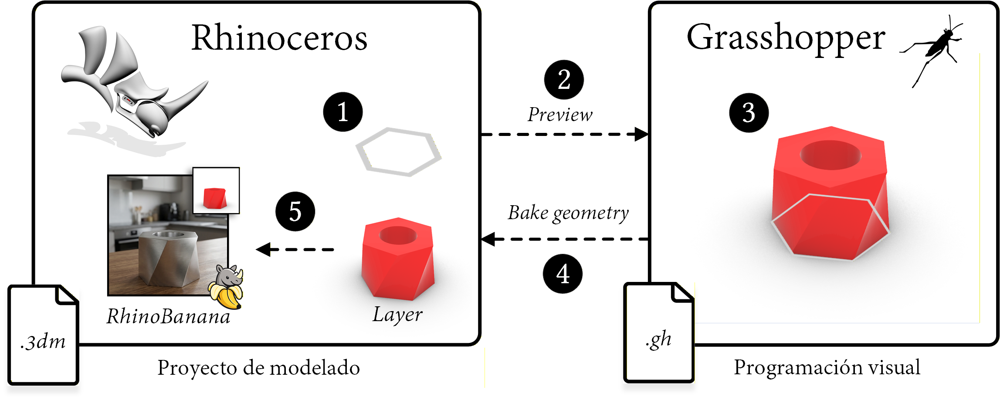
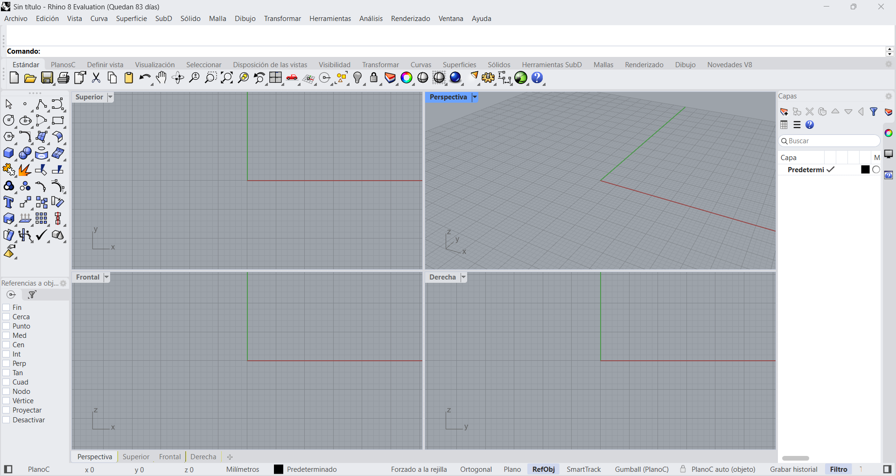
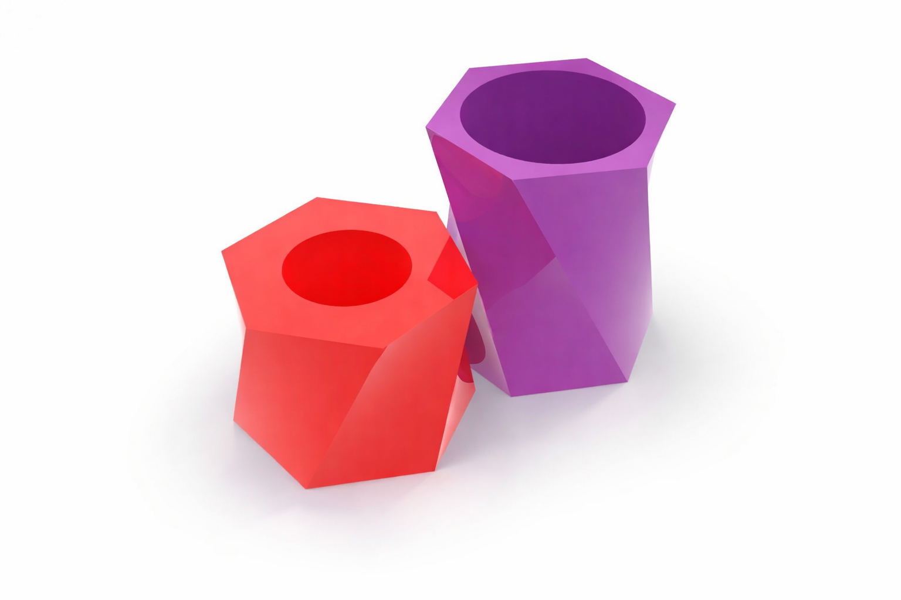
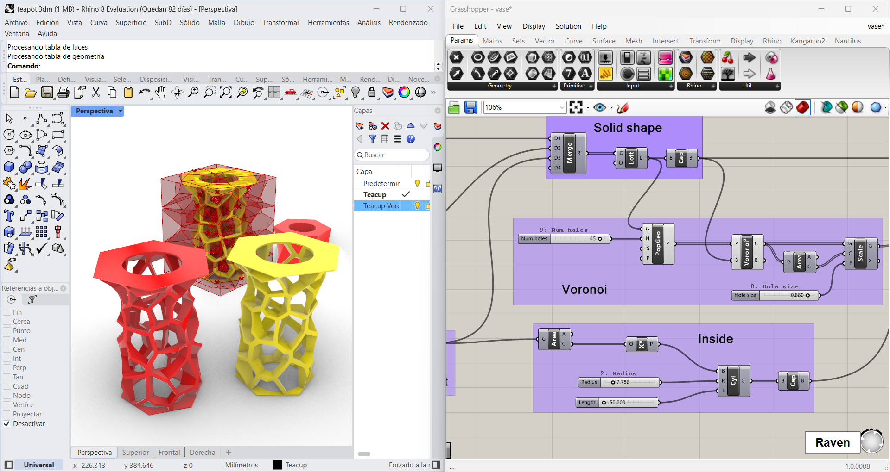
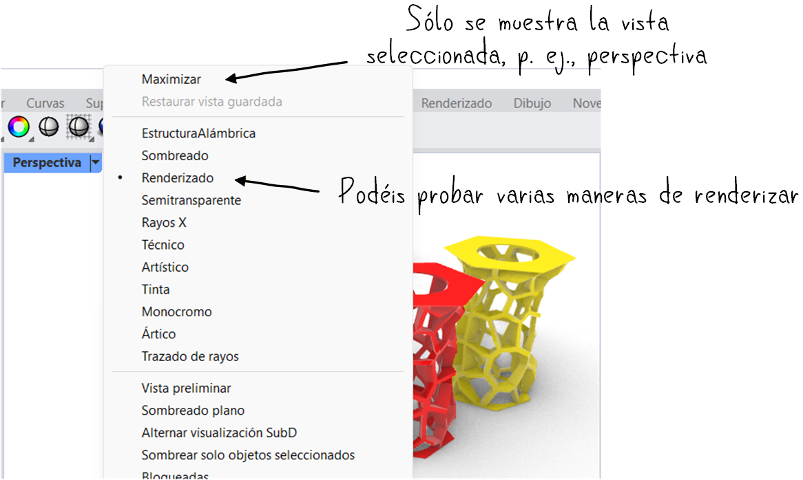
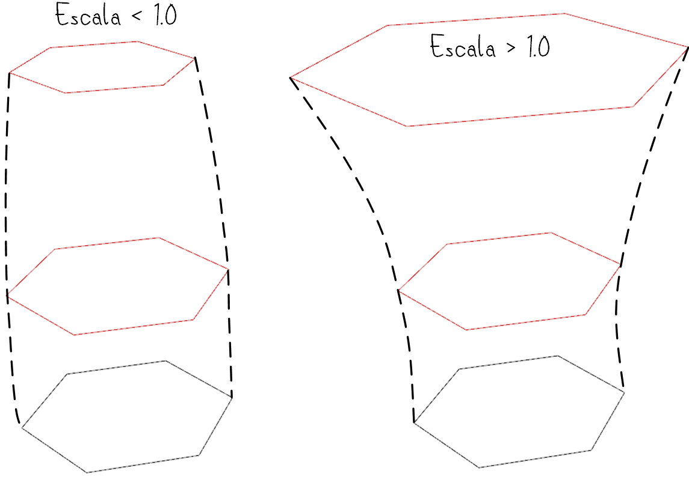
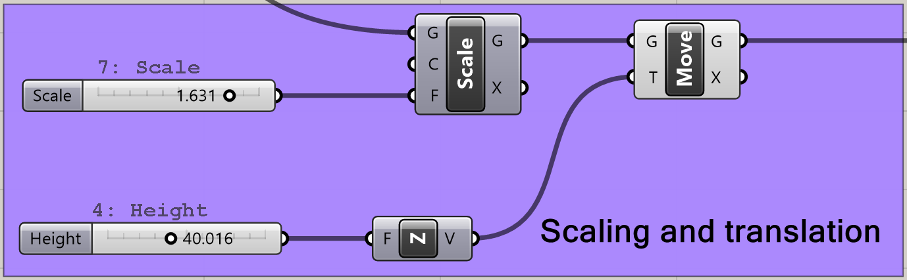
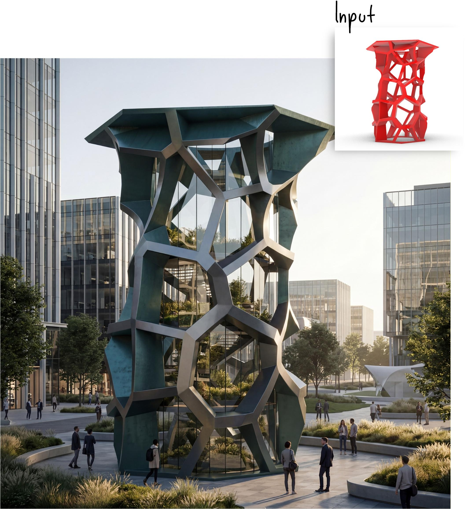
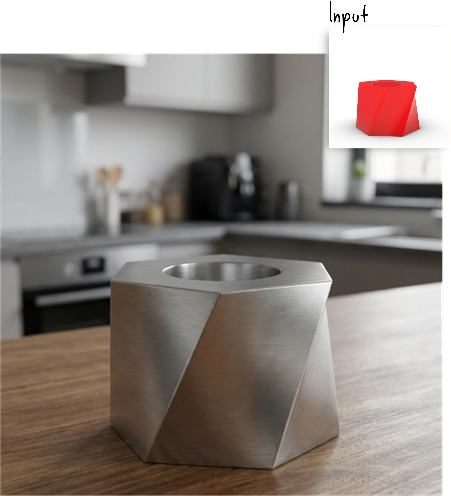
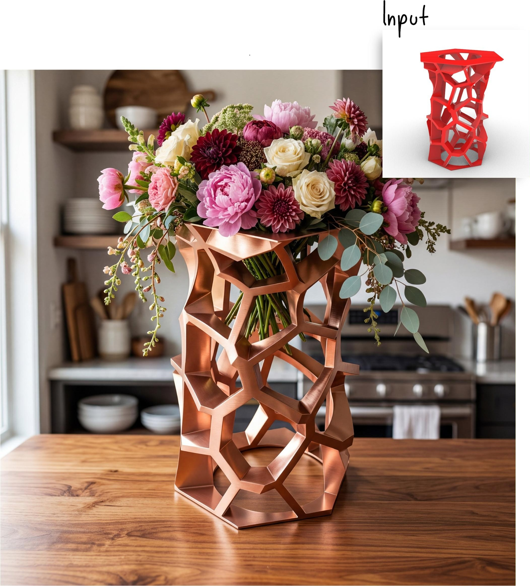

## Objetivos de la práctica

En esta práctica vamos a dar los primeros pasos con *Grasshopper* aplicándolo a un ejercicio sencillo de diseño paramétrico. Al finalizar, deberías ser capaz de:

- Conocer algunas operaciones básicas de *Grasshopper*.
- Utilizar recursos de Inteligencia Artificial integrados en *Grasshopper* para facilitar el proceso de generación de imágenes.
- Buscar información para solucionar dudas relacionadas con *Grasshopper*. 

---

## Introducción a Grasshopper

***Grasshopper*** es una herramienta de programación visual orientada al diseño paramétrico e integrada en ***Rhinoceros***. En lugar de modelar dibujando directamente cada objeto, en *Grasshopper* se construye una **definición** formada por componentes conectados entre sí. Cada componente realiza una operación, y el resultado final depende de los parámetros que introducimos.

Este modo de trabajo resulta especialmente útil cuando queremos probar variantes de una misma forma de manera rápida: por ejemplo, cambiar el tamaño de una base, la altura de una pieza o el número de divisiones de un patrón sin tener que rehacer el modelo desde cero.

{#fig-scheme width=80%}

### Descarga

Se puede descargar una versión de evaluación de 90 días, a contar desde la fecha de descarga, desde su [web](https://www.rhino3d.com/download/). Después de ese periodo, *Rhino* no permitirá guardar ficheros nuevos, aunque sí abrirlos y visualizarlos.

Una vez descargado e instalado ***Rhinoceros***, debería aparecer una pantalla como la que se muestra a continuación:



#### Instalación de complementos

Dentro de *Rhino* 8 es posible instalar complementos que añaden funcionalidades adicionales a la aplicación. Para esta práctica necesitaremos ***RhinoBanana***, un complemento que permite generar imágenes a partir de modelos creados en *Rhino* usando modelos de difusión.

Para instalarlo:

1. Abre *Rhino*.
2. Ve a `Herramientas > Administrar complementos`.
3. Busca **RhinoBanana**.
4. Pulsa **Instalar**.

{#fig-install-rhino-banana width=70%}

#### Acceso a Grasshopper

*Rhino* será nuestro visor principal, pero la construcción paramétrica de la geometría se hará en *Grasshopper*. Para abrirlo, escribe `Grasshopper` en la barra de comandos de *Rhino* 8 (ver @fig-command-line) y pulsa Enter.

{#fig-command-line width=50%}

También es posible acceder a *Grasshopper* mediante la opción **Ejecutar Grasshopper** de la barra de herramientas de *Rhino*.

{#fig-toolbar}

::: {.callout-note}
## Idea clave

En *Grasshopper* no estamos "dibujando" la pieza final directamente, sino definiendo una **receta** para generarla. Si modificamos un parámetro, la geometría se actualiza automáticamente.
:::

## Ejercicio 1: modelado de una taza

El primer objetivo práctico es modelar una taza sencilla en *Grasshopper* siguiendo el tutorial del siguiente vídeo:



Podéis encontrar también material complementario en algunos tutoriales disponibles en la web, como el de [Modelab](https://modelab.gitbooks.io/grasshopper-primer/content/).

### Qué debes hacer

Durante el tutorial, intenta no limitarte a copiar conexiones. Ve comprobando qué hace cada componente y qué ocurre cuando cambias sus parámetros. En particular:

:::: {.p7-split-uza}
::: {}
1. Crea los polígonos o perfiles base de la taza.
2. Ajusta su tamaño con *sliders*.
3. Colócalos a distintas alturas.
4. Conéctalos para generar una superficie o un volumen.
5. Observa cómo cambia el resultado al modificar radios, alturas o posiciones.
:::
::: {}

:::
::::

::: {.p7-ojs-setup-uza}
```{ojs}
import {
  createVoronoiControls,
  renderVoronoiExplorer
} from "../resources/practica7/ojs/practica7.js";
```
:::

### Consejos para no perderse

- Trabaja con la ventana de *Rhino* y la de *Grasshopper* visibles al mismo tiempo, como en la @fig-split-screen. De este modo, podrás ver cómo cada cambio en *Grasshopper* afecta a la geometría en *Rhino*.
- No busques medidas exactas: en esta práctica nos interesa más **entender el flujo de trabajo** que obtener una taza perfectamente precisa.
- Cambia a la vista de perspectiva y, si lo necesitas, utiliza el modo **Renderizado** para ver mejor la geometría (ver @fig-maximizar-renderizado). 
- Nombra los *sliders* más importantes para recordar qué controla cada uno.

{#fig-split-screen}

{#fig-maximizar-renderizado width=80%}

::: {.callout-tip}
## Comprueba que vas bien

Antes de seguir, deberías tener una taza cuya forma cambie al modificar varios *sliders*. Si mueves un control y no ocurre nada, revisa si ese componente está realmente conectado al resto de la definición.
:::

## Ejercicio 2: transformar la taza en una vasija

Una vez modelada la taza, el siguiente paso consiste en reutilizar la misma idea para crear una **vasija**. No se trata de empezar desde cero, sino de modificar la definición anterior para obtener una pieza más alta y con un perfil diferente.

:::: {.p7-split-uza}
::: {}
Para ello, puedes añadir un nuevo polígono en la parte superior y situarlo a una altura mayor que en la taza. Después, modifica su tamaño para que la silueta resultante sea más propia de una vasija: por ejemplo, con una base más estrecha y una parte superior más abierta, o al revés.

Ten en cuenta que *Grasshopper* genera una geometría **procedimental**, pero esta no pasa a formar parte de la escena de *Rhino* hasta que la **bakeamos**. Por eso, cuando la pieza tenga el aspecto que buscas, deberás hacer clic derecho sobre el componente final y elegir **Bake** para incorporarla a *Rhino* y poder exportarla.
:::
::: {}
{#fig-vasija}
:::
::::

Se recomienda **bakear** cada taza o vasija en una capa distinta, para mantener la escena organizada. Puedes crear una capa nueva en *Rhino* para cada objeto antes de realizar el *bake*.

{#fig-layers width=60%}

### Añadir una variación con escala

Para dar algo más de complejidad a la vasija, escalaremos el polígono superior para que su diámetro sea distinto al de los otros perfiles.

:::: {.p7-split-uza}
::: {}
Para ello, utilizaremos el componente **"Scale"** de *Grasshopper*, que permite escalar una geometría a partir de un centro y un factor de escala. El cambio puede ser muy sutil o muy pronunciado: basta con ajustar el valor del *slider* para obtener distintas variantes.

Es importante **escalar antes de trasladar** el nuevo polígono con **"Move"**, para evitar que también se modifique la distancia del desplazamiento. Además, conviene controlar el factor de escala con un *slider*, igual que hicimos antes con radios y alturas.
:::
::: {}
{#fig-vase-scale}
:::
::::

{#fig-vasija-grafo}

El componente **"Merge"** puede recibir cualquier número de entradas, por lo que puedes añadir tantos perfiles intermedios como necesites para generar formas más complejas.

{#fig-merge}

::: {.callout-warning}
## Error habitual

Si la forma se deforma de manera extraña, revisa el orden de operaciones. En diseño paramétrico, hacer primero un **Move** y luego un **Scale** no suele dar el mismo resultado que hacerlo al revés.
:::

## Ejercicio 3: añadir un patrón Voronoi

Una vez obtenida la vasija, podemos enriquecerla añadiendo un patrón a su superficie. Para ello, utilizaremos **Voronoi**, una técnica que divide el espacio en celdas a partir de un conjunto de puntos. Este tipo de patrón es muy habitual en diseño computacional y arquitectura porque permite generar de forma sencilla estructuras irregulares, perforaciones y efectos orgánicos.

{#fig-voronoi}

::: {.callout-note}
## ¿Qué es Voronoi?

Un diagrama de **Voronoi** divide una región en varias celdas a partir de un conjunto de puntos. Cada celda contiene todos los puntos que están más cerca de su punto generador que de cualquier otro. En modelado paramétrico, este recurso se utiliza con frecuencia para crear patrones geométricos, perforaciones y estructuras decorativas.
:::

::: {.p7-figure-uza}
::: {.p7-interactive-grid-uza}
::: {}
```{ojs}
renderVoronoiExplorer({ Plot, html, params: voronoiControls })
```
:::

::: {}
```{ojs}
viewof voronoiControls = createVoronoiControls({ Inputs, html })
```
:::
:::

Explorador de densidad de un patrón Voronoi.
:::

### Qué debes hacer

Para conseguir este efecto en *Grasshopper*:

1. Genera puntos aleatorios en el interior de la geometría con **"Populate Geometry"**.
2. Usa esos puntos como entrada de **"Voronoi 3D"**.
3. Observa las celdas obtenidas y comprueba si su tamaño y densidad resultan adecuados.
4. Resta esas celdas a la vasija mediante **"Solid Difference"**.

El número de puntos influirá mucho en el resultado: con pocos puntos obtendrás un patrón más simple; con muchos, una perforación más densa y compleja.

{#fig-voronoi-grafo}

::: {.callout-tip}
## Prueba y compara

No te quedes con una sola versión. Cambia el número de puntos, el tamaño de la vasija o la posición de los perfiles y compara varios resultados. En diseño paramétrico, explorar alternativas forma parte del propio ejercicio.
:::

## Ejercicio 4: generación de imágenes con modelos de difusión

Una vez modeladas la taza y la vasija, podemos generar una imagen final más llamativa visualmente mediante un modelo de difusión. La idea no es modificar la geometría base, sino utilizar una vista del modelo como referencia para añadir materiales, iluminación, contexto y detalles que no estaban presentes en la escena original. Podéis convertir la vasija en cualquier otro objeto: un edificio, una lámpara, un jarrón decorativo... La clave está en escribir un *prompt* que describa con detalle el resultado que quieres obtener.

De este modo, una geometría sencilla puede transformarse en una imagen más cercana a una visualización arquitectónica. A continuación se muestran algunos ejemplos obtenidos a partir de modelos generados durante la práctica:

:::: {.p7-prompt-grid-uza}
::: {.p7-prompt-card-uza}


<div class="p7-prompt-text-uza">
<strong>Prompt:</strong> <i>Photorealistic futuristic building inspired by the attached reference image, preserving its tall hexagonal silhouette and irregular cellular lattice structure. Reimagine it as a parametric architectural tower or pavilion with a metallic exoskeleton, glass walls, terraces, integrated base, and realistic architectural details. Set it in a modern urban plaza with soft landscaping and people for scale. Cinematic lighting, elegant materials, contemporary architecture, highly detailed, realistic reflections and shadows.</i>
</div>
:::

::: {.p7-prompt-card-uza}


<div class="p7-prompt-text-uza">
<strong>Prompt:</strong> <i>The mesh is a metal teacup lying on a wooden table in a modern kitchen.</i>
</div>
:::

::: {.p7-prompt-card-uza}


<div class="p7-prompt-text-uza">
<strong>Prompt:</strong> <i>Photorealistic decorative vase inspired by the attached reference image, preserving its tall organic lattice structure and hexagonal opening. Refine it into a functional vase with an integrated base and a polished metallic material, such as brushed copper or glossy red metal. Fill it with a lush bouquet of large overflowing flowers — peonies, dahlias, roses, soft greenery, and trailing stems — creating an abundant, luxurious arrangement. Place it on a warm wooden table in a stylish kitchen, lit by soft natural window light, with realistic reflections, shadows, and an elegant editorial interior design aesthetic.</i>
</div>
:::
::::

### Cómo usar Rhino Banana

Para comenzar a generar imágenes, abre ***RhinoBanana*** desde la línea de comandos de *Rhino* escribiendo `RhinoBanana` y pulsando Enter. Se abrirá una ventana como la que se muestra en la @fig-rhino-banana.

{#fig-rhino-banana width=60%}

En esta interfaz podrás:

- seleccionar la vista que se utilizará como referencia;
- elegir la proporción de la imagen final;
- escoger el modelo de difusión;
- escribir o refinar el *prompt*.

Además, la herramienta incluye un ***Prompt agent*** que, a partir de una descripción breve, puede ayudarte a generar un *prompt* más largo y elaborado, o a ajustar los parámetros del proceso de generación para conseguir un resultado más cercano a lo que buscas.

::: {.callout-note}
## Recomendación

Empieza con un *prompt* simple y claro. Si el resultado no se parece a lo que buscas, añade después detalles sobre material, iluminación, contexto o estilo. Suele funcionar mejor que escribir desde el principio un texto muy largo sin saber qué parte está influyendo en la imagen.
:::

## Qué debes entregar

**Sólo debe realizar la entrega un miembro del grupo.** Sube a Moodle un fichero comprimido `practica7.zip` que contenga:

- `taza.obj`, con la geometría de la taza modelada en *Grasshopper*;
- `vasija.obj`, con la geometría de la vasija modelada en *Grasshopper*;
- `imagen.jpeg`, una imagen generada con un modelo de difusión a partir de una vista de la vasija.

::: {.callout-important}
## Exportar la geometría

Para exportar la geometría de la taza y la vasija, selecciona cada una de ellas en *Rhino* y ve a `Archivo > Exportar selección`. Elige el formato **Wavefront OBJ** y guarda el fichero con el nombre correspondiente (`taza.obj` o `vasija.obj`).
:::
