

  ~4 min de lectura

## Objetivos de la práctica

Los objetivos de la séptima práctica de la asignatura son los siguientes:

- Conocer algunas operaciones básicas de *Grasshopper*.
- Utilizar recursos de Inteligencia Artificial integrados en *Grasshopper* para facilitar el proceso de generación de imágenes.
- Buscar información para solucionar dudas relacionadas con *Grasshopper*. 

---

## Introducción a Grasshopper

Grasshopper es una herramienta de programación visual orientada al diseño paramétrico, integrada en ***Rhinoceros***. Permite generar y controlar geometría mediante la definición y modificación de parámetros, lo que facilita la creación de formas complejas y la exploración rápida de distintas alternativas de diseño. Su funcionamiento se basa en una interfaz gráfica de componentes y conexiones, de modo que el usuario puede construir definiciones paramétricas sin recurrir necesariamente a la programación textual tradicional.

### Descarga

Se puede descargar una versión de evaluación de 90 días, a contar desde la fecha de descarga, desde su [web](https://www.rhino3d.com/download/). Después de dicho periodo, Rhino no dejará guardar ficheros, pero sí visualizarlos. 

Una vez descargado e instalado ***Rhinoceros***, debería aparecer una pantalla como la que se muestra a continuación:

#### Instalación de complementos

Dentro de *Rhino* 8, es posible instalar complementos que añaden funcionalidades adicionales a la aplicación. Para esta práctica, es necesario instalar el complemento ***Rhino Banana***, que permite generar imágenes a partir de modelos creados en *Rhino* utilizando modelos de difusión. Para ello, se puede acceder a `Herramientas > Administrar complementos`, buscar "Rhino Banana" en la barra de búsqueda, y hacer clic en "Instalar".

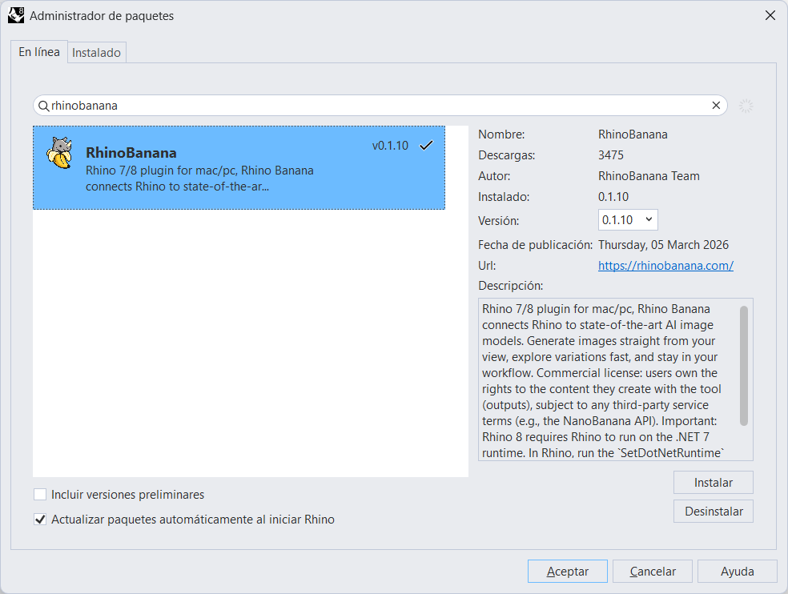{#fig-install_rhino_banana}

#### Acceso a Grasshopper

*Rhino* será nuestro visor; no obstante, la programación visual y el modelado de geometría se llevarán a cabo en *Grasshopper*. Se puede acceder a *Grasshopper* escribiendo "grasshopper" en la barra de comandos de *Rhino* 8 (ver @fig-command_line). Esto abrirá la interfaz de *Grasshopper*, donde se pueden crear y manipular modelos paramétricos.

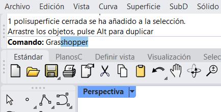{#fig-command_line width=50%}

También es posible acceder a *Grasshopper* a través de la opción "Ejecutar Grasshopper" en la barra de herramientas de *Rhino* (penúltima opción a la derecha).

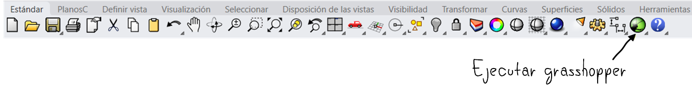{#fig-toolbar}

### Ejercicio de modelado de una taza

El primer objetivo de esta práctica es modelar una o varias tazas de té utilizando *Grasshopper*, siguiendo el tutorial del siguiente vídeo:



Podéis encontrar más información en algunos tutoriales disponibles en la web, como el de [Modelab](https://modelab.gitbooks.io/grasshopper-primer/content/). 

Algunos **consejos** para habituarse a *Grasshopper*:

- Es recomendable compartir la pantalla entre la vista de *Rhino* y la de *Grasshopper* para facilitar el proceso de modelado.

{#fig-split_screen}

- Dado que no buscamos un modelado preciso, ni medidas concretas, podemos **maximizar la vista de perspectiva** de *Rhino* para visualizar mejor el resultado de las operaciones realizadas en *Grasshopper*.
- También, podemos visualizar el resultado de una manera un poco más clara utilizando la opción **"Renderizado"**.

{#fig-maximizar_renderizado}

### Modelado de una vasija

::: {layout="[60,40]"}
::: {.column}
Una vez modelada la taza de té, se puede extender el ejercicio para modelar una **vasija**, utilizando el mismo procedimiento que para la taza, pero con un perfil diferente. Para ello, se puede crear otro polígono, con una altura mayor que el de la taza, y con una base más ancha o más estrecha, según el resultado que se quiera obtener.

Tened en cuenta que **Grasshopper** sólo permite modelar geometría, pero no genera la geometría en sí en *Rhino* hasta que se le indica que lo haga. Por lo tanto, es necesario **bakear** la geometría para que esta aparezca en *Rhino* y pueda ser exportada a un formato compatible con otras aplicaciones, como el formato OBJ. Para ello, se puede seleccionar el último nodo de la definición de *Grasshopper* (el que genera la geometría final), hacer clic derecho sobre él y seleccionar la opción **"Bake"**, eligiendo como destino la capa de *Rhino* donde se quiera que aparezca la geometría.
:::
::: {.column}
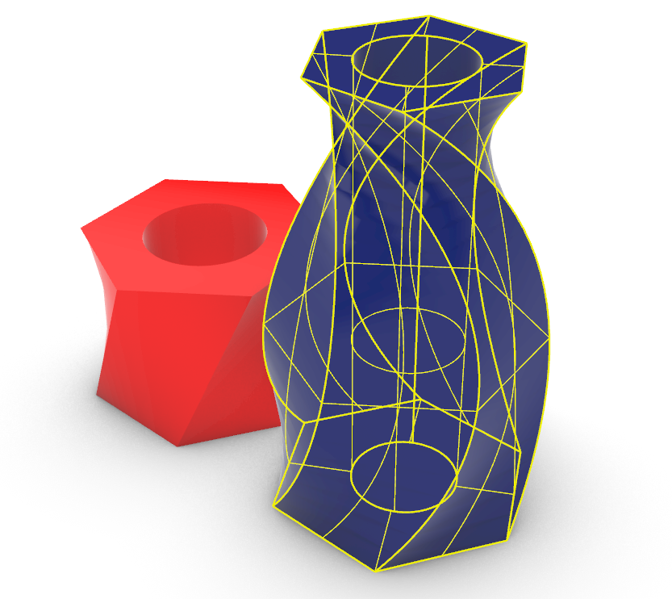{#fig-vasija}
:::
:::

Se recomienda *bakear* cada taza o vasija que se modele en una capa diferente, para facilitar su identificación y posterior exportación. Para ello, se puede crear una nueva capa en *Rhino* para cada taza o vasija (ver @fig-layers).

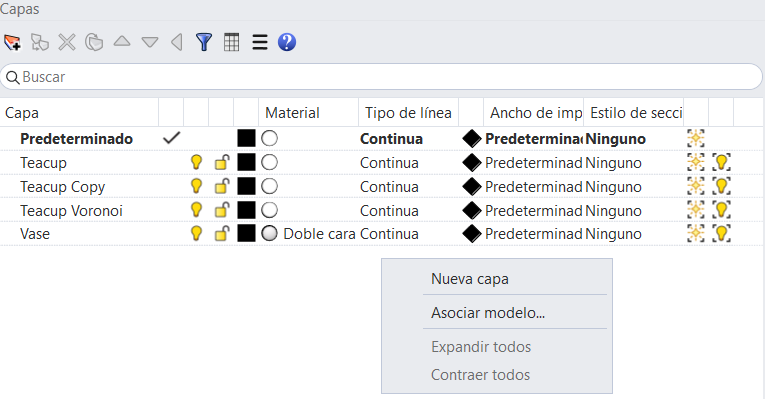{#fig-layers width=60%}

::: {layout="[70,30]"}
::: {.column}
Para añadir algo más de complejidad a la vasija, escalaremos el nuevo polígono que crearemos en la parte superior para que tenga un diámetro diferente a los dos anteriores. Para ello, utilizaremos el nodo **"Scale"** de *Grasshopper*, que permite escalar la geometría en función de un factor de escala. 
:::
::: {.column}
{#fig-vase_scale}
:::
:::

Tened en cuenta que **es necesario escalar antes de trasladar** (nodo "Move") el nuevo polígono, para evitar que se escale también la distancia a la que se traslada el nuevo polígono. También, **podemos ajustar el factor de escala mediante un *slider*** para obtener el resultado deseado, igual que anteriormente hemos configurado el radio del cilindro, o su longitud. Por ejemplo, la figura @fig-vasija_grafo muestra cómo quedaría la definición de *Grasshopper* para modelar la vasija, incluyendo el nodo de escala.

{#fig-vasija_grafo}

Además, tened en cuenta que el nodo **"Merge"** puede recibir cualquier número de entradas, por lo que se pueden añadir tantos polígonos como se quiera para crear formas más complejas. 

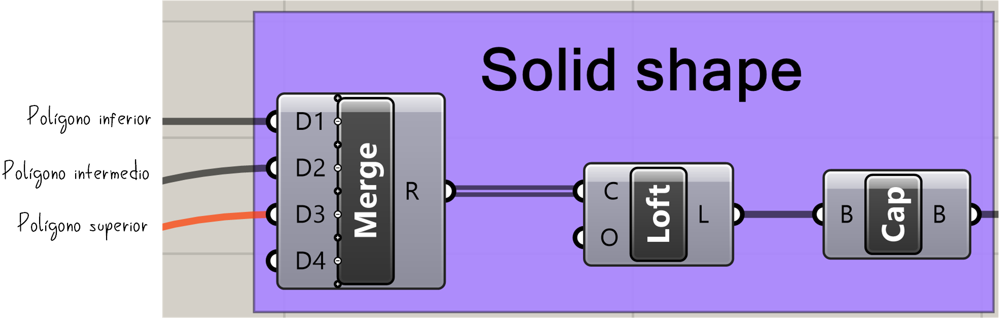{#fig-merge}

### Patrones en la geometría

Podemos enriquecer aún más el modelado de la vasija añadiendo un patrón a su superficie. Para ello, utilizaremos **Voronoi**, una técnica que divide el espacio en celdas a partir de un conjunto de puntos. Este tipo de patrón es muy habitual en diseño computacional y arquitectura, ya que permite generar de forma sencilla estructuras orgánicas e irregulares. Por ejemplo, la @fig-voronoi muestra un patrón de celdas obtenido a partir de varios puntos aleatorios distribuidos en el interior de la geometría de la vasija.

::: {.callout-note}
## ¿Qué es Voronoi?

Un diagrama de **Voronoi** divide una región en varias celdas a partir de un conjunto de puntos. Cada celda contiene todos los puntos que están más cerca de su punto generador que de cualquier otro. En modelado paramétrico, este recurso se utiliza con frecuencia para crear patrones geométricos, perforaciones y estructuras decorativas.
:::

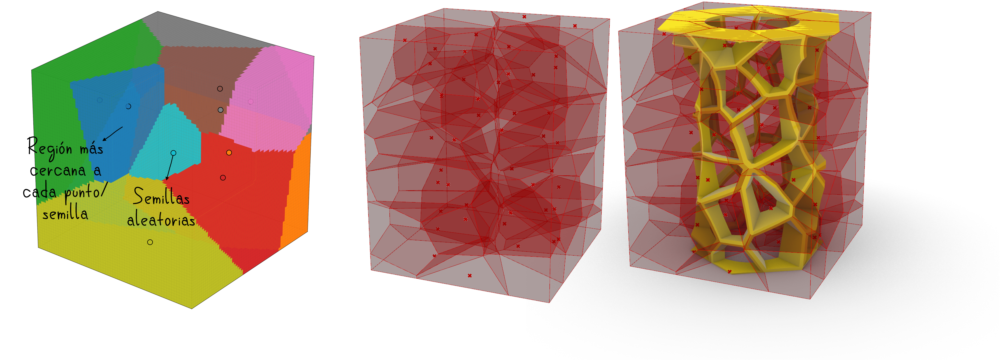{#fig-voronoi}

Para conseguir este efecto en *Grasshopper*, podemos utilizar el componente **"Voronoi 3D"**, que genera un conjunto de celdas tridimensionales a partir de una serie de puntos. Estos puntos pueden obtenerse con **"Populate Geometry"**, que permite distribuir puntos aleatorios dentro de una geometría dada. En este caso, generaremos los puntos en el interior de la vasija y, a continuación, emplearemos **"Voronoi 3D"** para construir el patrón celular. Finalmente, mediante **"Solid Difference"**, restaremos este patrón a la geometría original de la vasija, obteniendo así una superficie perforada con un diseño tipo Voronoi.

A continuación se muestra un ejemplo de cómo quedaría la definición de *Grasshopper* para generar el patrón Voronoi en la vasija:

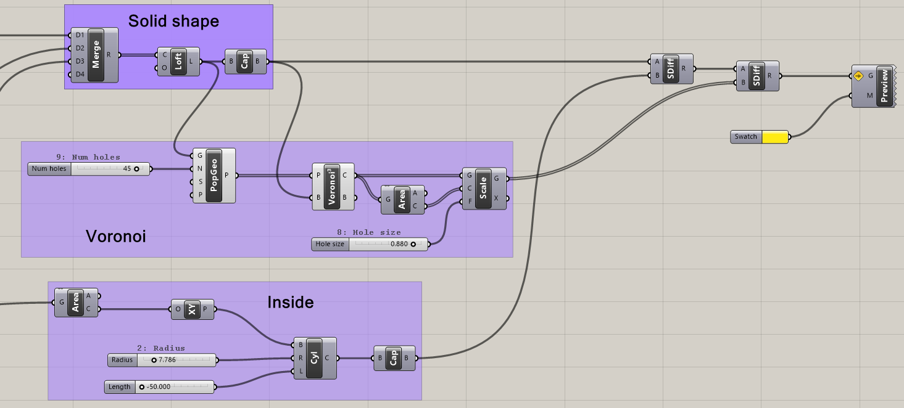{#fig-voronoi_grafo}

### Generación de imágenes con modelos de difusión

Por último, una vez hemos modelado una taza y una vasija, podemos generar una imagen final que añada detalles no presentes en la escena original mediante un modelo de difusión. Para ello, se puede utilizar como imagen de entrada una vista del modelo creado en *Grasshopper* y acompañarla de un *prompt* descriptivo que indique el resultado deseado.

De este modo, es posible transformar una geometría sencilla en una imagen más rica, incorporando materiales, iluminación, contexto y elementos decorativos. A continuación se muestran algunos ejemplos obtenidos a partir de modelos generados durante la práctica:

::: {layout="[30,30,30]"}
::: {.column}
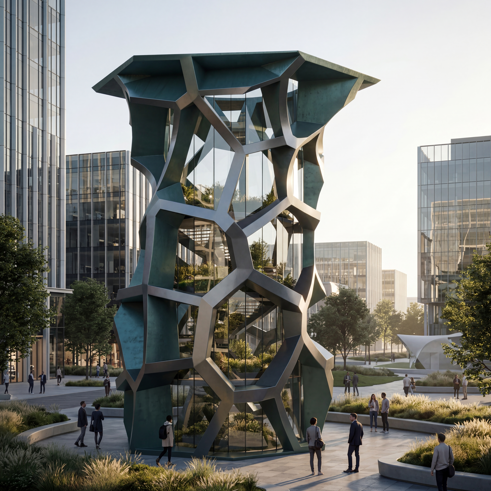

<strong>Prompt:</strong> <i>Photorealistic futuristic building inspired by the attached reference image, preserving its tall hexagonal silhouette and irregular cellular lattice structure. Reimagine it as a parametric architectural tower or pavilion with a metallic exoskeleton, glass walls, terraces, integrated base, and realistic architectural details. Set it in a modern urban plaza with soft landscaping and people for scale. Cinematic lighting, elegant materials, contemporary architecture, highly detailed, realistic reflections and shadows.</i>

:::

::: {.column}
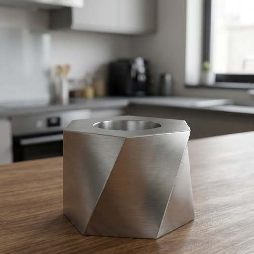

<strong>Prompt:</strong> <i>The mesh is a metal teacup lying on a wooden table in a modern kitchen.</i>

:::

::: {.column}
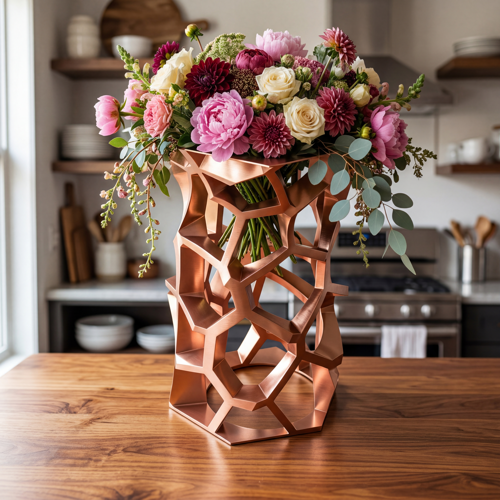

<strong>Prompt:</strong> <i>Photorealistic decorative vase inspired by the attached reference image, preserving its tall organic lattice structure and hexagonal opening. Refine it into a functional vase with an integrated base and a polished metallic material, such as brushed copper or glossy red metal. Fill it with a lush bouquet of large overflowing flowers — peonies, dahlias, roses, soft greenery, and trailing stems — creating an abundant, luxurious arrangement. Place it on a warm wooden table in a stylish kitchen, lit by soft natural window light, with realistic reflections, shadows, and an elegant editorial interior design aesthetic.</i>

:::
:::

Para comenzar a generar imágenes es necesario abrir ***Rhino Banana*** utilizando la línea de comandos de *Rhino* 8, escribiendo "RhinoBanana" y pulsando Enter. Esto abrirá una nueva ventana como la que se muestra en la @fig-rhino_banana. La interfaz es bastante intuitiva, y entre otras opciones, permite seleccionar qué vistas se utilizan para generar la imagen, la proporción de la imagen (por ejemplo, 1:1, 16:9, etc.), el modelo de difusión a utilizar, el *prompt* descriptivo, etc. 

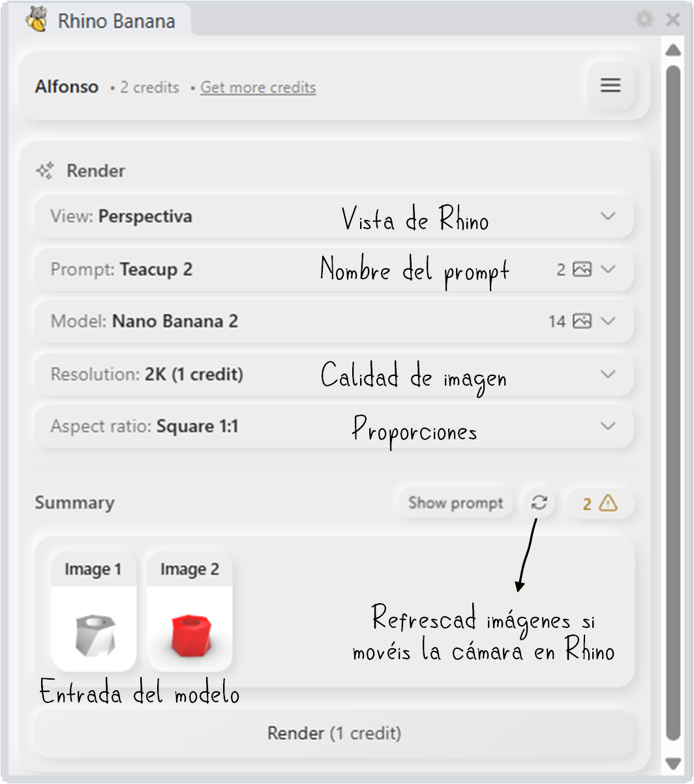{#fig-rhino_banana width=60%}

Entre otras herramientas, también contiene un ***Prompt agent*** que, a partir de una descripción breve del resultado deseado, genera un *prompt* más elaborado y detallado, lo que puede ser de gran ayuda para obtener mejores resultados. Para generar una imagen, os pedirá una carpeta de destino donde se guardará la imagen generada, y una vez seleccionada, comenzará el proceso de generación de la imagen.

## Entrega

**Sólo debe realizar la entrega un miembro del grupo**. Sube a Moodle un **fichero comprimido `practica7.zip`** que contenga los siguientes archivos:

- El fichero `taza.obj` con la geometría de las tazas modeladas en *Grasshopper*.
- El fichero `vasija.obj` con la geometría de las vasijas modeladas en *Grasshopper*.
- Una imagen `difussion.png` generada con un modelo de difusión, que sea el resultado de utilizar la imagen la vasija modelada en *Grasshopper* como imagen de entrada.