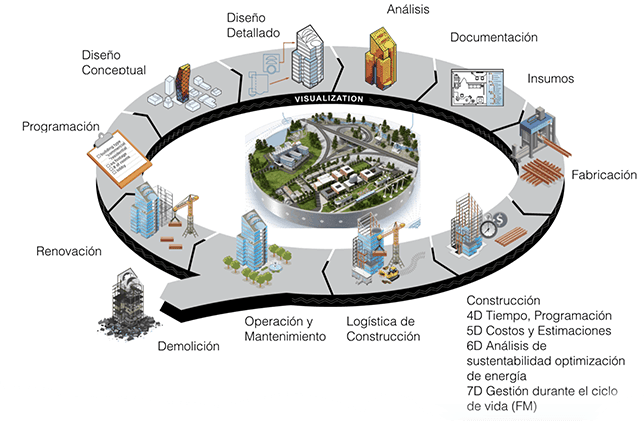
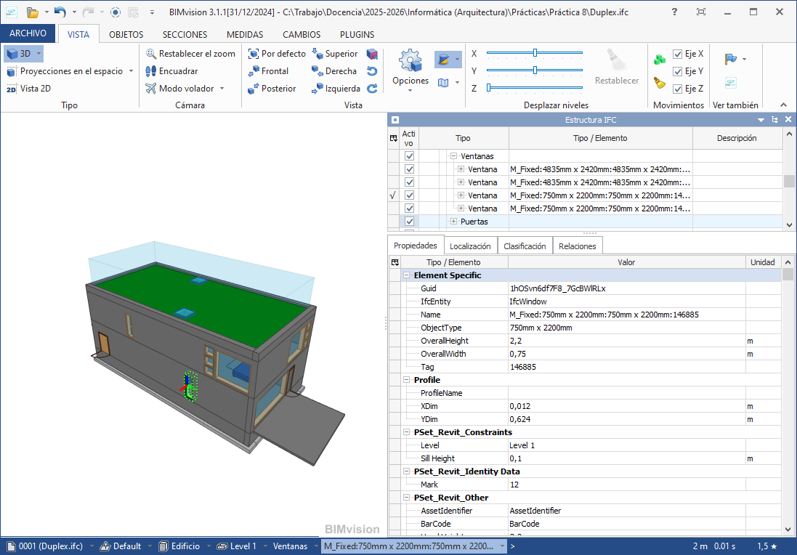
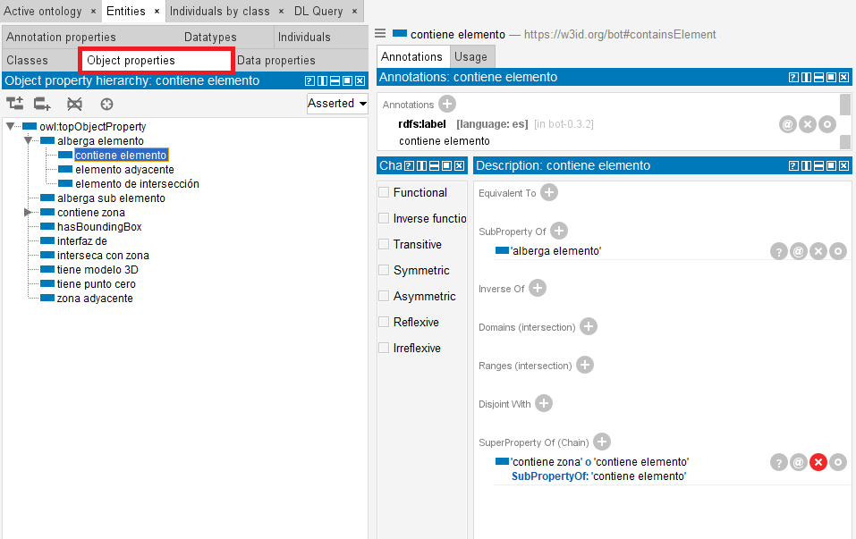
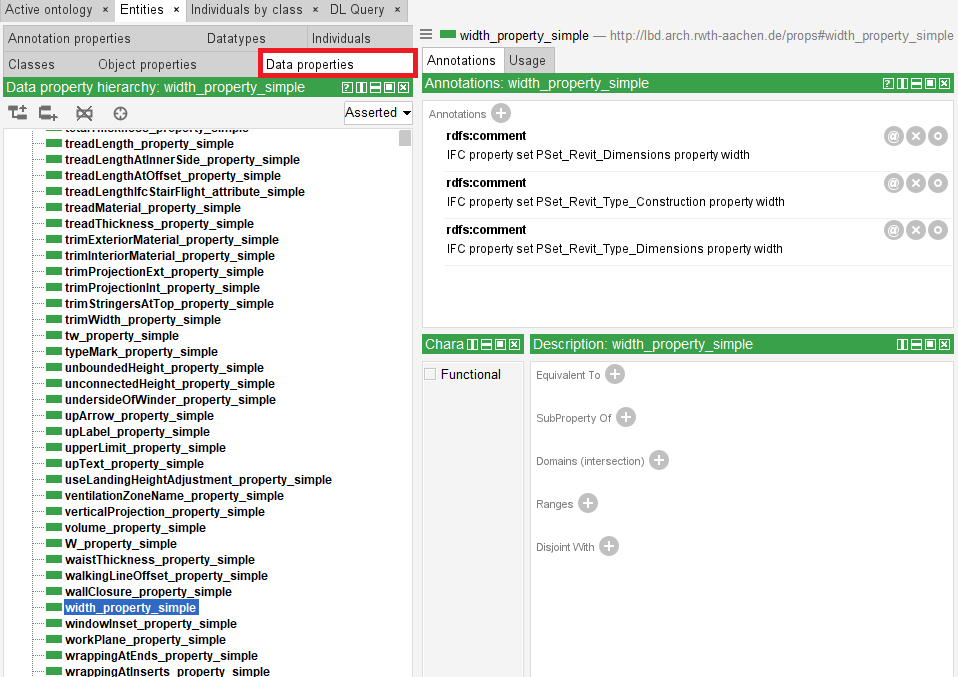
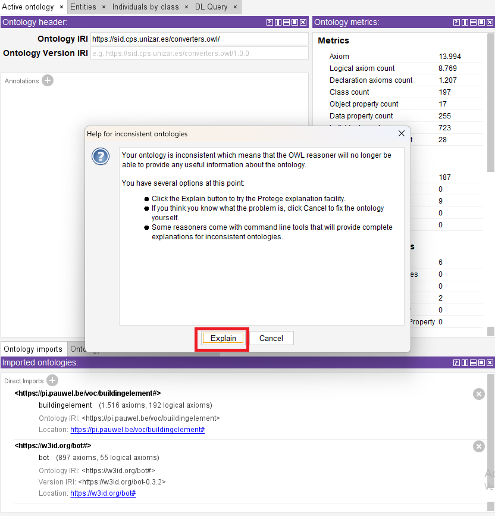

## Objetivos de la práctica

- Conocer la representación de modelos BIM usando ontologías
- Hacer consultas al modelo BIM usando un razonador semántico.

## ¿Qué es BIM?
El **Modelado de Información de Construcción** (**BIM** en inglés) es un proceso colaborativo para gestionar la información en un proyecto de construcción (Ver @fig-BIM).

.](../resources/practica8/bim1.png){#fig-BIM}

BIM se basa en la representación digital de un edificio para integrar el diseño, el modelado, la planificación y la operación durante todo su **ciclo de vida**, desde el diseño hasta el demolición (Ver @fig-edif).
Los modelos BIM incluyen numerosos datos interconectados, como un modelo geométrico 3D de los elementos del edificio, una descripción de los materiales utilizados y sus propiedades, etc. Las **ventajas** de usar BIM incluyen la optimización de los costes de construcción y mantenimiento, la mejora de la transparencia y la colaboración entre las diferentes partes interesadas, la gestión de proyectos complejos y la flexibilidad para adaptarse rápidamente a los requisitos cambiantes. Por lo tanto, BIM es un elemento clave en la **digitalización** del **sector de la construcción**.

{#fig-edif}

## Uso de un software visualizador BIM
En esta práctica considerararemos diferentes versiones de un modelo BIM públicamente
disponible correspondiente a un apartamento dúplex. La versión original ([⬇️ Duplex.ifc](../resources/practica8/Duplex.ifc)) está en IFC (concretamente, 2x3). La versión semántica ([⬇️ Duplex.owl](../resources/practica8/Duplex.owl)) está en el **lenguaje OWL**. 

El primer paso de la práctica es usar [BIMvision](https://bimvision.eu) u otro visualizador BIM para abrir el fichero **Duplex.ifc** y familiarizarse con el modelo. La @fig-visor muestra el
detalle de una ventana de la planta baja (Level 1). 

{#fig-visor}

::: {.callout-note}
## 🧠 Ejercicio 1 - Encontrar elementos

¿Cuántas ventanas hay? 
¿Qué identificador, alturas y anchura tiene cada una?
:::

##  Conversión a modelo semántico
Este apartado es opcional, puesto que el objetivo es obtener el fichero Duplex.owl que ya
está disponible, pero en todo caso vamos a describir mejor el proceso seguido
para obtener el fichero. Aunque existen varias herramientas que permiten traducir un fichero
de entrada en IFC a un fichero de salida en OWL, en nuestro caso se ha usado en particular
[IFCtoLBD 2.43.5](https://github.com/jyrkioraskari/IFCtoLBD/releases/tag/2.43.5). Debemos tener cuenta que este fichero utiliza vocabulario (clases y propiedades) previamente definidas en ontologías existentes en el ámbito de la construcción. 

::: {.callout-warning}
Se ha usado la configuración **BOT + PRODUCT + PROPS, Level L1**. Manualmente, se ha
eliminado la referencia a 2 ontologías externas (OMG y MEP) para simplificar la práctica.
:::

## Uso del editor de ontologías Protégé 

Para abrir el fichero **Duplex.owl** usaremos [Protégé](http://protege.stanford.edu), un editor
de ontologías gratuito y con versiones para varios sistemas operativos,. Protégé no requiere
instalación, basta descargar un fichero .zip, descomprimirlo y pinchar en el ejecutable.

En el menú de opciones que hay bajo el título de la ontología (“Converters”), podemos elegir
**Entities** para seleccionar los diferentes componentes de la ontología (ver @fig-protege cuadro en color rojo): clases (**Classes**),
propiedades cuyo valor es un objeto/individuo (**Object properties**), propiedades cuyo valor
es un tipo de dato conocido por la máquina (**Data properties**), individuos (**Individuals**), etc.

La @fig-protege muestra el resultado de seleccionar **Clases** y, concretamente, **Edificio**.
Obsérvese cómo la interfaz nos muestra que **Edificio** es una subclase de **Zona**. 

{#fig-protege}

.]

Dependiendo de la versión de la herramienta Protégé utilizada, es posible que importe
automáticamente las ontologías desde Internet o que nos pida que aportemos ficheros
locales para importar las ontologías. En este último caso, en **Active ontology → Ontology
imports** pinchamos en el botón **+** para añadir los ficheros
[⬇️ beo.owl](../resources/practica8/beo.owl) y [⬇️ bot.owl](../resources/practica8/bot.owl).

Como vemos en la @fig-protege, algunos elementos de la ontología tienen asociadas varias
anotaciones con etiquetas en múltiples idiomas. Por ejemplo, la clase
**http://w3id.org/bot/Building** tiene etiquetas **Building**, **Edificio**, etc. Dependiendo de la
configuración de nuestro ordenador (del idioma predeterminado), Protégé puede mostrarnos
las etiquetas en un idioma u otro. En este guion, se asume que se muestran en castellano. 

## Ejercicio 2: encontrar elementos

Navegar a través de la jerarquía de **clases** de la ontología y localizar la que permite
representar las ventanas.

Navegar a través de la jerarquía de **propiedades** de la ontología y localizar las que
permiten representar la altura de una ventana y la anchura de una ventana.

Navegar a través de los **individuos** de la ontología, localizar una ventana y comprobar el
valor de sus propiedades. ¿Se corresponden con lo mostrado por OpenIFCViewer?

💡 Solución Classes

{#fig-clas}

💡 Solución Propiedades

{#fig-prop1}

{#fig-prop2}

💡 Solución Individuos

{#fig-ind}

## Ejercicio 3: inferencia

Para cargar un **razonador**, pinchamos en la opción del menú superior **Reasoner**. Según la
versión de Protégé, puede haber uno o varios razonadores. Seleccionamos **HermiT** y
pinchamos en **Start reasoner**. Si hacemos cambios en la ontología, tendremos que pinchar
en **Synchronize reasoner**.

Posteriormente, a través de la pestaña **DL query**, podemos hacer consultas al razonador.
Recuperar las instancias de la clase que representa las **ventanas** (en inglés). Pinchando en alguna
de ellas, podemos ver los valores de las propiedades (tanto los originales como los inferidos
por el razonador, si los hubiera).

Recuperar las superclases de la clase que representa las ventanas.

Recuperar las instancias de alguna de las superclases obtenidas en el paso anterior, para comprobar que el razonador recupera las instancias indirectas.

Recuperar nuevamente las instancias de la clase que representa las **ventanas**. Da click sobre el simbolo **?** en alguna instancia. El rasonador te dara al menos una explicación.

💡 Ejemplo: Escalera

{#fig-str1}
{#fig-str2}

## Ejercicio 4: consultas
Para hacerlo aún más interesante, Protégé permite construir consultas complejas que involucran a varios elementos a la vez. 

Recuperar las instancias de “**Espacio and 'elemento adyacente' some Window**”, que es el conjunto de espacios que tienen un elemento tal adyacente que pertenece a la clase Ventana. 
¿Cuántos individuos hay?

## Ejercicio 5: ontología inconsistente

Si la ontología es **inconsistente**, no se puede razonar con ella: el razonador avisa de ello y permite pinchar en el botón **Explain** para entender el motivo y poder resolverlo.

Actualizar la ontología introduciendo una inconsistencia. Por ejemplo, añadiendo dos
valores diferentes para la altura de una ventana. Primero, marcamos la propiedad como
**Functional**. A continuación, buscamos la ventana y añadimos una **Data property
assertions** con el botón **+**, eligiendo la propiedad que representa la altura y un valor
diferente al que ya tenía (como 1234). Por último, debemos sincronizar el razonador. 

💡 Solución Funcional

{#fig-fnl}

{#fig-val}

{#fig-exp1}

{#fig-exp2}

