<div>
  <span class="badge rounded-pill text-bg-secondary read-time-pill">
    <svg xmlns="http://www.w3.org/2000/svg" width="14" height="14" fill="currentColor" viewBox="0 0 16 16" aria-hidden="true">
      <path d="M8 3.5a.5.5 0 0 1 .5.5v3.207l2.146 1.147a.5.5 0 0 1-.472.882l-2.25-1.2A.5.5 0 0 1 7 8V4a.5.5 0 0 1 .5-.5z"/>
      <path d="M8 16A8 8 0 1 0 8 0a8 8 0 0 0 0 16zm0-1A7 7 0 1 1 8 1a7 7 0 0 1 0 14z"/>
    </svg>
    ~10 min de lectura
  </span>
</div>

## Objetivos de la práctica

En esta práctica trabajaremos con un mismo edificio en dos representaciones complementarias: un modelo BIM (*Building Information Modeling*) en formato IFC (*Industry Foundation Classes*) y una versión semántica en OWL (*Web Ontology Language*). Al finalizar, deberías ser capaz de:

- Entender qué aporta BIM como sistema de organización de información de un edificio.
- Explorar un modelo IFC con un visor BIM y localizar elementos concretos.
- Abrir una ontología en *Protégé* y recorrer sus clases, propiedades e individuos.
- Realizar consultas semánticas con un razonador para recuperar información del modelo.

De manera orientativa, la @fig-scheme muestra el flujo de trabajo que seguiremos en esta práctica, desde la exploración del modelo BIM en un visor hasta la consulta de información a través de una ontología semántica:

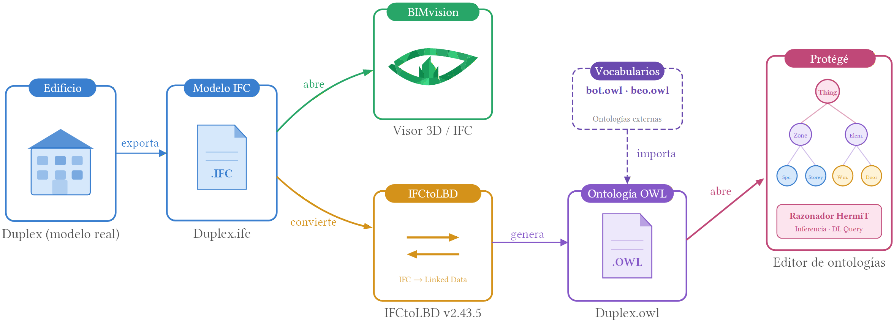{#fig-scheme width=100%}

## Introducción a BIM

Cuando se diseña un edificio no solo se define su forma. También se decide qué elementos lo componen, cómo se relacionan entre sí y qué información será necesaria más adelante, tanto durante la obra como en su uso posterior. El **modelado de información de construcción** (**BIM**, *Building Information Modeling*) surge precisamente para organizar todo eso dentro de una representación digital coherente.

Por eso, un modelo BIM no es simplemente un modelo 3D. Además de la geometría, puede incorporar materiales, identificadores, relaciones espaciales, propiedades técnicas y otros datos útiles para distintas fases del proyecto. La idea es que el modelo deje de ser solo algo que se visualiza y pase a ser también algo que se consulta, se coordina y se reutiliza.

Esta forma de trabajo resulta especialmente útil porque reúne en un mismo entorno información que, de otro modo, estaría dispersa entre planos, tablas, memorias y documentos técnicos. En lugar de revisar cada pieza por separado, BIM permite entender mejor el edificio como un sistema de objetos conectados entre sí.

Esa utilidad se aprecia sobre todo cuando se piensa en el **ciclo de vida** de la edificación. Un edificio pasa por distintas etapas: diseño, construcción, uso, mantenimiento, reforma e incluso desmontaje o sustitución. En cada una de ellas se necesita información distinta, aunque muchas veces está relacionada. BIM permite que una misma base de información acompañe al edificio a lo largo de ese proceso, adaptándose a las necesidades de cada fase: puede servir para diseñar y coordinar, para detectar interferencias antes de construir, para planificar la obra o para gestionar después el mantenimiento y la explotación.

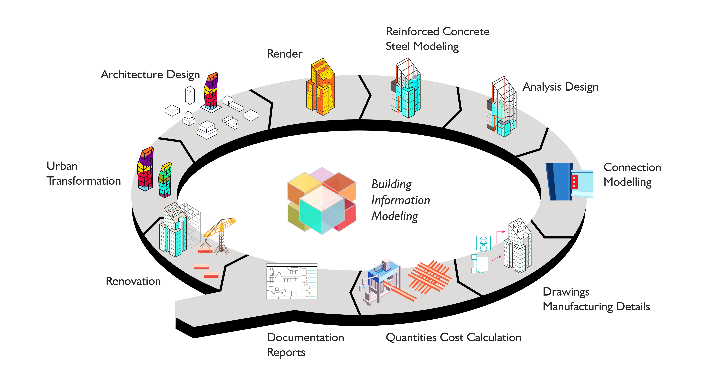{#fig-bim-cycle width=80%}

Como curiosidad, existen técnicas de captura de la realidad que también pueden integrarse en este tipo de flujos. Una de las más conocidas es **LiDAR** (*Light Detection and Ranging*), que permite obtener nubes de puntos tridimensionales del edificio o de su entorno a partir de mediciones láser.

Este tipo de información puede ser útil, por ejemplo, en rehabilitación, documentación del patrimonio o control de obra, donde interesa partir del estado real de un elemento construido. A veces, estas capturas se emplean como base para generar modelos *as-built* en procesos conocidos como ***scan-to-BIM***.

En cualquier caso, esta práctica no se centra en esas técnicas de captura, sino en entender qué es BIM, qué tipo de información organiza y por qué resulta útil a lo largo del ciclo de vida de la edificación.

::: {.content-visible unless-format="pdf"}

```{=html}
<p class="lidar-viewer-credits">
  Modelo del <em>Monumento a Goya</em> (Zaragoza) por <a href="https://sketchfab.com/3d-models/monumento-a-goya-81593fc7ed844d85902ee048ae8e1637" target="_blank" rel="noopener">Sketchfab</a>; nube de puntos derivada del mismo modelo.<br>
  Nube de puntos de estancia: <a href="https://sketchfab.com/3d-models/point-cloud-from-diy-laser-scanner-lidar-05acf617dc9e4161a347153e045f6681" target="_blank" rel="noopener"><em>Point cloud from DIY laser scanner (lidar)</em></a>, de Alexey Yuzhakov (@tour3d), Sketchfab, licencia CC BY-NC.
</p>

<div class="lidar-viewer">
  <div class="lidar-viewer-pane">
    <div class="lidar-viewer-canvas" id="lidar-viewer-cloud"></div>
    <span class="lidar-viewer-label">Nube de puntos</span>
  </div>
  <div class="lidar-viewer-pane">
    <div class="lidar-viewer-canvas" id="lidar-viewer-room"></div>
    <span class="lidar-viewer-label">Escaneo real: nube de puntos</span>
  </div>
</div>
<p class="lidar-viewer-caption">
  Click derecho para rotar, click izquierdo para trasladar y la rueda para hacer zoom.
  </p>

<style>
.lidar-viewer {
  display: grid;
  grid-template-columns: minmax(260px, 1fr) minmax(0, 2fr);
  gap: 1rem;
  align-items: stretch;
  margin: 0.75rem 0 0.5rem;
}
.lidar-viewer-pane {
  position: relative;
  min-width: 0;
  border: 1px solid #d0d7de;
  border-radius: 8px;
  overflow: hidden;
  background: #0b1221;
}
.lidar-viewer-canvas {
  width: 100%;
  height: clamp(320px, 46vw, 480px);
  display: block;
}
.lidar-viewer-label {
  position: absolute;
  top: 8px;
  left: 8px;
  padding: 2px 8px;
  background: rgba(0, 0, 0, 0.55);
  color: #fff;
  font-size: 0.8rem;
  border-radius: 4px;
  pointer-events: none;
}
.lidar-viewer-status {
  position: absolute;
  inset: 0;
  display: flex;
  align-items: center;
  justify-content: center;
  color: #c0c8d4;
  font-size: 0.9rem;
  pointer-events: none;
}
.lidar-viewer-caption {
  text-align: center;
  font-size: 0.85rem;
  color: #56616b;
  margin-bottom: 1.5rem;
}
.lidar-viewer-credits {
  text-align: center;
  font-size: 0.7rem;
  color: #56616b;
  margin: 1.5rem 0 0.75rem;
}
@media (max-width: 700px) {
  .lidar-viewer { grid-template-columns: 1fr; }
  .lidar-viewer-canvas {
    height: min(72vw, 360px);
    min-height: 260px;
  }
}
</style>

<script type="module">
import * as THREE from 'https://esm.sh/three@0.161.0';
import { OrbitControls } from 'https://esm.sh/three@0.161.0/examples/jsm/controls/OrbitControls.js';
import { PLYLoader } from 'https://esm.sh/three@0.161.0/examples/jsm/loaders/PLYLoader.js';

function createViewer(id, url, options = {}) {
  const container = document.getElementById(id);
  if (!container) return;

  const status = document.createElement('div');
  status.className = 'lidar-viewer-status';
  status.textContent = 'Cargando…';
  container.parentElement.appendChild(status);

  const scene = new THREE.Scene();
  scene.background = new THREE.Color(0x0b1221);

  const initW = container.clientWidth || 400;
  const initH = container.clientHeight || initW * 0.75;
  const camera = new THREE.PerspectiveCamera(45, initW / initH, 0.001, 100);
  camera.position.set(2.5, 1.8, 2.5);

  const renderer = new THREE.WebGLRenderer({ antialias: true });
  renderer.setPixelRatio(window.devicePixelRatio);
  renderer.setSize(initW, initH);
  container.appendChild(renderer.domElement);

  const controls = new OrbitControls(camera, renderer.domElement);
  controls.enableDamping = true;

  scene.add(new THREE.HemisphereLight(0xffffff, 0x444466, 1.0));
  const dir = new THREE.DirectionalLight(0xffffff, 0.6);
  dir.position.set(1, 2, 1);
  scene.add(dir);

  const frameCamera = (sphere) => {
    const radius = Math.max(0.001, sphere.radius);
    if (options.startInside) {
      camera.position.set(radius * 0.08, radius * 0.03, radius * 0.08);
      controls.target.set(0, radius * 0.02, -radius * 0.45);
      camera.near = Math.max(0.0005, radius / 2000);
      camera.far = radius * 20;
      controls.minDistance = radius * 0.01;
      controls.maxDistance = radius * 4;
    } else {
      const dist = radius / Math.tan((camera.fov * Math.PI / 180) / 2) * 0.85;
      camera.position.set(dist * 0.7, dist * 0.5, dist * 0.7);
      controls.target.set(0, 0, 0);
      camera.near = Math.max(0.001, dist / 1000);
      camera.far = dist * 100;
    }
    camera.updateProjectionMatrix();
    controls.update();
  };

  (async () => {
    try {
      const response = await fetch(url);
      if (!response.ok) throw new Error(response.status + ' ' + response.statusText);
      const buffer = await response.arrayBuffer();
      const geometry = new PLYLoader().parse(buffer);

      geometry.computeBoundingBox();
      const bbox = geometry.boundingBox;
      const size = new THREE.Vector3(); bbox.getSize(size);
      const center = new THREE.Vector3(); bbox.getCenter(center);
      geometry.translate(-center.x, -center.y, -center.z);
      const maxDim = Math.max(size.x, size.y, size.z) || 1;
      const scale = 1.5 / maxDim;
      geometry.scale(scale, scale, scale);

      const hasColor = geometry.hasAttribute('color');
      const vertCount = geometry.attributes.position?.count ?? 0;
      console.log('[lidar-viewer]', id, { format: 'ply', vertCount, hasColor });

      // Screen-space points stay readable from far away without swelling on zoom-in.
      const pointSize = vertCount > 200000 ? 1.2 : vertCount > 50000 ? 1.45 : 1.7;
      const material = new THREE.PointsMaterial({
        size: pointSize,
        vertexColors: hasColor,
        color: hasColor ? 0xffffff : 0x88c0ff,
        sizeAttenuation: false
      });
      const object = new THREE.Points(geometry, material);
      scene.add(object);

      const sphere = new THREE.Sphere();
      geometry.boundingBox.getBoundingSphere(sphere);
      frameCamera(sphere);

      status.remove();
    } catch (err) {
      console.error('[lidar-viewer] load error for ' + url, err);
      status.textContent = 'Modelo no disponible';
    }
  })();

  function animate() {
    requestAnimationFrame(animate);
    controls.update();
    renderer.render(scene, camera);
  }
  animate();

  // Handle late layout (Quarto can size containers after initial paint) and window resize.
  const resize = () => {
    const nw = container.clientWidth;
    const nh = container.clientHeight || nw * 0.75;
    if (!nw || !nh) return;
    camera.aspect = nw / nh;
    camera.updateProjectionMatrix();
    renderer.setSize(nw, nh);
  };
  new ResizeObserver(resize).observe(container);
  window.addEventListener('resize', resize);
}

createViewer('lidar-viewer-cloud', '../resources/practica8/models/goya_point_cloud.ply');
createViewer('lidar-viewer-room',  '../resources/practica8/models/room.ply', { startInside: true });
</script>
```

:::

::: {.content-visible when-format="pdf"}
*Visor interactivo de nubes de puntos disponible en la versión HTML.*
:::

En el siguiente vídeo de *Autodesk Building Solutions* se explica de forma sencilla qué es BIM y qué ventajas aporta a lo largo del ciclo de vida de un edificio:

::: {.content-visible unless-format="pdf"}
<div class="ratio ratio-16x9">
  <iframe data-external="1" src="https://www.youtube.com/embed/suNadRnHy-U" title="What Is BIM? by Autodesk Building Solutions" frameborder="0" allow="accelerometer; autoplay; clipboard-write; encrypted-media; gyroscope; picture-in-picture; web-share" referrerpolicy="strict-origin-when-cross-origin" allowfullscreen></iframe>
</div>
:::

::: {.content-visible when-format="pdf"}
[Ver el vídeo en YouTube: *What Is BIM?*](https://www.youtube.com/watch?v=suNadRnHy-U)
:::

::: {.callout-note}
## Idea clave

En esta práctica no vamos a modelar un edificio desde cero. Vamos a aprender a **leer** un modelo BIM y a **consultar** su información, primero con un visor IFC (*Industry Foundation Classes*) y después con herramientas semánticas.
:::

## Material de trabajo

Utilizaremos los siguientes ficheros:

- [Duplex.ifc](../resources/practica8/files/Duplex.ifc), que contiene el modelo BIM original del apartamento dúplex en formato IFC (*Industry Foundation Classes*).
- [Duplex.owl](../resources/practica8/files/Duplex.owl), que contiene una versión semántica del mismo modelo en lenguaje **OWL** (*Web Ontology Language*).
- [beo.owl](../resources/practica8/files/beo.owl) y [bot.owl](../resources/practica8/files/bot.owl), que pueden ser necesarios si *Protégé* te pide resolver manualmente algunas importaciones.

Como software de apoyo utilzaremos [BIMvision](https://bimvision.eu) para visualizar el IFC y [Protégé](http://protege.stanford.edu) para explorar la ontología.

## Ejercicio 1: explorar el modelo IFC

El primer paso es abrir `Duplex.ifc` en **BIMvision**. El objetivo no es todavía hacer consultas complejas, sino familiarizarse con el edificio, sus plantas y la forma en que cada elemento aparece identificado en el modelo.

{#fig-viewer}

::: {.callout-tip}
## Qué debes observar

Empieza por recorrer la planta baja y la planta superior, y acostúmbrate a seleccionar elementos individuales. Fíjate en cómo el visor muestra sus nombres, identificadores y propiedades básicas.
:::

::: {.callout-note}
## Encuentra elementos

Durante esta primera exploración, responde a las siguientes preguntas:

- **¿Cuántas ventanas hay en el modelo?**
- **¿Qué identificador tiene cada una?**
- **¿Qué altura y qué anchura tiene cada ventana?**
:::

## Del IFC al modelo semántico

El siguiente paso consiste en pasar de una representación BIM convencional a una representación **semántica**. En lugar de trabajar solamente con geometría y propiedades dentro de un visor, vamos a describir el edificio mediante clases, propiedades e individuos conectados entre sí en una ontología.

En esta práctica no es necesario que hagas la conversión por tu cuenta, porque el fichero `Duplex.owl` ya está preparado. Aun así, conviene entender de dónde sale: se ha generado a partir del IFC usando [IFCtoLBD 2.43.5](https://github.com/jyrkioraskari/IFCtoLBD/releases/tag/2.43.5), una herramienta que transforma modelos IFC en datos enlazados reutilizando vocabularios existentes del ámbito de la construcción.

::: {.callout-note}
## Nota técnica

El fichero `Duplex.owl` se ha generado con la configuración **BOT + PRODUCT + PROPS, Level L1**. Además, se han eliminado manualmente las referencias a dos ontologías externas para simplificar la práctica.
:::

## Ejercicio 2: abrir la ontología en Protégé

Para abrir `Duplex.owl` usaremos **Protégé**, un editor de ontologías gratuito y disponible para varios sistemas operativos. No requiere una instalación compleja: basta con descargar el archivo comprimido, descomprimirlo y ejecutar la aplicación.

La interfaz puede cambiar ligeramente según la versión de *Protégé*, pero la idea general es siempre la misma: pasar de la estructura conceptual a los elementos concretos del edificio.

Una vez abierto el fichero, encontrarás varias vistas desde las que puedes navegar por la ontología. Debajo del título de la ontología, *converters*, puedes encontrar una pestaña llamada ***Entities*** que te permitirá acceder a las siguientes categorías:

- **Classes**, para ver la jerarquía de clases del dominio.
- **Object properties**, para ver propiedades cuyo valor es otro objeto o individuo.
- **Data properties**, para ver propiedades cuyo valor es un dato literal.
- **Individuals**, para ver las instancias concretas del modelo.

La @fig-protege muestra el resultado de seleccionar ***Clases*** y, concretamente, ***Edificio***.
Podeis observar cómo la interfaz nos muestra que ***Edificio*** es una subclase de ***Zona***. 

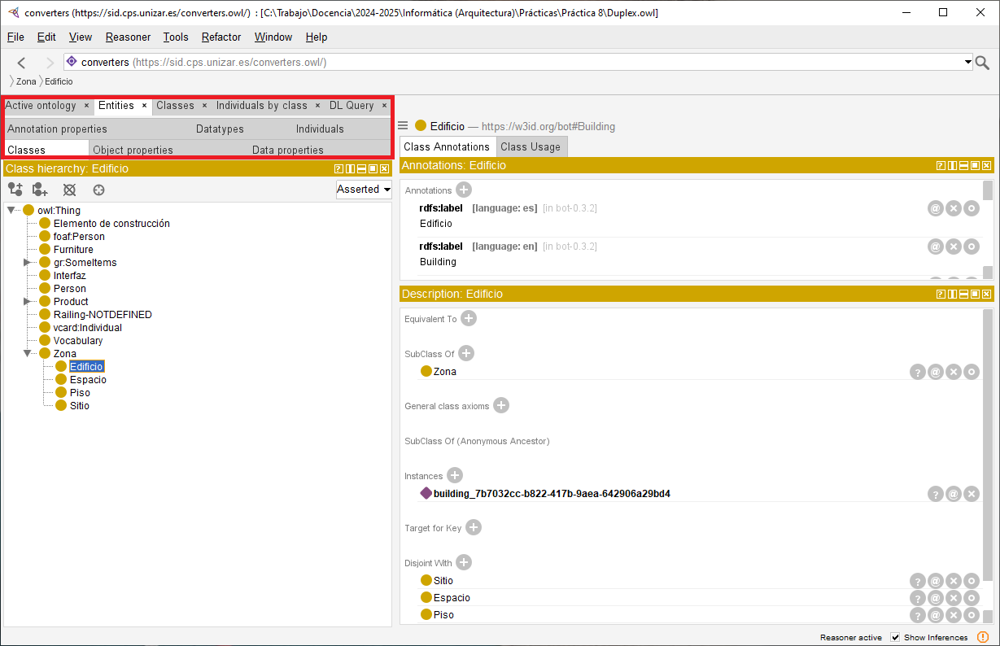{#fig-protege}

Puedes encontrar una pequeña introducción a la interfaz de *Protégé* en el siguiente vídeo, aunque no está orientado a nuestro mismo modelo, por lo que no es necesario seguirlo al pie de la letra:

::: {.content-visible unless-format="pdf"}
<div class="ratio ratio-16x9">
  <iframe data-external="1" src="https://drive.google.com/file/d/1eHHxYrJRiQZni_7KKrtRFqu5KEwk9omW/preview" title="Introducción a Protégé, de Fernando Bobillo" frameborder="0" allow="autoplay" allowfullscreen></iframe>
</div>
:::

::: {.content-visible when-format="pdf"}
[Ver el vídeo en Google Drive: introducción a Protégé](https://drive.google.com/file/d/1eHHxYrJRiQZni_7KKrtRFqu5KEwk9omW/view)
:::

::: {.callout-tip}
## Si faltan importaciones

En algunas versiones de *Protégé*, las ontologías importadas se descargan automáticamente desde Internet. En otras, tendremos que resolver manualmente las importaciones. En este último caso, en `Active ontology > Ontology imports` pinchamos en el botón `+` para añadir los ficheros [beo.owl](../resources/practica8/files/beo.owl) y [bot.owl](../resources/practica8/files/bot.owl).
:::

También debes tener en cuenta que muchas entidades tienen **etiquetas en varios idiomas**. Dependiendo de la configuración de tu equipo, *Protégé* puede mostrar nombres en castellano o en inglés. Por ejemplo, la clase `Edificio ‐ http://w3id.org/bot/Building` tiene etiquetas `Building`, `Edificio`, etc. En este guion se asume que las etiquetas se muestran en castellano siempre que sea posible.

### Qué debes localizar

Dentro de la ontología, localiza:

- **La clase que permite representar las ventanas**.
- **Las propiedades que representan la altura y la anchura de una ventana**.
- **Una ventana concreta y los valores de sus propiedades**.

Comprueba además si esos valores coinciden con los que viste en el visor IFC durante el ejercicio anterior.

::: {.callout-tip collapse="true"}
## Solución orientativa: clases

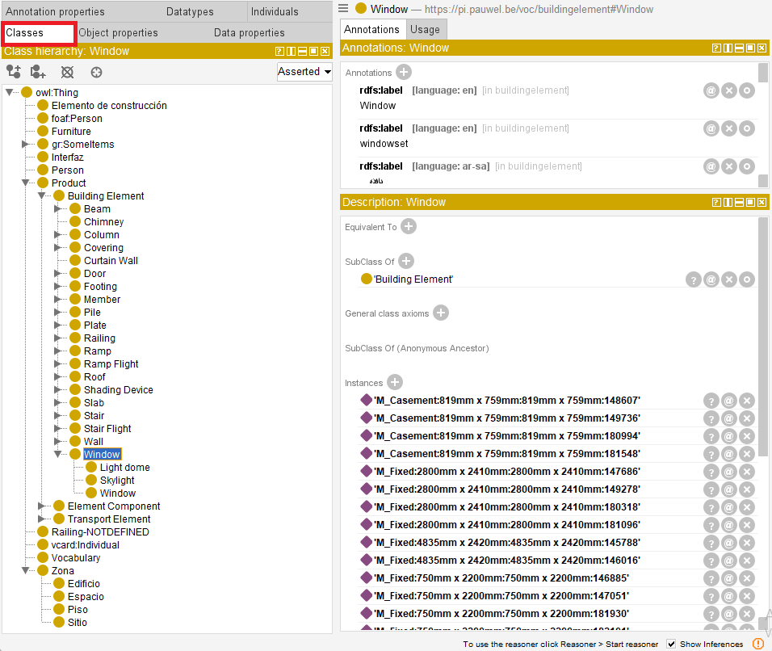{#fig-classes-solution width=100%}
:::

::: {.callout-tip collapse="true"}
## Solución orientativa: propiedades

{#fig-property-object width=100%}

{#fig-property-data width=100%}
:::

::: {.callout-tip collapse="true"}
## Solución orientativa: individuos

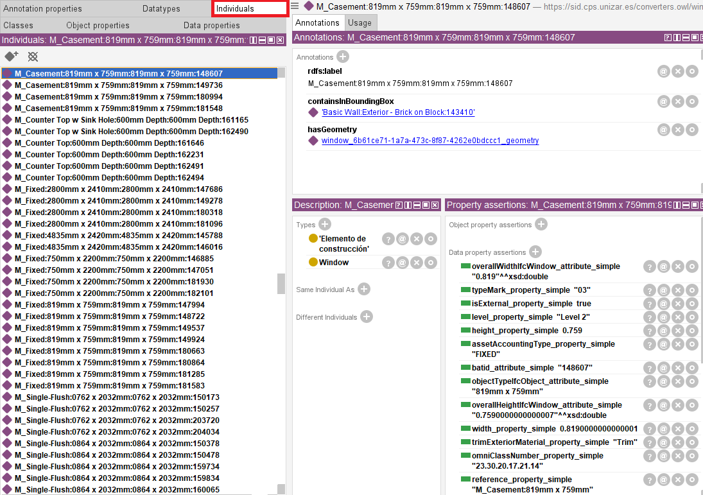{#fig-individuals-solution width=100%}
:::

## Ejercicio 3: razonamiento e inferencia

Una de las ventajas de trabajar con ontologías es que no solo podemos leer datos explícitos, sino también **inferir** información nueva a partir de la estructura del modelo y de las restricciones definidas en la ontología.

Para ello, activa un razonador desde el menú superior **Reasoner**. En esta práctica se recomienda utilizar **HermiT**. Inicia el razonador mediante `Reasoner > Start reasoner`. Una vez cargado, podrás abrir la pestaña **DL Query** para lanzar consultas sobre clases e individuos. 

Si en algún momento actualizamos la ontología, tendremos que utilizar la opción **Synchronize reasoner** para que el razonador actualice su información y pueda responder a las consultas correctamente.

### Consultas propuestas

A través de la pestaña ***DL Query***, recupera las instancias de la clase que representa las **ventanas**. Pinchando en alguna de ellas, puedes ver los valores de las propiedades (tanto los originales como los inferidos por el razonador, si los hubiera).

Con el razonador activo, realiza las siguientes comprobaciones:

- **Recupera las instancias de la clase que representa las ventanas**.
- **Recupera las superclases** de esa clase.
- **Recupera las instancias de alguna de esas superclases para comprobar si el razonador también devuelve instancias indirectas**.
- **Vuelve a consultar las instancias de la clase de ventanas y haz clic en el símbolo `?` de alguna de ellas para ver al menos una explicación**.

::: {.callout-note}
## Pista

En muchas instalaciones, las consultas se escriben con los nombres cortos en inglés, por ejemplo `Window`, aunque en la interfaz veas etiquetas en castellano.
:::

::: {.callout-tip collapse="true"}
## Ejemplo orientativo: consulta sobre escaleras

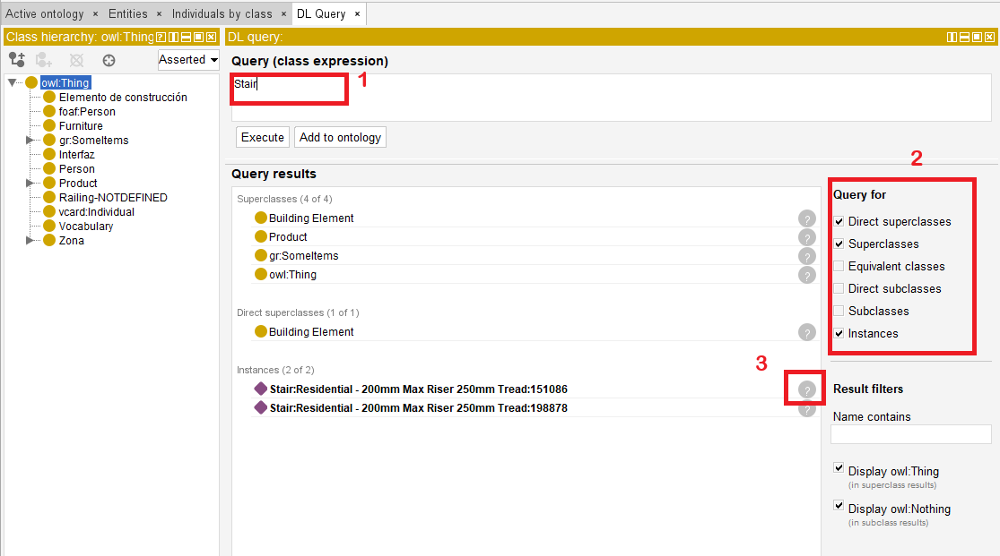{#fig-stairs-dl width=100%}

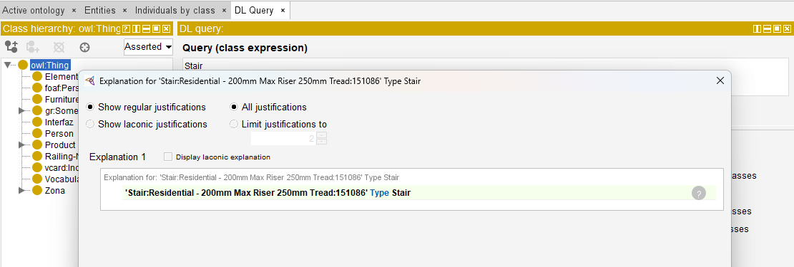{#fig-stairs-explanation width=100%}
:::

## Ejercicio 4: consultas más expresivas

Una vez dominadas las consultas básicas, podemos construir expresiones más ricas combinando clases y propiedades. Esto permite formular preguntas que no se reducen a "dame todas las instancias de una clase", sino a "dame todos los elementos que cumplan una determinada condición".

Por ejemplo, lanza la siguiente consulta:

`Espacio and 'elemento adyacente' some Window`

Esa expresión representa el conjunto de espacios que tienen al menos un elemento adyacente que pertenece a la clase **Window**.

::: {.callout-note}
## Pista

A medidas que escribes la consulta, *Protégé* te ofrece sugerencias de autocompletado para las clases y propiedades. Si no recuerdas el nombre exacto, puedes aprovechar esa función para construir la consulta. Si no aparecen las sugerencias a medida que escribes, puedes pulsar `Ctrl + Space` para forzar que se muestren.
:::

::: {.callout-note}
## Explora los resultados

Responde a estas preguntas:

- **¿Cuántos individuos recupera la consulta?**
- **¿Qué tipo de espacios son?**
- **¿Coincide ese resultado con lo que esperarías al observar el edificio en el visor IFC?**
:::

## Ejercicio 5: provocar una inconsistencia

Si una ontología se vuelve **inconsistente**, el razonador ya no puede trabajar correctamente con ella. En ese caso, *Protégé* muestra un aviso y permite abrir una explicación para entender qué axiomas están entrando en conflicto.

En este ejercicio vamos a provocar una inconsistencia de forma controlada. La idea es declarar como **funcional** la propiedad que representa la altura de una ventana y, después, asignar a una misma ventana dos valores distintos para esa altura.

En una ontología, una propiedad **funcional** es una propiedad que puede tener como máximo un valor para cada individuo. Por ejemplo, si la propiedad que representa la altura de una ventana se declara funcional, una misma ventana no debería tener dos alturas distintas. Si añadimos dos valores incompatibles, el razonador detectará que el modelo contiene una contradicción.

### Pasos sugeridos

1. Localiza la propiedad de datos que representa la altura.
2. Márcala como ***Functional***.
3. Busca una ventana concreta en ***Individuals***.
4. Añade una segunda afirmación de tipo ***Data property assertion*** con un valor distinto del original, por ejemplo `1234`.
5. Sincroniza el razonador y observa el error de inconsistencia.

::: {.callout-warning}
## Recomendación

Haz este ejercicio sobre una copia de trabajo del fichero si quieres conservar `Duplex.owl` sin cambios al terminar la práctica.
:::

::: {.callout-tip collapse="true"}
## Solución orientativa: inconsistencia

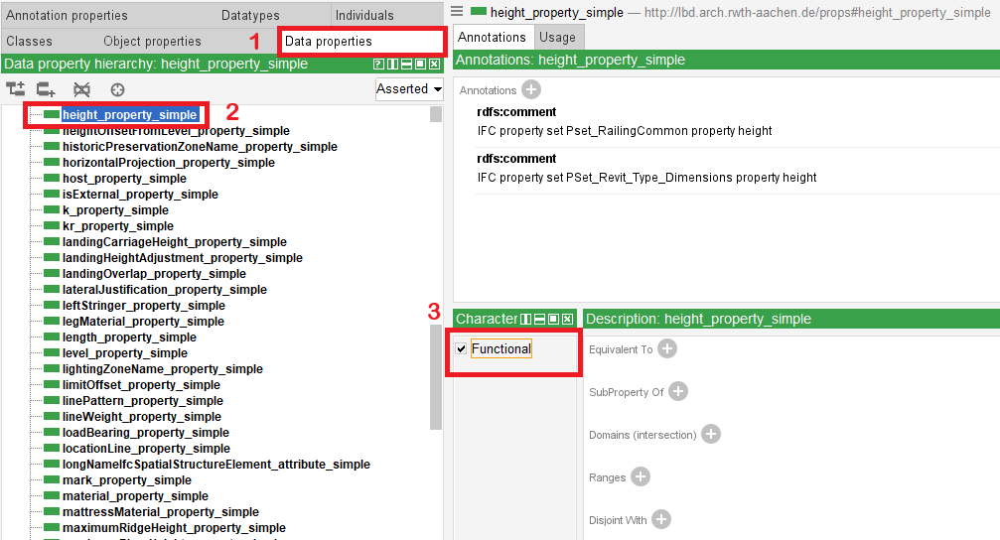{#fig-functional width=100%}

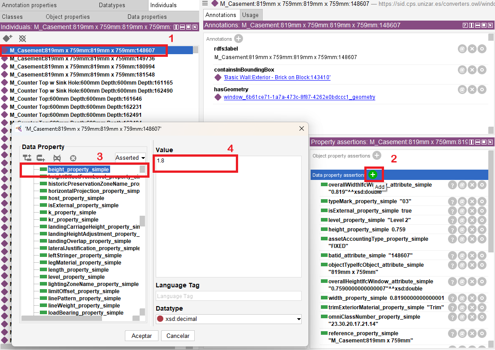{#fig-property-value width=100%}

{#fig-explain width=100%}

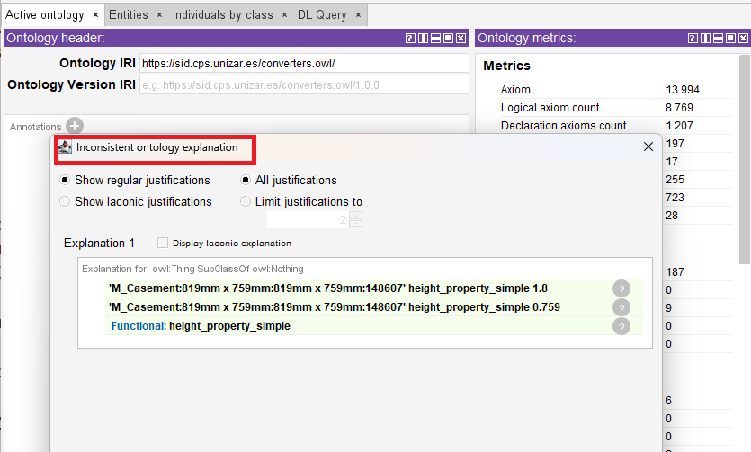{#fig-explanation width=100%}

:::

## Descarga

### BIMvision

Puedes descargar ***BIMvision*** desde su [página oficial](https://bimvision.eu/es/descargar/). Tendrás que introducir tu correo electrónico para recibir el enlace de descarga y aceptar los términos de servicio. Una vez hecho recibirás un correo con el enlace para descargar el instalador. Sigue las instrucciones de instalación para completar el proceso. Al ejecutar el programa por primera vez, deberías ver algo como esto:

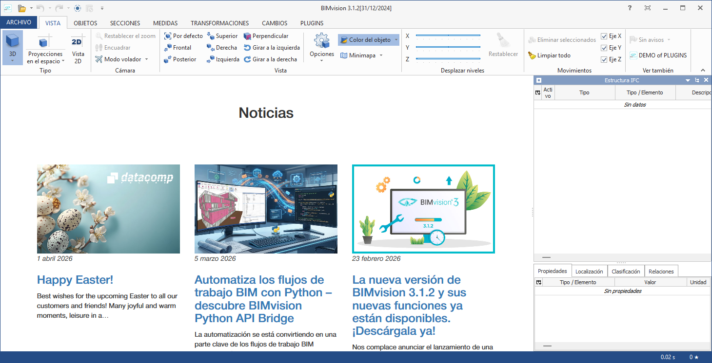{#fig-bimvision}

### Protégé

Puedes descargar ***Protégé*** desde su [página oficial](https://protege.stanford.edu/software/#desktop-protege). En la sección de descargas, elige la versión que corresponda a tu sistema operativo (Windows, macOS o Linux). Descarga el archivo comprimido y descomprímelo en una ubicación de tu elección. Ten en cuenta que Protégé no requiere instalación adicional, por lo que puedes situar la carpeta descomprimida en una ubicación que recuerdes fácilmente. Para ejecutar Protégé, simplemente abre la carpeta descomprimida y haz doble clic en el archivo `Protege.exe` (en Windows). Al abrir Protégé, deberías ver una pantalla de bienvenida similar a esta:

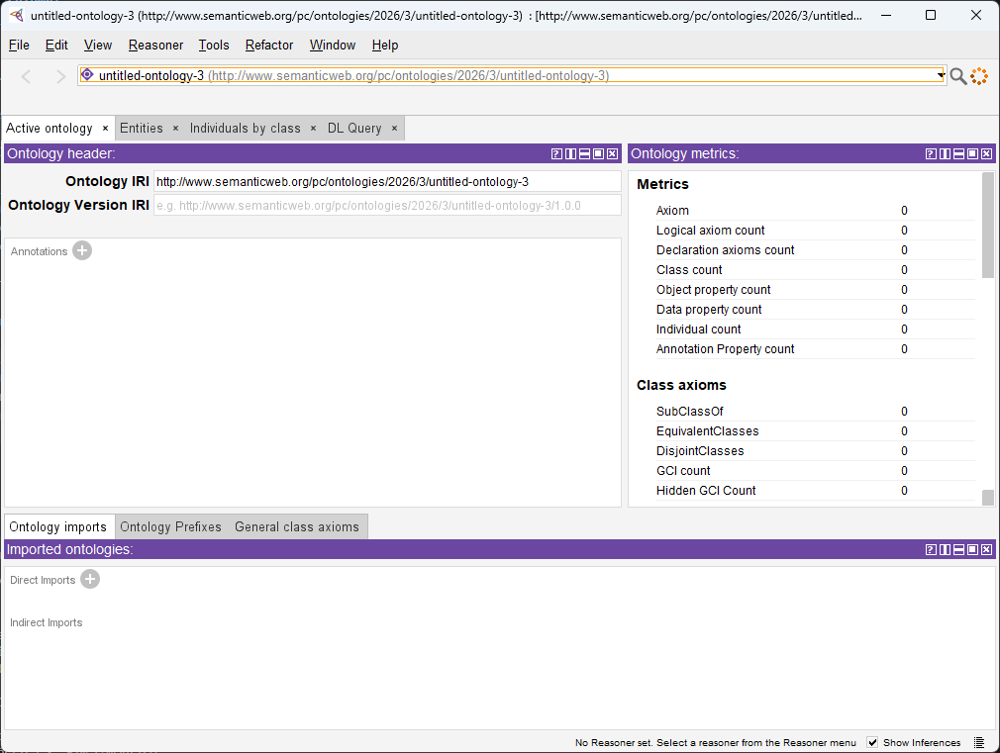{#fig-protege-welcome width=100%}
