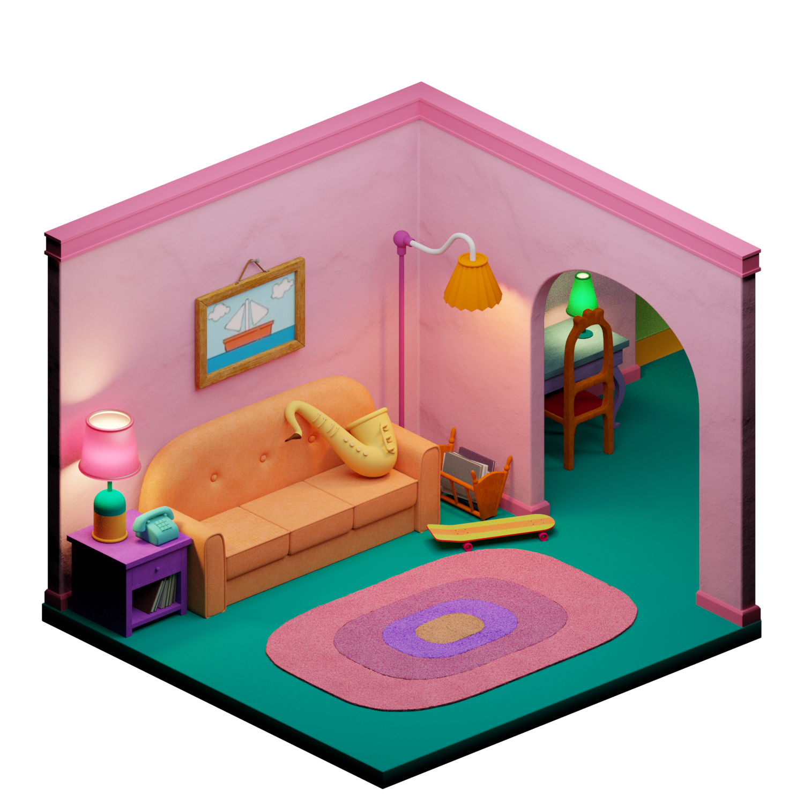
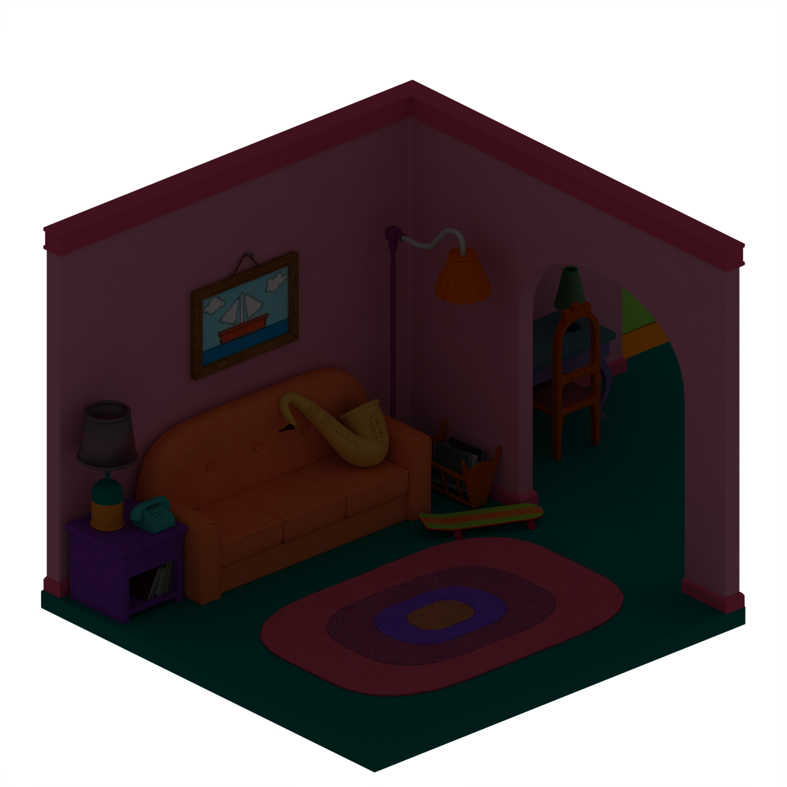

<div>
  <span class="badge rounded-pill text-bg-secondary read-time-pill">
    <svg xmlns="http://www.w3.org/2000/svg" width="14" height="14" fill="currentColor" viewBox="0 0 16 16" aria-hidden="true">
      <path d="M8 3.5a.5.5 0 0 1 .5.5v3.207l2.146 1.147a.5.5 0 0 1-.472.882l-2.25-1.2A.5.5 0 0 1 7 8V4a.5.5 0 0 1 .5-.5z"/>
      <path d="M8 16A8 8 0 1 0 8 0a8 8 0 0 0 0 16zm0-1A7 7 0 1 1 8 1a7 7 0 0 1 0 14z"/>
    </svg>
    ~15 min de lectura
  </span>
</div>

## Objetivos de la práctica

En esta práctica exploraremos un visualizador de objetos 3D desarrollado en Java, analizando tanto su interfaz como su código fuente. Al finalizar, deberías ser capaz de:

- Comprender algunas técnicas de informática gráfica usadas en un visualizador de objetos.
- Gestionar aplicaciones Java complejas organizadas en paquetes en el entorno Eclipse.
- Identificar los distintos elementos del visualizador y relacionarlos con el código que los implementa.

**Entrega:** un documento Word que responda a las cuestiones que aparecen a lo largo del guion.

---

## El visualizador

### Importando el visualizador

Descarga el archivo `visualizador.zip` y descomprímelo en la carpeta del *workspace* de Eclipse. Para importar el proyecto:

1. Ve a **File → Import**.
2. Selecciona **General → Existing projects into workspace**.
3. Elige la carpeta `PracticaVisualizador`.

Alternativamente, puedes ir a **File → New → Java project**, elegir un nombre, marcar **Create project from existing source**, pulsar **Browse** y seleccionar la carpeta con el código.

### El código fuente: organización por paquetes

El visualizador es una aplicación suficientemente grande como para que resulte necesario agrupar las clases en **paquetes**. Un paquete es un conjunto de clases que representan conceptos relacionados entre sí.

El código fuente está dividido en tres paquetes:

- **`geometria`**: clases que representan elementos geométricos: puntos, vectores, normales, caras, objetos y matrices de transformación.
- **`escena`**: clases que representan los elementos de la escena: colores, materiales, luces y la cámara.
- **`interfaz`**: clases que representan el interfaz gráfico: la ventana principal y los paneles de visualización y configuración.

Puedes ver estos paquetes en el explorador de paquetes de Eclipse, en la parte izquierda de la pantalla. En el sistema de archivos, cada paquete se corresponde con una carpeta dentro de la carpeta del proyecto.

::: {.callout-note}
## Experimenta con los paquetes

Crea un paquete nuevo: haz clic derecho sobre el proyecto y ve a **New → Package**. Ponle el nombre que quieras y pulsa **Finish**.

Después, arrastra y suelta `Luz.java` del paquete `escena` al nuevo paquete. Antes de confirmar, asegúrate de que está marcada la opción **Update references to the moved elements** y pulsa **Preview** para ver qué cambios se realizarían en todo el código del proyecto. Una vez revisados, vuelve a dejar `Luz.java` en `escena` y borra el paquete que has creado (botón derecho → **Delete**).

**¿Por qué esos cambios de código?** Cuando desde un archivo quieres acceder a una clase de otro paquete, tienes dos opciones: o escribir `<paquete>.<clase>`, o bien poner al principio `import <paquete>.<clase>` y usar simplemente `<clase>`.
:::

### El código fuente: una clase, un archivo, un concepto

La regla habitual de la programación orientada a objetos es que cada archivo contiene una clase, y cada clase representa un concepto concreto.

En el paquete `geometria` hay tres clases geométricas básicas:

- **`Punto`**: punto en el espacio (vector de 3 componentes).
- **`Direccion`**: dirección en el espacio (vector de 3 componentes).
- **`Normal`**: normal en el espacio, dirección de longitud 1.

Un **`Objeto`** es una serie de caras y vértices. Un vértice es un punto junto con su normal, y una **`Cara`** es una lista de vértices con aristas entre puntos consecutivos (y entre el último y el primero).

::: {.callout-note}
## Explora el código

Abre en Eclipse los archivos de las clases `Punto`, `Direccion` y `Normal`. Repasa el código de cada una y observa cómo se relaciona con el *Outline* que aparece a la derecha, que muestra esquemáticamente los atributos y métodos de la clase.

**¿En qué clase está el método `public static void main(String s[])`?** Sólo puede haber uno por aplicación; búscalo (pista: está en una de las clases del paquete `interfaz`).

Crea una captura de pantalla de Eclipse donde se vea la estructura completa del proyecto.
:::

### Ejecutando el visualizador

Ejecuta el visualizador desde Eclipse. Para cargar un objeto tridimensional, ve a **Archivo → Abrir** y selecciona un archivo `.obj` de la carpeta `objetos3d` del proyecto. Te recomendamos empezar con `teapot.obj`. La carga puede tardar unos segundos.

Puedes cambiar el modo de visualización entre **Malla de alambre** (*wireframe*), donde sólo se muestran las aristas, y **Raster**, que rellena las caras con iluminación.

::: {.callout-note}
## Experimenta con el visualizador

- Crea una captura de pantalla donde se vea el visualizador ejecutándose en tu ordenador.
- Prueba a cambiar los diferentes parámetros de la cámara o a activar el *backface culling*. ¿Qué ocurre?
- En modo **Raster**, cambia las propiedades del material (**Escena → Material**). Intenta conseguir que el objeto sea de color amarillo.
- Juega también con las propiedades de la luz (**Escena → Luz**).
:::

### Editando código

Los parámetros de la cámara están en inglés en el interfaz gráfico. Todo el interfaz relacionado con la cámara está en la clase `PanelCamara`.

::: {.callout-note}
## Traduce la interfaz

Busca en `PanelCamara` las cadenas de texto que hay en las etiquetas de la interfaz gráfica. En Java, las cadenas van siempre entre comillas dobles. Las cadenas de la interfaz suelen aparecer en las líneas que contienen `JLabel`. Cámbialas a castellano.

Muestra el resultado con una captura de pantalla.

**Cuidado:** si modificas algo que no sea una cadena de texto, el código puede dejar de compilar. Siempre puedes deshacer los cambios.
:::

### Depuración de errores

En aplicaciones de este tamaño, el depurador de Eclipse resulta muy útil para entender paso a paso qué hace el código. Vamos a depurar el método `matrizDeProyeccion()` de la clase `PanelVisor` del paquete `interfaz`.

::: {.callout-note}
## Usa el depurador

1. Busca en `PanelVisor` la línea:
   ```java
   geometria.Matriz4x4 proyeccion = new geometria.Matriz4x4();
   ```
2. Pon un **punto de ruptura** (*breakpoint*): botón derecho sobre la línea → **Toggle Breakpoint**.
3. Ejecuta la aplicación en **modo depuración** (el botón con el insecto).
4. Pulsa **F6** repetidamente para avanzar paso a paso y observa cómo se va construyendo la matriz de proyección.
5. ¿Por qué el programa vuelve una y otra vez a esa misma línea aunque no hayas hecho nada?
6. Cuando termines, desactiva el breakpoint: botón derecho → **Disable Breakpoint**.
:::

---

## El visualizador por dentro

### Proyectando 3 dimensiones en 2 dimensiones

Para visualizar un objeto tridimensional en pantalla hay que transformar cada punto 3D $(x, y, z)$ a coordenadas de pantalla $(x, y)$.

Todas las transformaciones se hacen con **matrices de cuatro dimensiones** (clase `Matriz4x4`). Para ello, a cada punto se le añade una cuarta componente llamada **coordenada homogénea**:

$$
(x,\, y,\, z) \;\longrightarrow\; (x,\, y,\, z,\, 1)
$$

La clase `Vector4` representa ese vector de 4 dimensiones. La transformación de un vector respecto a una matriz es un producto:

$$
V_t = M \cdot V
$$

donde $V_t$ es el vector transformado, $M$ la matriz y $V$ el vector original. Para recuperar el punto 3D se divide por la coordenada homogénea $w$:

$$
(x,\, y,\, z,\, w) \;\longrightarrow\; \left(\frac{x}{w},\;\frac{y}{w},\;\frac{z}{w}\right)
$$

::: {.callout-note}
## Busca en el código

¿Qué dos métodos de la clase `Punto` encapsulan respectivamente la conversión $(x,y,z) \to (x,y,z,1)$ y la vuelta $(x,y,z,w) \to (x/w,\,y/w,\,z/w)$? Estudia su código.

En el método `matrizDeProyeccion()` de `PanelVisor`, comenta la línea:
```java
proyeccion.rotacionX(camara().inclinacion() * Math.PI / 180.0);
```
(añade `//` al principio) y vuelve a ejecutar. ¿Qué ha cambiado? Prueba a comentar otras líneas del mismo método.
:::

### Matrices de transformación

La clase `Matriz4x4` contiene métodos que generan cada tipo de matriz de transformación:

$$
\text{traslacion}(x,y,z) \;\to\; \begin{pmatrix} 1 & 0 & 0 & x \\ 0 & 1 & 0 & y \\ 0 & 0 & 1 & z \\ 0 & 0 & 0 & 1 \end{pmatrix}
\qquad
\text{escalado}(x,y,z) \;\to\; \begin{pmatrix} x & 0 & 0 & 0 \\ 0 & y & 0 & 0 \\ 0 & 0 & z & 0 \\ 0 & 0 & 0 & 1 \end{pmatrix}
$$

$$
\text{rotacionX}(a) \;\to\; \begin{pmatrix} 1 & 0 & 0 & 0 \\ 0 & \cos a & \sin a & 0 \\ 0 & {-\sin a} & \cos a & 0 \\ 0 & 0 & 0 & 1 \end{pmatrix}
\qquad
\text{rotacionY}(a) \;\to\; \begin{pmatrix} \cos a & 0 & {-\sin a} & 0 \\ 0 & 1 & 0 & 0 \\ \sin a & 0 & \cos a & 0 \\ 0 & 0 & 0 & 1 \end{pmatrix}
$$

$$
\text{rotacionZ}(a) \;\to\; \begin{pmatrix} \cos a & \sin a & 0 & 0 \\ {-\sin a} & \cos a & 0 & 0 \\ 0 & 0 & 1 & 0 \\ 0 & 0 & 0 & 1 \end{pmatrix}
$$

La siguiente visualización muestra cómo actúa **rotacionZ** sobre un punto del plano XY. Mueve el ángulo y observa cómo se actualizan los valores de la matriz:

```{=html}
<div id="rot-demo-uza" style="margin:1.2rem 0; display:grid; grid-template-columns:1fr 1fr; gap:1rem; align-items:start;">
  <div style="background:#fff; border:1px solid #e2e8f0; border-radius:14px; padding:0.8rem; box-shadow:0 4px 16px rgba(0,0,0,0.06);">
    <canvas id="rot-canvas-uza" width="280" height="280" style="width:100%;border-radius:8px;background:linear-gradient(180deg,#f8fafc,#eef2f7);display:block;"></canvas>
  </div>
  <div style="background:#fff; border:1px solid #e2e8f0; border-radius:14px; padding:1rem; box-shadow:0 4px 16px rgba(0,0,0,0.06); display:flex; flex-direction:column; gap:0.85rem;">
    <div>
      <label style="font-size:0.9rem; font-weight:500;">Ángulo <em>a</em></label>
      <div style="display:grid; grid-template-columns:1fr 52px; gap:0.5rem; align-items:center; margin-top:0.3rem;">
        <input id="rot-angle-uza" type="range" min="0" max="360" step="1" value="35" style="width:100%;">
        <span id="rot-angle-val" style="font-variant-numeric:tabular-nums; font-size:0.9rem; text-align:right;">35°</span>
      </div>
    </div>
    <div>
      <div style="font-size:0.85rem; font-weight:500; margin-bottom:0.35rem;">rotacionZ(<em>a</em>) — submatriz XY</div>
      <table id="rot-matrix-uza" style="border-collapse:collapse; width:100%; font-variant-numeric:tabular-nums; font-size:0.88rem;">
        <tr><td></td><td style="text-align:center; color:#64748b; font-size:0.8rem;">x</td><td style="text-align:center; color:#64748b; font-size:0.8rem;">y</td></tr>
        <tr>
          <td style="color:#64748b; font-size:0.8rem; padding-right:0.3rem;">x′</td>
          <td id="rot-m00" style="border:1px solid #e2e8f0; padding:0.3rem 0.5rem; text-align:center; background:#eff6ff;"></td>
          <td id="rot-m01" style="border:1px solid #e2e8f0; padding:0.3rem 0.5rem; text-align:center; background:#fff7ed;"></td>
        </tr>
        <tr>
          <td style="color:#64748b; font-size:0.8rem; padding-right:0.3rem;">y′</td>
          <td id="rot-m10" style="border:1px solid #e2e8f0; padding:0.3rem 0.5rem; text-align:center; background:#fff7ed;"></td>
          <td id="rot-m11" style="border:1px solid #e2e8f0; padding:0.3rem 0.5rem; text-align:center; background:#eff6ff;"></td>
        </tr>
      </table>
    </div>
    <div style="background:#f8fafc; border-radius:8px; padding:0.65rem 0.8rem; font-size:0.85rem;">
      <div style="font-weight:500; margin-bottom:0.3rem;">Punta de la flecha <span style="color:#ef4444;">●</span></div>
      <div>Antes: <code id="rot-before-uza">(0.70, 0.00)</code></div>
      <div>Después: <code id="rot-after-uza"></code></div>
    </div>
  </div>
</div>
<style>
@media (max-width: 600px) {
  #rot-demo-uza { grid-template-columns: 1fr !important; }
}
</style>
<script>
(() => {
  const canvas = document.getElementById('rot-canvas-uza');
  const ctx = canvas.getContext('2d');
  const W = canvas.width, H = canvas.height;
  const cx = W / 2, cy = H / 2, SC = 95;

  // Arrow shape in world coords (unit space)
  const SHAPE = [[-0.65,-0.28],[0.05,-0.28],[0.05,-0.62],[0.78,0],[0.05,0.62],[0.05,0.28],[-0.65,0.28]];
  const TIP = 3; // index of arrow tip (0.78, 0)

  function tw(x, y) { return [cx + x * SC, cy - y * SC]; }

  function rot(x, y, cosA, sinA) {
    return [cosA * x + sinA * y, -sinA * x + cosA * y];
  }

  function drawPoly(pts, fill, stroke, lw) {
    ctx.beginPath();
    pts.forEach(([x,y], i) => { const [cx2,cy2]=tw(x,y); i===0?ctx.moveTo(cx2,cy2):ctx.lineTo(cx2,cy2); });
    ctx.closePath();
    if (fill) { ctx.fillStyle = fill; ctx.fill(); }
    ctx.strokeStyle = stroke; ctx.lineWidth = lw; ctx.stroke();
  }

  function draw(deg) {
    const a = deg * Math.PI / 180;
    const cosA = Math.cos(a), sinA = Math.sin(a);

    ctx.clearRect(0, 0, W, H);

    // Grid
    ctx.strokeStyle = 'rgba(148,163,184,0.2)'; ctx.lineWidth = 1;
    ctx.beginPath();
    for (let gx = -3; gx <= 3; gx++) { const [px] = tw(gx, 0); ctx.moveTo(px, 0); ctx.lineTo(px, H); }
    for (let gy = -3; gy <= 3; gy++) { const [,py] = tw(0, gy); ctx.moveTo(0, py); ctx.lineTo(W, py); }
    ctx.stroke();

    // Axes
    ctx.strokeStyle = 'rgba(15,23,42,0.35)'; ctx.lineWidth = 1.5;
    ctx.beginPath();
    ctx.moveTo(0, cy); ctx.lineTo(W, cy);
    ctx.moveTo(cx, 0); ctx.lineTo(cx, H);
    ctx.stroke();

    // X/Y labels
    ctx.fillStyle = '#94a3b8'; ctx.font = '12px sans-serif';
    ctx.fillText('x', W - 14, cy - 6);
    ctx.fillText('y', cx + 6, 14);

    // Original arrow (faint)
    drawPoly(SHAPE, 'rgba(13,110,253,0.07)', 'rgba(13,110,253,0.25)', 1.2);

    // Rotated arrow
    const rotShape = SHAPE.map(([x,y]) => rot(x, y, cosA, sinA));
    drawPoly(rotShape, 'rgba(29,78,216,0.12)', '#1d4ed8', 2);

    // Arc showing angle
    if (deg > 2 && deg < 358) {
      ctx.strokeStyle = '#f97316'; ctx.lineWidth = 1.5;
      ctx.beginPath();
      ctx.arc(cx, cy, 22, -Math.atan2(0, SC), -Math.atan2(sinA * SHAPE[TIP][0], cosA * SHAPE[TIP][0] + sinA * SHAPE[TIP][1]), false);
      // Simplified: just draw arc from 0 to angle
      ctx.beginPath();
      ctx.arc(cx, cy, 22, 0, -a, a < 0);
      ctx.stroke();
    }

    // Tracked point (tip of arrow)
    const [ox, oy] = SHAPE[TIP];
    const [rx, ry] = rot(ox, oy, cosA, sinA);
    const [opx, opy] = tw(ox, oy);
    const [rpx, rpy] = tw(rx, ry);

    // Line from origin to rotated tip
    ctx.strokeStyle = '#ef4444'; ctx.lineWidth = 1.4; ctx.setLineDash([4,3]);
    ctx.beginPath(); ctx.moveTo(cx, cy); ctx.lineTo(rpx, rpy); ctx.stroke();
    ctx.setLineDash([]);

    // Original tip (faint)
    ctx.fillStyle = 'rgba(13,110,253,0.4)';
    ctx.beginPath(); ctx.arc(opx, opy, 4, 0, Math.PI * 2); ctx.fill();

    // Rotated tip (red)
    ctx.fillStyle = '#ef4444';
    ctx.beginPath(); ctx.arc(rpx, rpy, 5.5, 0, Math.PI * 2); ctx.fill();

    // Update matrix cells
    document.getElementById('rot-m00').textContent = cosA.toFixed(3);
    document.getElementById('rot-m01').textContent = sinA.toFixed(3);
    document.getElementById('rot-m10').textContent = (-sinA).toFixed(3);
    document.getElementById('rot-m11').textContent = cosA.toFixed(3);

    // Update coordinates
    document.getElementById('rot-after-uza').textContent =
      `(${rx.toFixed(2)}, ${ry.toFixed(2)})`;
  }

  const slider = document.getElementById('rot-angle-uza');
  const valLabel = document.getElementById('rot-angle-val');
  slider.addEventListener('input', () => {
    valLabel.textContent = slider.value + '°';
    draw(Number(slider.value));
  });
  draw(35);
})();
</script>
```

La **matriz de perspectiva** transforma coordenadas de cámara a coordenadas de recorte (*clip space*):

$$
\text{perspectiva}(fov,ar,n,f) \;\to\; \begin{pmatrix} (ar\cdot\tan(fov/2))^{-1} & 0 & 0 & 0 \\ 0 & \tan(fov/2)^{-1} & 0 & 0 \\ 0 & 0 & \frac{f}{f-n} & -\frac{nf}{f-n} \\ 0 & 0 & 1 & 0 \end{pmatrix}
$$

con $n = 1$, $f = 100$, $ar = h/w$ y $fov$ el ángulo de campo de visión. La **matriz de pantalla** convierte coordenadas normalizadas a píxeles:

$$
\text{pantalla}(w,h) \;\to\; \begin{pmatrix} w/2 & 0 & 0 & w/2 \\ 0 & h/2 & 0 & h/2 \\ 0 & 0 & 1 & 0 \\ 0 & 0 & 0 & 1 \end{pmatrix}
$$

La **matriz de proyección completa** que aplica `PanelVisor` a todos los puntos del objeto es:

$$
M_p = \text{pantalla}(w,h)\cdot\text{perspectiva}(fov,h/w,1,100)\cdot\text{traslacion}(0,0,d)\cdot\text{rotacionX}(inc)\cdot\text{rotacionY}(rot)\cdot\text{traslacion}(x_c,y_c,z_c)
$$

donde $d$ es la distancia, $inc$ la inclinación, $rot$ la rotación (parámetros de la `Camara`) y $(x_c, y_c, z_c)$ las coordenadas del centro del `Objeto`.

La siguiente visualización resume esa idea en 2D: moviendo el punto en profundidad o abriendo el campo de visión, la proyección horizontal cambia según

$$
x' = \frac{f\,x}{z}
\qquad\text{con}\qquad
f = \frac{1}{\tan(fov/2)}
$$

```{=html}
<div id="perspective-demo-uza" style="margin:1.2rem 0; display:grid; grid-template-columns:minmax(0,1fr) 300px; gap:1rem; align-items:start;">
  <div style="background:#fff; border:1px solid #e2e8f0; border-radius:14px; padding:0.8rem; box-shadow:0 4px 16px rgba(0,0,0,0.06);">
    <canvas id="perspective-canvas-uza" width="420" height="260" style="width:100%; display:block; border-radius:10px; background:linear-gradient(180deg,#fbfdff,#eef4fb);"></canvas>
  </div>
  <div style="background:#fff; border:1px solid #e2e8f0; border-radius:14px; padding:1rem; box-shadow:0 4px 16px rgba(0,0,0,0.06); display:flex; flex-direction:column; gap:0.8rem;">
    <div style="display:grid; grid-template-columns:84px 1fr 58px; gap:0.4rem 0.6rem; align-items:center; font-size:0.88rem;">
      <label><em>fov</em></label>
      <input id="persp-fov-uza" type="range" min="25" max="100" step="1" value="55" style="width:100%;">
      <span id="persp-fov-val-uza" style="text-align:right; font-variant-numeric:tabular-nums;">55°</span>

      <label><em>z</em></label>
      <input id="persp-z-uza" type="range" min="1.2" max="6" step="0.1" value="2.4" style="width:100%;">
      <span id="persp-z-val-uza" style="text-align:right; font-variant-numeric:tabular-nums;">2.4</span>

      <label><em>x</em></label>
      <input id="persp-x-uza" type="range" min="0.2" max="2.2" step="0.05" value="1.1" style="width:100%;">
      <span id="persp-x-val-uza" style="text-align:right; font-variant-numeric:tabular-nums;">1.10</span>
    </div>

    <div style="background:#f8fafc; border-radius:10px; padding:0.7rem 0.8rem; font-size:0.84rem; color:#334155; line-height:1.55;">
      <div style="font-family:Georgia, 'Times New Roman', serif; font-size:1rem; margin-bottom:0.25rem;">
        <span style="font-style:italic;">x</span><span style="font-size:0.92em;">′</span> = <span id="persp-f-val-uza">1.92</span> · <span style="font-style:italic;">x</span> / <span style="font-style:italic;">z</span>
      </div>
      <div>Punto 3D: <code id="persp-point-uza">(1.10, 2.40)</code></div>
      <div>Proyección en el plano: <code id="persp-proj-uza">x′ = 0.88</code></div>
      <div style="margin-top:0.35rem; color:#64748b;">Más lejos (<em>z</em> mayor) implica una proyección menor; un <em>fov</em> más abierto reduce <em>f</em> y exagera la sensación de gran angular.</div>
    </div>
  </div>
</div>
<style>
@media (max-width: 700px) {
  #perspective-demo-uza { grid-template-columns: 1fr !important; }
}
</style>
<script>
(() => {
  const canvas = document.getElementById('perspective-canvas-uza');
  const ctx = canvas.getContext('2d');
  const W = canvas.width;
  const H = canvas.height;
  const originX = 72;
  const originY = H / 2;
  const zScale = 48;
  const xScale = 44;
  const planeZ = 1;

  const ids = {
    fov: document.getElementById('persp-fov-uza'),
    z: document.getElementById('persp-z-uza'),
    x: document.getElementById('persp-x-uza'),
    fovVal: document.getElementById('persp-fov-val-uza'),
    zVal: document.getElementById('persp-z-val-uza'),
    xVal: document.getElementById('persp-x-val-uza'),
    fVal: document.getElementById('persp-f-val-uza'),
    point: document.getElementById('persp-point-uza'),
    proj: document.getElementById('persp-proj-uza'),
  };

  function sx(z) { return originX + z * zScale; }
  function sy(x) { return originY - x * xScale; }

  function draw() {
    const fov = Number(ids.fov.value);
    const z = Number(ids.z.value);
    const x = Number(ids.x.value);
    const f = 1 / Math.tan((fov * Math.PI / 180) / 2);
    const xProj = f * x / z;

    ids.fovVal.textContent = `${fov}°`;
    ids.zVal.textContent = z.toFixed(1);
    ids.xVal.textContent = x.toFixed(2);
    ids.fVal.textContent = f.toFixed(2);
    ids.point.textContent = `(${x.toFixed(2)}, ${z.toFixed(2)})`;
    ids.proj.textContent = `x′ = ${xProj.toFixed(2)}`;

    ctx.clearRect(0, 0, W, H);

    ctx.strokeStyle = 'rgba(148,163,184,0.28)';
    ctx.lineWidth = 1;
    for (let i = 1; i <= 6; i++) {
      ctx.beginPath();
      ctx.moveTo(sx(i), 18);
      ctx.lineTo(sx(i), H - 18);
      ctx.stroke();
    }
    for (let i = -2; i <= 2; i++) {
      ctx.beginPath();
      ctx.moveTo(originX - 12, sy(i));
      ctx.lineTo(W - 20, sy(i));
      ctx.stroke();
    }

    ctx.strokeStyle = '#334155';
    ctx.lineWidth = 1.6;
    ctx.beginPath();
    ctx.moveTo(originX - 12, originY);
    ctx.lineTo(W - 20, originY);
    ctx.stroke();

    ctx.beginPath();
    ctx.moveTo(originX, 18);
    ctx.lineTo(originX, H - 18);
    ctx.stroke();

    const planeX = sx(planeZ);
    ctx.strokeStyle = '#0f766e';
    ctx.lineWidth = 3;
    ctx.beginPath();
    ctx.moveTo(planeX, 36);
    ctx.lineTo(planeX, H - 36);
    ctx.stroke();

    const pointX = sx(z);
    const pointY = sy(x);
    const projY = sy(xProj);

    ctx.strokeStyle = '#f59e0b';
    ctx.lineWidth = 2;
    ctx.beginPath();
    ctx.moveTo(originX, originY);
    ctx.lineTo(pointX, pointY);
    ctx.stroke();

    ctx.setLineDash([6, 4]);
    ctx.strokeStyle = '#64748b';
    ctx.beginPath();
    ctx.moveTo(pointX, pointY);
    ctx.lineTo(pointX, originY);
    ctx.moveTo(planeX, projY);
    ctx.lineTo(pointX, pointY);
    ctx.stroke();
    ctx.setLineDash([]);

    ctx.fillStyle = '#0f172a';
    ctx.beginPath();
    ctx.arc(originX, originY, 4, 0, Math.PI * 2);
    ctx.fill();

    ctx.fillStyle = '#f59e0b';
    ctx.beginPath();
    ctx.arc(pointX, pointY, 6, 0, Math.PI * 2);
    ctx.fill();

    ctx.fillStyle = '#0f766e';
    ctx.beginPath();
    ctx.arc(planeX, projY, 5.5, 0, Math.PI * 2);
    ctx.fill();

    ctx.fillStyle = '#475569';
    ctx.font = '12px sans-serif';
    ctx.fillText('cámara', originX - 26, originY + 22);
    ctx.fillText('plano de proyección z = 1', planeX - 38, 28);
    ctx.fillText('P(x, z)', pointX + 10, pointY - 10);
    ctx.fillText('P′(x′, 1)', planeX + 8, projY - 8);
    ctx.fillText('z', W - 28, originY - 8);
    ctx.fillText('x', originX + 8, 16);
  }

  ['input', 'change'].forEach(eventName => {
    ids.fov.addEventListener(eventName, draw);
    ids.z.addEventListener(eventName, draw);
    ids.x.addEventListener(eventName, draw);
  });

  draw();
})();
</script>
```

::: {.callout-note}
## Calcula numéricamente

Calcula el resultado de rotar 90° con respecto al eje Z el punto $(4,\, 3,\, 2)$. Para ello, multiplica el vector fila $(4\ 3\ 2\ 1)$ por la matriz de rotación correspondiente.

Ejecuta después el código en modo depuración para comprobar cómo se realiza una rotación en el visualizador. Explícalo brevemente en el documento Word.
:::

### Modos de visualización

`PanelVisor` gestiona la visualización del objeto con dos modos:

**Malla de alambre** (`pintarMallaAlambre`): se recorren todas las `Cara`s, se transforman sus `Punto`s con $M_p$ y se pintan líneas entre puntos adyacentes (`pintarCaraMallaAlambre`).

**Raster**: se aplica el modelo de iluminación de Phong para calcular el color de cada píxel de cada cara visible. Además, se mantiene un ***z-buffer*** que guarda la profundidad $z$ de cada píxel para evitar pintar uno que quede por detrás de otro ya pintado.

En ambos modos se puede activar el ***backface culling*** (método `considerarCara`), que descarta las caras cuya normal apunta en sentido contrario a la cámara, acelerando el proceso de pintado.

::: {.callout-note}
## Busca en el código

Revisa los métodos `considerarCara`, `pintarMallaAlambre` y `pintarCaraMallaAlambre`, y los tres métodos que implementan el algoritmo raster. Identifica qué partes del algoritmo descrito en este guion implementa cada método. Compara los dos modos de visualización.
:::

### Renderizado físicamente realista

El modo raster con Phong es computacionalmente barato, pero simplificado. Si queremos una imagen realmente fotorrealista, la teoría completa se describe con la **ecuación de renderizado** de Kajiya (1986):

$$
L_o(\mathbf{p},\,\omega_o) = L_e(\mathbf{p},\,\omega_o) + \int_{\Omega} f_r(\mathbf{p},\,\omega_o,\,\omega_i)\; L_i(\mathbf{p},\,\omega_i)\; |\cos\theta_i|\; d\omega_i
$$

Si esa fórmula intimida un poco, es normal. La buena noticia es que, para entender la idea, no hace falta detenerse en cada símbolo. Lo que viene a decir, en esencia, es esto:

> El color que vemos en un punto no depende solo de una luz directa, sino de **toda la luz que llega a ese punto después de rebotar por la escena**.

Dicho de una forma más clara:

- $L_o(\mathbf{p}, \omega_o)$ es la **luz que sale** del punto y termina llegando a la cámara. En la práctica: el color final que veremos en ese píxel.
- $L_e(\mathbf{p}, \omega_o)$ es la luz que el propio material **emite por sí mismo**. En la mayoría de paredes, muebles u objetos normales vale cero; en una lámpara o una pantalla, no.
- $L_i(\mathbf{p}, \omega_i)$ es la luz que **llega al punto** desde una dirección concreta.
- $f_r$ indica **cómo responde el material** a esa luz: si se comporta como mate, brillante, metálico, rugoso, etc.
- $|\cos\theta_i|$ corrige el ángulo de incidencia: la luz aprovecha mejor cuando llega más de frente y menos cuando roza la superficie.

En una escena arquitectónica esto significa que el aspecto de una pared no depende solo del foco o del sol, sino también de la luz que ha rebotado antes en el suelo, en el techo, en una ventana o en cualquier otro material cercano.

El problema aparece enseguida: esa luz entrante $L_i$ no aparece sin más, sino que viene de otros puntos de la escena. Y esos otros puntos también dependen de la luz que les llega desde otros lugares. Es decir, todo está relacionado. Expandiendo un rebote:

$$
L_o(\mathbf{p}, \omega_o) = L_e + \int_{\Omega} f_r \left[ L_e(\mathbf{p}', \omega_i) + \int_{\Omega} f_r'\; L_i(\mathbf{p}', \omega_i')\; |\cos\theta_i'|\; d\omega_i' \right] |\cos\theta_i|\; d\omega_i
$$

La integral se anida una y otra vez: rebote sobre una pared, luego sobre el suelo, luego sobre el techo, luego sobre otra pared... y así sucesivamente. No hay una fórmula cerrada cómoda para escenas reales. Dicho sin dramatismo matemático: **resolverlo exactamente es demasiado complicado para hacerlo “a mano”**.

#### Monte Carlo: la solución práctica

La solución práctica consiste en aproximarlo con **Monte Carlo**: en vez de intentar calcular todos los rebotes de manera exacta, se toman muchas muestras aleatorias y se promedia su efecto. En renderizado esto suele explicarse así: desde cada píxel se lanzan muchos rayos, esos rayos rebotan por la escena y se estima cuánta luz termina llegando a cámara.

Cuantas menos muestras uses, más ruido aparece. Cuantas más uses, más limpia y estable queda la imagen. Por eso los renders físicamente realistas pueden tardar bastante: el ordenador está repitiendo una y otra vez una pregunta que parece sencilla, pero no lo es tanto: “¿de dónde viene realmente la luz que veo aquí?”.

Veámoslo con el ejemplo más clásico: estimar el **área de un círculo de radio 1** (que sabemos que es $\pi$) sin usar ninguna fórmula, solo lanzando puntos al azar.

```{=html}
<div id="mc-demo-uza" style="margin:1.2rem 0; background:#fff; border:1px solid #e2e8f0; border-radius:14px; padding:1rem; box-shadow:0 4px 16px rgba(0,0,0,0.06);">
  <div style="display:grid; grid-template-columns:auto 1fr; gap:1rem; align-items:start;">
    <div>
      <canvas id="mc-canvas" width="240" height="240" style="display:block; border-radius:8px; border:1px solid #e2e8f0;"></canvas>
      <canvas id="mc-graph"  width="240" height="68"  style="display:block; margin-top:0.45rem; border-radius:6px; border:1px solid #e2e8f0;"></canvas>
    </div>
    <div style="display:flex; flex-direction:column; gap:0.75rem; min-width:0;">
      <div style="display:grid; grid-template-columns:repeat(3,1fr); text-align:center; gap:0.4rem;">
        <div>
          <div style="font-size:0.75rem; color:#64748b;">Puntos</div>
          <div id="mc-total" style="font-size:1.1rem; font-weight:600; font-variant-numeric:tabular-nums;">0</div>
        </div>
        <div>
          <div style="font-size:0.75rem; color:#ef4444;">Dentro ●</div>
          <div id="mc-inside" style="font-size:1.1rem; font-weight:600; color:#ef4444; font-variant-numeric:tabular-nums;">0</div>
        </div>
        <div>
          <div style="font-size:0.75rem; color:#1d4ed8;">π ≈</div>
          <div id="mc-pi" style="font-size:1.1rem; font-weight:600; color:#1d4ed8; font-variant-numeric:tabular-nums;">—</div>
        </div>
      </div>

      <div>
        <label style="font-size:0.85rem; font-weight:500;">Velocidad</label>
        <input id="mc-speed" type="range" min="0" max="4" step="1" value="1" style="width:100%; margin-top:0.2rem;">
        <div style="display:flex; justify-content:space-between; font-size:0.75rem; color:#94a3b8; margin-top:0.1rem;">
          <span>1&nbsp;pt</span><span>5</span><span>25</span><span>100</span><span>500</span>
        </div>
      </div>

      <div style="display:flex; gap:0.5rem;">
        <button id="mc-btn"   style="flex:1; border:1px solid #cbd5e1; background:#fff; border-radius:999px; padding:0.4rem 0.6rem; cursor:pointer; font-size:0.9rem;">Iniciar</button>
        <button id="mc-reset" style="border:1px solid #cbd5e1; background:#fff; border-radius:999px; padding:0.4rem 0.75rem; cursor:pointer; font-size:0.9rem;">↺</button>
      </div>

      <div style="background:#f8fafc; border-radius:8px; padding:0.65rem 0.8rem; font-size:0.82rem; color:#475569; line-height:1.55;">
        <p style="margin:0 0 0.4rem;"><strong>Idea:</strong> lanzamos puntos en el cuadrado [−1,&nbsp;1]² (área&nbsp;=&nbsp;4). La fracción que cae dentro del círculo de radio 1 (área&nbsp;=&nbsp;π) es π/4.</p>
        <p style="margin:0;"><code>π ≈ 4 × puntos&nbsp;dentro / total</code></p>
        <p style="margin:0.4rem 0 0; color:#94a3b8; font-size:0.78rem;">El gráfico inferior muestra la convergencia (eje x en escala logarítmica).</p>
      </div>
    </div>
  </div>
</div>
<style>
#mc-btn:hover, #mc-reset:hover { background:#f8fafc !important; }
@media (max-width: 560px) { #mc-demo-uza > div { grid-template-columns: 1fr !important; } }
</style>
<script>
(() => {
  const mainC  = document.getElementById('mc-canvas');
  const graphC = document.getElementById('mc-graph');
  const ctx  = mainC.getContext('2d');
  const gctx = graphC.getContext('2d');
  const W = mainC.width, H = mainC.height, GW = graphC.width, GH = graphC.height;

  let total = 0, inside = 0, running = false, rafId = null;
  const RECORD_AT = new Set([1,2,5,10,20,50,100,200,500,1000,2000,5000,10000,20000,30000]);
  const history = [];
  const MAX_N = 30000;
  const SPEED = [1, 5, 25, 100, 500];

  function overlay() {
    ctx.strokeStyle = '#94a3b8'; ctx.lineWidth = 1.5;
    ctx.strokeRect(0.75, 0.75, W - 1.5, H - 1.5);
    ctx.strokeStyle = '#3b82f6'; ctx.lineWidth = 2;
    ctx.beginPath(); ctx.arc(W/2, H/2, W/2 - 1, 0, Math.PI * 2); ctx.stroke();
  }

  function bg() { ctx.fillStyle = '#f8fafc'; ctx.fillRect(0, 0, W, H); overlay(); }

  function addBatch(n) {
    for (let i = 0; i < n && total < MAX_N; i++) {
      const x = Math.random() * 2 - 1, y = Math.random() * 2 - 1;
      const hit = x * x + y * y <= 1;
      if (hit) inside++;
      total++;
      const px = (x + 1) / 2 * W, py = (1 - (y + 1) / 2) * H;
      ctx.fillStyle = hit ? 'rgba(239,68,68,0.7)' : 'rgba(147,197,253,0.6)';
      ctx.beginPath(); ctx.arc(px, py, 1.5, 0, Math.PI * 2); ctx.fill();
      if (RECORD_AT.has(total)) history.push({ n: total, v: inside / total * 4 });
    }
    overlay();
  }

  function stats() {
    document.getElementById('mc-total').textContent  = total.toLocaleString('es');
    document.getElementById('mc-inside').textContent = inside.toLocaleString('es');
    document.getElementById('mc-pi').textContent = total > 0 ? (inside / total * 4).toFixed(5) : '—';
  }

  function graph() {
    gctx.fillStyle = '#f8fafc'; gctx.fillRect(0, 0, GW, GH);
    const pl = 22, pr = 4, pt = 5, pb = 14;
    const pw = GW - pl - pr, ph = GH - pt - pb;
    const yMin = 2.4, yMax = 4.2, logMax = Math.log10(MAX_N);
    const gx = n => pl + pw * Math.log10(Math.max(1, n)) / logMax;
    const gy = v => pt + ph * (1 - (Math.min(Math.max(v, yMin), yMax) - yMin) / (yMax - yMin));

    gctx.strokeStyle = '#e2e8f0'; gctx.lineWidth = 1;
    [3.0, Math.PI, 3.5, 4.0].forEach(y => {
      gctx.beginPath(); gctx.moveTo(pl, gy(y)); gctx.lineTo(GW - pr, gy(y)); gctx.stroke();
    });
    const piY = gy(Math.PI);
    gctx.strokeStyle = '#64748b'; gctx.lineWidth = 1; gctx.setLineDash([3, 3]);
    gctx.beginPath(); gctx.moveTo(pl, piY); gctx.lineTo(GW - pr, piY); gctx.stroke();
    gctx.setLineDash([]);
    gctx.fillStyle = '#64748b'; gctx.font = '9px sans-serif'; gctx.fillText('π', 2, piY + 3);
    gctx.fillStyle = '#94a3b8';
    [10, 100, 1000, 10000].forEach(n => gctx.fillText(n >= 1000 ? (n/1000) + 'k' : n, gx(n) - 4, GH - 2));

    if (history.length >= 2) {
      gctx.strokeStyle = '#ef4444'; gctx.lineWidth = 1.8;
      gctx.beginPath();
      history.forEach(({ n, v }, i) => i === 0 ? gctx.moveTo(gx(n), gy(v)) : gctx.lineTo(gx(n), gy(v)));
      gctx.stroke();
      const last = history[history.length - 1];
      gctx.fillStyle = '#ef4444';
      gctx.beginPath(); gctx.arc(gx(last.n), gy(last.v), 3, 0, Math.PI * 2); gctx.fill();
    }
  }

  function frame() {
    addBatch(SPEED[Number(document.getElementById('mc-speed').value)]);
    stats(); graph();
    if (total >= MAX_N) { running = false; document.getElementById('mc-btn').textContent = 'Reiniciar'; return; }
    if (running) rafId = requestAnimationFrame(frame);
  }

  function toggle() {
    if (total >= MAX_N) { reset(); return; }
    if (running) {
      running = false; cancelAnimationFrame(rafId);
      document.getElementById('mc-btn').textContent = 'Continuar';
    } else {
      running = true;
      document.getElementById('mc-btn').textContent = 'Pausar';
      rafId = requestAnimationFrame(frame);
    }
  }

  function reset() {
    running = false; cancelAnimationFrame(rafId);
    total = 0; inside = 0; history.length = 0;
    bg(); stats(); graph();
    document.getElementById('mc-btn').textContent = 'Iniciar';
  }

  document.getElementById('mc-btn').addEventListener('click', toggle);
  document.getElementById('mc-reset').addEventListener('click', reset);
  bg(); stats(); graph();
})();
</script>
```

En el renderizado ocurre lo mismo: desde cada píxel se lanzan rayos aleatorios que rebotan entre superficies. Con **pocas muestras por píxel** (*spp*) el resultado es muy ruidoso; con **miles de muestras** converge a la solución física correcta. Los dos renders de Blender siguientes ilustran este efecto — arrastra el divisor para comparar:

<div class="img-compare" role="slider" aria-label="Comparación entre render ruidoso y render limpio" aria-valuemin="0" aria-valuemax="100" aria-valuenow="50" tabindex="0" style="max-width:640px; margin:1rem auto;">
  
  
  <span class="img-compare-label is-left">Pocas muestras</span>
  <span class="img-compare-label is-right">Muchas muestras</span>
  <span class="img-compare-line" aria-hidden="true"></span>
  <span class="img-compare-knob" aria-hidden="true">
    <svg viewBox="0 0 24 24" fill="none" stroke="currentColor" stroke-width="2.2" stroke-linecap="round" stroke-linejoin="round"><polyline points="9 6 3 12 9 18"/><polyline points="15 6 21 12 15 18"/></svg>
  </span>
</div>
<small class="img-compare-caption">Comparación de convergencia en Blender Cycles: 50 spp frente a 500 spp.</small>
<p class="img-compare-credits">Escena del comparador spp procedente de <a href="https://www.blenderkit.com/get-blenderkit/a9267e7e-7cd7-4d5d-b479-8bf8fff2eddf/" target="_blank" rel="noopener">BlenderKit</a>, autor: Ibrohim Toxirov.</p>

**[Blender](https://www.blender.org/)** utiliza este tipo de renderizado por trazado de caminos (*path tracing*). En el ámbito de la arquitectura se emplea habitualmente para visualizaciones de interiores y exteriores, renders de presentación y animaciones fotorrealistas. Sin embargo, simular correctamente la iluminación global puede tardar desde minutos hasta horas por imagen según la complejidad de la escena.

Por eso en tiempo real se utilizan modelos aproximados como el de Phong: en lugar de simular el transporte de luz completo, se define directamente una fórmula heurística que capta los aspectos visuales más importantes con un coste computacional mínimo.

---

### Iluminación de Phong

El modo raster calcula el color de cada píxel aplicando el **modelo de iluminación de Phong**, que descompone la luz reflejada en tres componentes:

$$
C_p = k_a\, C_a \;+\; k_d\, C_l\,(n_p \cdot d_l) \;+\; k_s\, C_l\,(r_p \cdot v)^{e}
$$

donde las propiedades del **material** son $k_a$ (coeficiente ambiental), $k_d$ (difuso), $k_s$ (especular) y $e$ (exponente especular, que controla el tamaño del reflejo), las propiedades de la **luz** son $C_a$ (color ambiental), $C_l$ (color de la luz) y $d_l$ (dirección desde el punto hasta la luz), y las propiedades **geométricas** son $n_p$ (normal del punto) y $r_p$ (vector de reflexión de la cámara en ese punto).

La siguiente visualización 3D permite ajustar los coeficientes y ver su efecto en tiempo real sobre una lámpara de araña con materiales metálicos cálidos. Arrastra para orbitar y usa la rueda para hacer zoom.

```{=html}
<div id="phong-demo-uza" style="margin:1.2rem 0; display:grid; grid-template-columns:1fr 300px; gap:1rem; align-items:start;">

  <div style="background:#fff; border:1px solid #e2e8f0; border-radius:14px; overflow:hidden; box-shadow:0 4px 16px rgba(0,0,0,0.06); position:relative;">
    <div id="phong-viewport" style="width:100%; height:340px;"></div>
    <div id="phong-status" style="position:absolute; inset:0; display:flex; align-items:center; justify-content:center; color:#64748b; font-size:0.9rem; pointer-events:none;">Cargando modelo…</div>
    <p style="margin:0; padding:0.35rem 0.75rem; font-size:0.78rem; color:#94a3b8; border-top:1px solid #f1f5f9; background:#fafbfc;">
      🖱 Arrastra para orbitar · Rueda para zoom · Click derecho para trasladar
    </p>
  </div>

  <div style="background:#fff; border:1px solid #e2e8f0; border-radius:14px; padding:1rem; box-shadow:0 4px 16px rgba(0,0,0,0.06); display:flex; flex-direction:column; gap:0.7rem;">

    <div style="display:grid; grid-template-columns:118px 1fr 44px; gap:0.4rem 0.6rem; align-items:center; font-size:0.88rem;">
      <label><span style="font-family:Georgia, 'Times New Roman', serif;"><em>k</em><sub>a</sub></span> ambiental</label>
      <input id="ph-ka" type="range" min="0" max="1" step="0.02" value="0.20" style="width:100%;">
      <span id="ph-ka-v" style="text-align:right; font-variant-numeric:tabular-nums;">0.20</span>

      <label><span style="font-family:Georgia, 'Times New Roman', serif;"><em>k</em><sub>d</sub></span> difuso</label>
      <input id="ph-kd" type="range" min="0" max="1" step="0.02" value="0.70" style="width:100%;">
      <span id="ph-kd-v" style="text-align:right; font-variant-numeric:tabular-nums;">0.70</span>

      <label><span style="font-family:Georgia, 'Times New Roman', serif;"><em>k</em><sub>s</sub></span> especular</label>
      <input id="ph-ks" type="range" min="0" max="1" step="0.02" value="0.35" style="width:100%;">
      <span id="ph-ks-v" style="text-align:right; font-variant-numeric:tabular-nums;">0.35</span>

      <label><span style="font-family:Georgia, 'Times New Roman', serif;"><em>e</em></span> exponente</label>
      <input id="ph-e" type="range" min="1" max="120" step="1" value="40" style="width:100%;">
      <span id="ph-e-v" style="text-align:right; font-variant-numeric:tabular-nums;">40</span>
    </div>

    <div style="display:grid; grid-template-columns:1fr 1fr; gap:0.5rem; font-size:0.88rem;">
      <div>
        <label style="display:block; margin-bottom:0.2rem;"><span style="font-family:Georgia, 'Times New Roman', serif;"><em>C</em><sub>a</sub></span> ambiente</label>
        <input id="ph-ca" type="color" value="#fff4e0" style="width:100%; height:32px; border-radius:8px; border:2px solid #cbd5e1; cursor:pointer; padding:0; overflow:hidden; background:#fff;">
      </div>
      <div>
        <label style="display:block; margin-bottom:0.2rem;"><span style="font-family:Georgia, 'Times New Roman', serif;"><em>C</em><sub>l</sub></span> luz</label>
        <input id="ph-cl" type="color" value="#ffffff" style="width:100%; height:32px; border-radius:8px; border:2px solid #cbd5e1; cursor:pointer; padding:0; overflow:hidden; background:#fff;">
      </div>
    </div>

  </div>
</div>
<style>
#ph-ca, #ph-cl {
  appearance: none;
  -webkit-appearance: none;
}

#ph-ca::-webkit-color-swatch-wrapper,
#ph-cl::-webkit-color-swatch-wrapper {
  padding: 0;
}

#ph-ca::-webkit-color-swatch,
#ph-cl::-webkit-color-swatch {
  border: none;
  border-radius: 6px;
}

#ph-ca::-moz-color-swatch,
#ph-cl::-moz-color-swatch {
  border: none;
  border-radius: 6px;
}

@media (max-width: 680px) {
  #phong-demo-uza { grid-template-columns: 1fr !important; }
  #phong-viewport { height: 260px !important; }
}
</style>
<script type="module">
import * as THREE from 'https://esm.sh/three@0.161.0';
import { OrbitControls } from 'https://esm.sh/three@0.161.0/examples/jsm/controls/OrbitControls.js';
import { RGBELoader }    from 'https://esm.sh/three@0.161.0/examples/jsm/loaders/RGBELoader.js';

const vp = document.getElementById('phong-viewport');
const statusEl = document.getElementById('phong-status');

const scene = new THREE.Scene();
scene.background = new THREE.Color(0x000000);

const W = vp.clientWidth || 500, H = 340;
const camera = new THREE.PerspectiveCamera(45, W / H, 0.001, 2000);
const renderer = new THREE.WebGLRenderer({ antialias: true });
renderer.setPixelRatio(Math.min(window.devicePixelRatio, 2));
renderer.setSize(W, H);
renderer.outputColorSpace = THREE.SRGBColorSpace;
renderer.toneMapping = THREE.ACESFilmicToneMapping;
renderer.toneMappingExposure = 1.1;
vp.appendChild(renderer.domElement);

const pmremGenerator = new THREE.PMREMGenerator(renderer);
pmremGenerator.compileEquirectangularShader();

const ambientLight = new THREE.AmbientLight(0xfff4e0, 1.0);
const dirLight     = new THREE.DirectionalLight(0xffffff, 2.8);
dirLight.position.set(3, 6, 4);
scene.add(ambientLight, dirLight);

const controls = new OrbitControls(camera, renderer.domElement);
controls.enableDamping = true;
controls.dampingFactor = 0.08;

const shadedMats = [];
let envMap = null;

const sphereGeometry = new THREE.SphereGeometry(1.08, 128, 96);
const sphereMaterial = new THREE.MeshStandardMaterial({
  color: new THREE.Color('#f7f7f5'),
  metalness: 1,
  roughness: 0.08,
  envMap: null,
  envMapIntensity: 2.6,
});
const sphere = new THREE.Mesh(sphereGeometry, sphereMaterial);
sphere.position.set(0, 0, 0);
scene.add(sphere);
shadedMats.push(sphereMaterial);

camera.position.set(0, 0.12, 3.05);
controls.target.set(0, 0, 0);
controls.update();
statusEl.style.display = 'none';

function hexToColor(hex) {
  const v = parseInt(hex.slice(1), 16);
  return new THREE.Color((v >> 16 & 255) / 255, (v >> 8 & 255) / 255, (v & 255) / 255);
}

function updatePhong() {
  const ka = Number(document.getElementById('ph-ka').value);
  const kd = Number(document.getElementById('ph-kd').value);
  const ks = Number(document.getElementById('ph-ks').value);
  const e  = Number(document.getElementById('ph-e').value);
  const cl = hexToColor(document.getElementById('ph-cl').value);
  const ca = hexToColor(document.getElementById('ph-ca').value);

  ambientLight.color.copy(ca);
  ambientLight.intensity = ka * 5;
  dirLight.color.copy(cl);
  dirLight.intensity = kd * 5;

  shadedMats.forEach(mat => {
    mat.color.copy(ca).lerp(new THREE.Color('#ffffff'), 0.72);
    mat.metalness = 0.82 + ks * 0.18;
    mat.roughness = Math.max(0.035, 0.22 - (e / 120) * 0.18);
    if (envMap) {
      mat.envMap = envMap;
      mat.envMapIntensity = 1.8 + ks * 1.8;
    }
    mat.needsUpdate = true;
  });
}

new RGBELoader().load('../resources/practica9/models/sunset.hdr', texture => {
  texture.mapping = THREE.EquirectangularReflectionMapping;
  envMap = pmremGenerator.fromEquirectangular(texture).texture;
  scene.environment = envMap;
  shadedMats.forEach(mat => {
    mat.envMap = envMap;
    mat.envMapIntensity = 2.4;
    mat.needsUpdate = true;
  });
  texture.dispose();
  pmremGenerator.dispose();
}, undefined, err => {
  console.warn('No se pudo cargar sunset.hdr', err);
});
updatePhong();

['ph-ka','ph-kd','ph-ks','ph-e','ph-ca','ph-cl'].forEach(id => {
  document.getElementById(id)?.addEventListener('input', () => {
    const vEl = document.getElementById(id + '-v');
    const el  = document.getElementById(id);
    if (vEl) vEl.textContent = id === 'ph-e' ? el.value : Number(el.value).toFixed(2);
    updatePhong();
  });
});

(function animate() { requestAnimationFrame(animate); controls.update(); renderer.render(scene, camera); })();

new ResizeObserver(() => {
  const nw = vp.clientWidth;
  if (!nw) return;
  camera.aspect = nw / H;
  camera.updateProjectionMatrix();
  renderer.setSize(nw, H);
}).observe(vp);
</script>
```

Los siguientes comparadores muestran renders reales del visualizador. A la derecha de cada divisor se ve la imagen con menos términos activos; arrastra para comparar:

::: {.grid}

::: {.g-col-12 .g-col-md-6}
<div class="img-compare" role="slider" aria-label="Comparación entre iluminación completa y ambiente + difusa" aria-valuemin="0" aria-valuemax="100" aria-valuenow="50" tabindex="0">
  
  
  <span class="img-compare-label is-left">ka + kd + ks</span>
  <span class="img-compare-label is-right">ka + kd</span>
  <span class="img-compare-line" aria-hidden="true"></span>
  <span class="img-compare-knob" aria-hidden="true">
    <svg viewBox="0 0 24 24" fill="none" stroke="currentColor" stroke-width="2.2" stroke-linecap="round" stroke-linejoin="round"><polyline points="9 6 3 12 9 18"/><polyline points="15 6 21 12 15 18"/></svg>
  </span>
</div>
<small class="img-compare-caption">Completo ↔ sin componente especular</small>
:::

::: {.g-col-12 .g-col-md-6}
<div class="img-compare" role="slider" aria-label="Comparación entre difusa + especular y solo difusa" aria-valuemin="0" aria-valuemax="100" aria-valuenow="50" tabindex="0">
  
  
  <span class="img-compare-label is-left">kd + ks</span>
  <span class="img-compare-label is-right">kd</span>
  <span class="img-compare-line" aria-hidden="true"></span>
  <span class="img-compare-knob" aria-hidden="true">
    <svg viewBox="0 0 24 24" fill="none" stroke="currentColor" stroke-width="2.2" stroke-linecap="round" stroke-linejoin="round"><polyline points="9 6 3 12 9 18"/><polyline points="15 6 21 12 15 18"/></svg>
  </span>
</div>
<small class="img-compare-caption">Sin componente ambiental ↔ solo difusa</small>
:::

:::

<p class="img-compare-credits">Comparadores de <em>k</em><sub>a</sub>, <em>k</em><sub>d</sub> y <em>k</em><sub>s</sub> a partir de una escena de <a href="https://www.blenderkit.com/get-blenderkit/1ac8808f-11e6-4c76-894e-227f1eb3cba5/" target="_blank" rel="noopener">BlenderKit</a>, autor: Russo 3D.</p>

::: {.callout-note}
## Experimenta con colores

Pon en el visualizador una **luz completamente roja** (canales verde y azul a 0) y el **material completamente verde** (canales rojo y azul a 0). ¿De qué color queda el objeto? ¿Por qué?

Prueba con otras combinaciones de colores de luz y material.
:::

---

## Conceptos de programación orientada a objetos

Responde a las siguientes preguntas en el documento Word:

1. **¿En qué paquetes está dividido el código del visualizador? ¿Qué clases contiene cada paquete?**

2. **Enumera los atributos de objeto, atributos de clase, métodos de objeto y métodos de clase de las siguientes clases:**
   - `interfaz.VentanaPrincipal`
   - `geometria.Matriz4x4`
   - `geometria.Objeto`

3. **Enumera las variables y sus tipos de los siguientes métodos:**
   - `construirNormales`, de la clase `geometria.Objeto`
   - `cargarObj`, de la clase `geometria.Objeto`

4. **Escribe el tipo de los siguientes métodos:**
   - `modificar`, de la clase `geometria.Punto`
   - `interpretarComoVertice`, de la clase `geometria.Objeto`

5. **Enumera los parámetros y sus tipos de los siguientes métodos:**
   - Los dos métodos `modificar` de la clase `geometria.Punto`
   - `cargarObj`, de la clase `geometria.Objeto`

6. **El método `modificar` (el que tiene tres parámetros) de la clase `geometria.Punto` es llamado durante la ejecución. ¿Qué valores toman sus tres parámetros la primera vez? ¿Y la segunda vez?**

```{=html}
<style>
.img-compare-credits {
  text-align: center;
  font-size: 0.7rem;
  color: #56616b;
  margin: 0.45rem 0 1rem;
}
</style>

<script>
(() => {
  const init = (el) => {
    const setPos = (clientX) => {
      const r = el.getBoundingClientRect();
      const pct = Math.max(0, Math.min(100, ((clientX - r.left) / r.width) * 100));
      el.style.setProperty('--pos', pct + '%');
      el.setAttribute('aria-valuenow', Math.round(pct));
    };
    const onDown = (e) => { el.classList.add('is-dragging'); el.setPointerCapture?.(e.pointerId); setPos(e.clientX); };
    const onMove = (e) => { if (el.classList.contains('is-dragging')) setPos(e.clientX); };
    const onUp   = (e) => { el.classList.remove('is-dragging'); el.releasePointerCapture?.(e.pointerId); };
    el.addEventListener('pointerdown', onDown);
    el.addEventListener('pointermove', onMove);
    el.addEventListener('pointerup', onUp);
    el.addEventListener('pointercancel', onUp);
    el.addEventListener('keydown', (e) => {
      const cur = parseFloat(getComputedStyle(el).getPropertyValue('--pos')) || 50;
      const step = e.shiftKey ? 10 : 2;
      if (e.key === 'ArrowLeft')  { el.style.setProperty('--pos', Math.max(0, cur - step) + '%'); e.preventDefault(); }
      if (e.key === 'ArrowRight') { el.style.setProperty('--pos', Math.min(100, cur + step) + '%'); e.preventDefault(); }
    });
  };
  const ready = () => document.querySelectorAll('.img-compare').forEach(init);
  if (document.readyState === 'loading') document.addEventListener('DOMContentLoaded', ready);
  else ready();
})();
</script>
```
